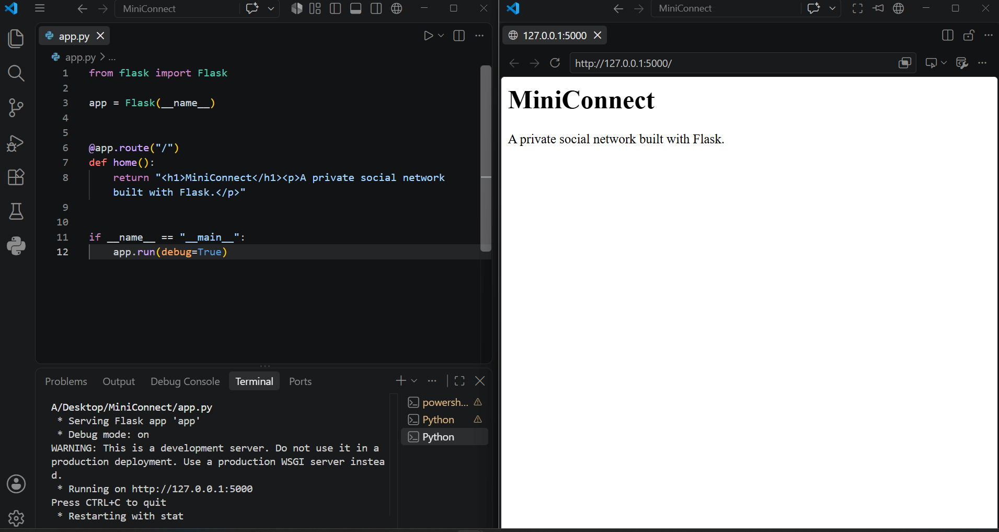
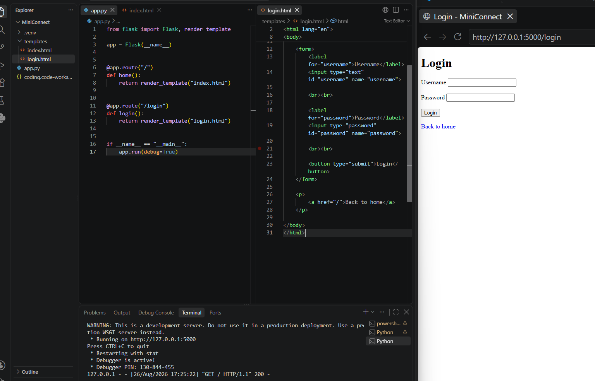
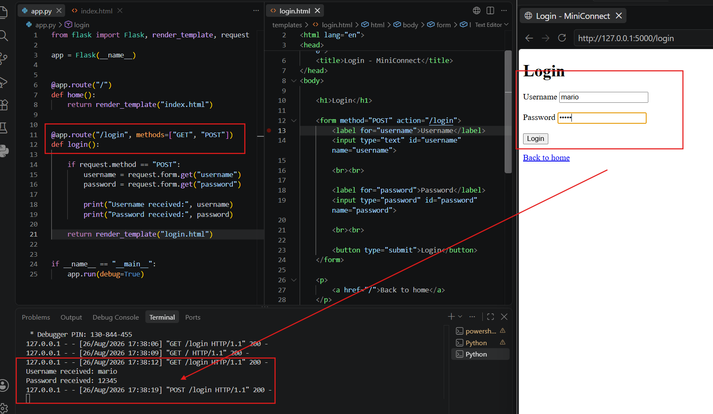
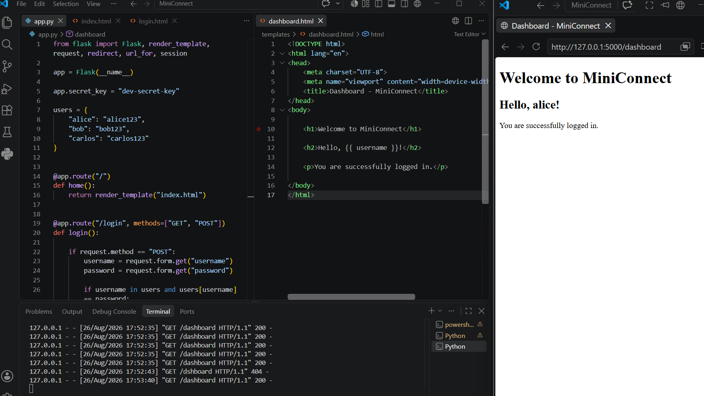
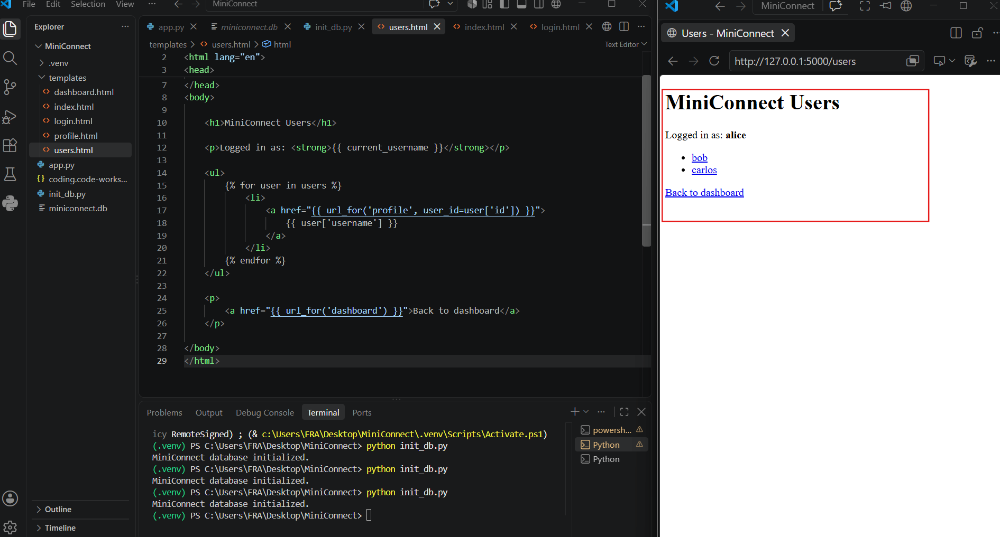
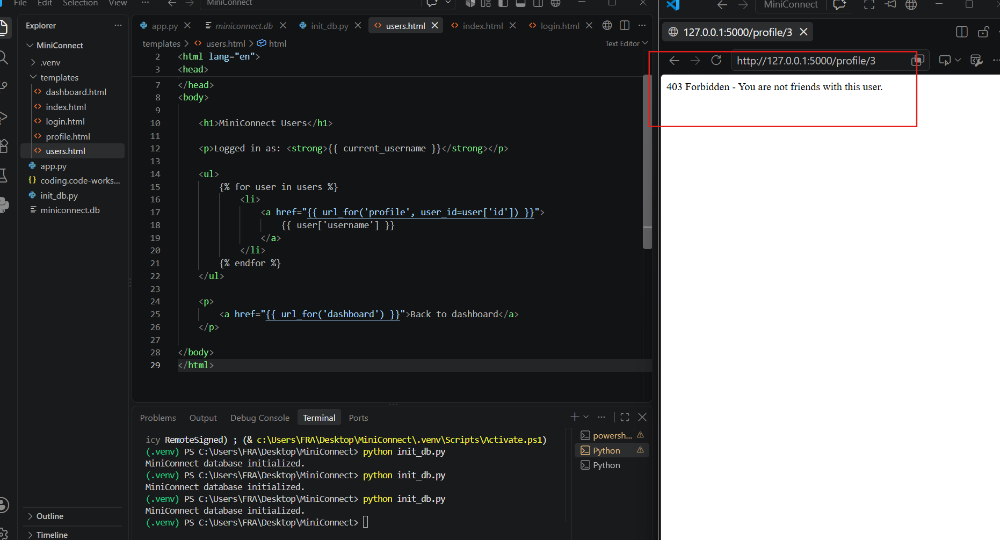
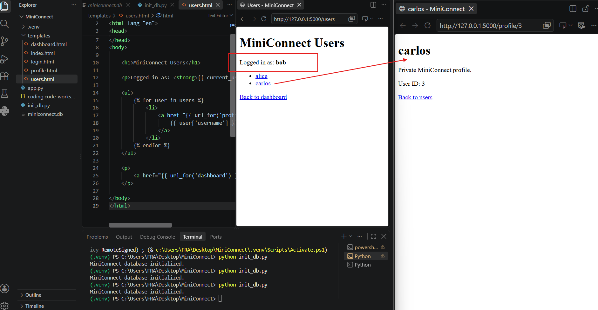

# MiniConnect

MiniConnect is a small private social networking application built from scratch with Python and Flask.

The project was created as a hands-on way to understand how modern web applications work internally, with particular focus on the relationship between:

* HTTP requests and responses
* Flask routes
* HTML forms
* authentication
* sessions
* databases
* user IDs
* authorization
* secure password storage

The goal was not to build a large production social network, but to create a small and understandable application where the complete flow from browser request to backend response can be followed directly in the source code.

---

# Project Goals

MiniConnect was created to bridge the gap between web development and web security.

Security training platforms often present requests such as:

```http
POST /login
```

or:

```http
GET /profile/3
```

from the outside.

This project makes it possible to see what happens on the other side of those requests:

```text
Browser
   ↓
HTTP Request
   ↓
Flask Route
   ↓
Application Logic
   ↓
Database
   ↓
Template
   ↓
HTTP Response
   ↓
Browser
```

Understanding this flow provides a stronger foundation for studying topics such as authentication, access control, IDOR, SQL injection, session management, and other web application security concepts.

---

# Features

MiniConnect currently includes:

* Home page
* Login page
* User authentication
* Password hashing
* Flask sessions
* Protected dashboard
* SQLite database
* Multiple user accounts
* User list
* User profiles
* User IDs
* Friendship-based profile authorization
* Logout functionality
* Server-side access control

---

# Technology Stack

MiniConnect was built using:

* Python 3
* Flask
* SQLite
* Werkzeug password hashing
* HTML
* Jinja templates
* Visual Studio Code
* Git / GitHub

The application was initially developed locally on Windows.

A later phase of the project can deploy the application to a private Ubuntu virtual machine for additional development and controlled security testing.

---

# Project Structure

```text
MiniConnect/
│
├── app.py
├── init_db.py
├── miniconnect.db
├── README.md
├── .gitignore
│
├── templates/
│   ├── index.html
│   ├── login.html
│   ├── dashboard.html
│   ├── users.html
│   └── profile.html
│
└── screenshots/
    ├── 01-first-flask-app.png
    ├── 02-login-page.png
    ├── 03-post-request-backend.png
    ├── 04-authenticated-dashboard.png
    ├── 05-users-list.png
    ├── 06-access-control-denied.png
    └── 07-authorized-profile.png
```

The local Python virtual environment is intentionally excluded from the repository.

---

# Application Flow

A typical authenticated session follows this process:

```text
User opens MiniConnect
        ↓
GET /login
        ↓
Flask returns login.html
        ↓
User enters username/password
        ↓
POST /login
        ↓
Flask reads form parameters
        ↓
Database lookup
        ↓
Password hash verification
        ↓
Session created
        ↓
Redirect to /dashboard
```

This allows the complete authentication process to be observed directly in the source code.

---

# HTTP Forms and Flask

The login form sends credentials using an HTTP POST request.

Example HTML:

```html
<form method="POST" action="/login">
```

The browser sends values such as:

```text
username=alice
password=alice123
```

Flask receives them using:

```python
username = request.form.get("username")
password = request.form.get("password")
```

This demonstrates how data controlled by a browser moves from an HTML form into backend application logic.

---

# Authentication

MiniConnect contains three initial users:

```text
alice
bob
carlos
```

Authentication is performed by retrieving a user from the SQLite database and verifying the supplied password against the stored password hash.

Conceptually:

```text
Username + Password
        ↓
POST /login
        ↓
Search users table
        ↓
User found?
        ↓
Verify password hash
        ↓
Authentication successful
        ↓
Create session
```

Failed authentication returns an invalid username or password message.

---

# Password Security

Passwords are not stored directly as plaintext in the database.

During database initialization, passwords are processed using:

```python
generate_password_hash()
```

The database stores the resulting password hash rather than the original password.

During login:

```python
check_password_hash()
```

is used to verify the submitted password.

Conceptually:

```text
Original Password
       ↓
Password Hash Function
       ↓
Stored Hash
       ↓
Database
```

This prevents the database from requiring plaintext passwords for authentication.

---

# Sessions

After successful authentication, MiniConnect stores information about the authenticated user inside the Flask session.

For example:

```python
session["username"] = user["username"]
session["user_id"] = user["id"]
```

A session might therefore represent:

```text
username = alice
user_id = 1
```

Protected routes can check the session before returning private content.

For example:

```python
if "user_id" not in session:
    return redirect(url_for("login"))
```

This demonstrates the difference between simply knowing a URL and being authenticated to access application functionality.

---

# SQLite Database

MiniConnect uses SQLite for persistent application data.

The main user table contains fields such as:

```text
users

id
username
password_hash
```

Example conceptual data:

| id | username | password_hash |
| -: | -------- | ------------- |
|  1 | alice    | hashed value  |
|  2 | bob      | hashed value  |
|  3 | carlos   | hashed value  |

This project helped demonstrate the difference between:

* database
* table
* column
* row
* primary key
* query

---

# SQL Queries

MiniConnect uses parameterized SQL queries.

Example:

```python
user = connection.execute(
    "SELECT * FROM users WHERE username = ?",
    (username,)
).fetchone()
```

Conceptually, this query means:

```sql
SELECT *
FROM users
WHERE username = ?
```

The application searches the `users` table for the submitted username.

Parameterized queries are used instead of directly concatenating user-controlled input into SQL statements.

This design provides a foundation for later studying why unsafe query construction can lead to SQL injection vulnerabilities.

---

# User IDs

Every MiniConnect user receives a unique numeric identifier.

For example:

```text
Alice  → 1
Bob    → 2
Carlos → 3
```

Profiles can therefore be represented through routes containing object identifiers.

For example:

```text
/profile/2
/profile/3
```

The number identifies the requested user object.

This provides a practical foundation for understanding how object references are used inside web applications.

---

# Access Control

Authentication answers the question:

```text
Who are you?
```

Authorization answers a different question:

```text
What are you allowed to access?
```

MiniConnect implements server-side authorization before displaying private user profiles.

The application does not simply retrieve a user profile because a valid user ID was supplied.

It also verifies whether the authenticated user is authorized to view that profile.

Conceptually:

```text
Authenticated User
        ↓
Requests Profile
        ↓
Requested User Exists?
        ↓
Authorization Check
        ↓
Allowed?
   ┌────┴────┐
   YES       NO
    ↓         ↓
Profile      403
```

This demonstrates why hiding URLs or using unpredictable IDs is not a substitute for server-side authorization.

---

# Friendship Model

MiniConnect contains a simple friendship relationship.

In the current demonstration:

```text
Bob ↔ Carlos
```

Bob and Carlos are authorized to view each other's private profiles.

Alice is not part of that friendship relationship.

Therefore:

```text
Bob → Carlos
ALLOWED
```

```text
Carlos → Bob
ALLOWED
```

while:

```text
Alice → Bob
DENIED
```

and:

```text
Alice → Carlos
DENIED
```

The authorization decision is performed by the backend rather than trusted to information supplied by the browser.

---

# HTTP Status Codes

MiniConnect also demonstrates several common HTTP behaviors.

Successful requests normally produce:

```text
200 OK
```

Requests for nonexistent users can produce:

```text
404 Not Found
```

Attempts to access a private profile without authorization produce:

```text
403 Forbidden
```

Authentication failures are handled by returning the login page with an error message.

---

# Templates

Flask uses the `templates` directory to separate application logic from HTML presentation.

Instead of embedding HTML directly inside Python:

```python
return "<h1>Hello</h1>"
```

MiniConnect uses:

```python
return render_template("dashboard.html")
```

Jinja allows Python values to be passed into HTML.

Example:

```html
<h2>Hello, {{ username }}!</h2>
```

Flask provides the value for `username` when rendering the template.

---

# Screenshots

## First Flask Application



The first working MiniConnect Flask route running on the local development server.

---

## Login Page



The first HTML login form connected to the Flask application.

---

## POST Request Reaching the Backend



Demonstration of data moving from an HTML form through an HTTP POST request into Flask backend logic.

---

## Authenticated Dashboard



Successful authentication followed by creation of a Flask session and access to the protected dashboard.

---

## User List



List of MiniConnect users retrieved from the SQLite database.

---

## Access Control Denied



Example of server-side authorization denying access to a private profile.

---

## Authorized Profile



Example of successful access to a private profile when the friendship authorization requirement is satisfied.

---

# Running MiniConnect Locally

Clone or download the repository.

Create a Python virtual environment:

```powershell
py -m venv .venv
```

Activate the environment on Windows PowerShell:

```powershell
.\.venv\Scripts\Activate.ps1
```

Install Flask:

```powershell
python -m pip install flask
```

Initialize the database:

```powershell
python init_db.py
```

Start the application:

```powershell
python app.py
```

The local Flask development server will normally start on:

```text
http://127.0.0.1:5000
```

---

# Development Accounts

The current educational version initializes three demonstration accounts:

```text
alice
bob
carlos
```

These accounts exist only for local development and controlled testing.

The project is not intended to expose demonstration credentials or development configuration on a public production server.

---

# .gitignore

The repository should exclude local Python environment files and generated Python cache files.

Example `.gitignore`:

```gitignore
.venv/
__pycache__/
*.pyc
```

The virtual environment should be recreated locally instead of committed to GitHub.

---

# Security Design

MiniConnect currently demonstrates several secure development concepts:

* password hashing
* server-side authentication
* sessions
* protected routes
* parameterized SQL queries
* server-side authorization
* object ownership / relationship checks
* generic login failure messages
* separation between templates and application logic

The project is intentionally small so that each security decision can be traced directly through the source code.

---

# Future Security Lab

A future phase of MiniConnect may create isolated, intentionally vulnerable variants of selected application functionality.

The purpose of those variants would be to compare:

```text
Secure Implementation
        ↓
Intentional Security Mistake
        ↓
Observed Application Behavior
        ↓
Root Cause
        ↓
Remediation
```

Potential educational topics include:

* Broken Access Control
* IDOR
* Authentication weaknesses
* SQL Injection
* Path Traversal
* File Upload security
* OS Command Injection

Any such testing will be restricted to private, controlled laboratory environments.

---

# What I Learned

Building MiniConnect helped connect several previously separate concepts.

Before building the application, HTTP security exercises often showed only the external request:

```http
GET /profile/3
```

MiniConnect demonstrates the complete internal path:

```text
GET /profile/3
        ↓
Flask route
        ↓
user_id = 3
        ↓
database query
        ↓
authorization logic
        ↓
template rendering
        ↓
HTTP response
```

The project therefore provides a practical bridge between:

```text
Web Development
       +
HTTP
       +
Databases
       +
Authentication
       +
Authorization
       +
Web Security
```

---

# Current Status

**MiniConnect v1**

Current functionality:

```text
Home                    ✔
Login                   ✔
SQLite Database         ✔
Password Hashing        ✔
Sessions                ✔
Dashboard               ✔
User List               ✔
User Profiles           ✔
Access Control          ✔
Logout                  ✔
```

The application is intentionally kept small and understandable before additional functionality is introduced.

---

# Disclaimer

MiniConnect is an educational project created for software development and cybersecurity learning.

All security testing associated with this project is intended to be performed exclusively against systems, virtual machines, applications, and networks that are privately owned or explicitly authorized for testing.

The project is not intended for unauthorized access or testing of third-party systems.

