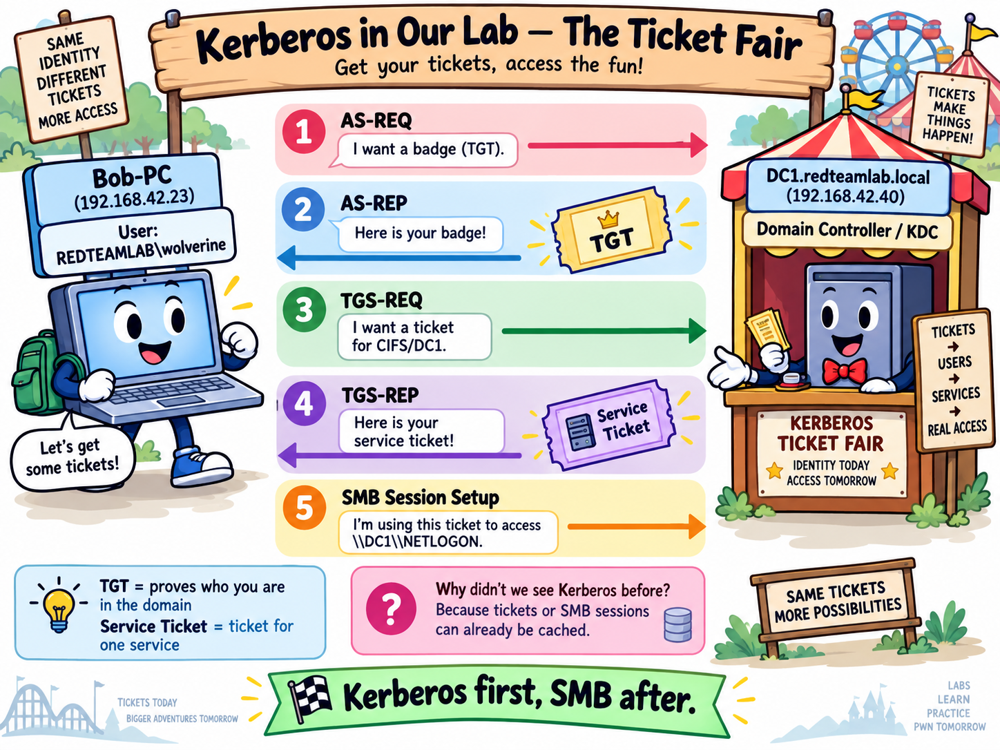
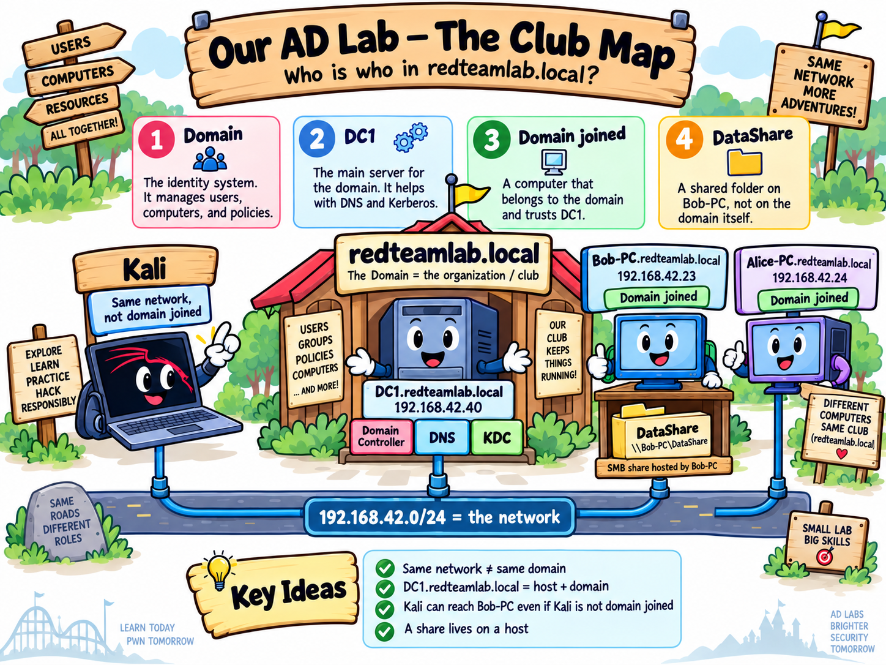
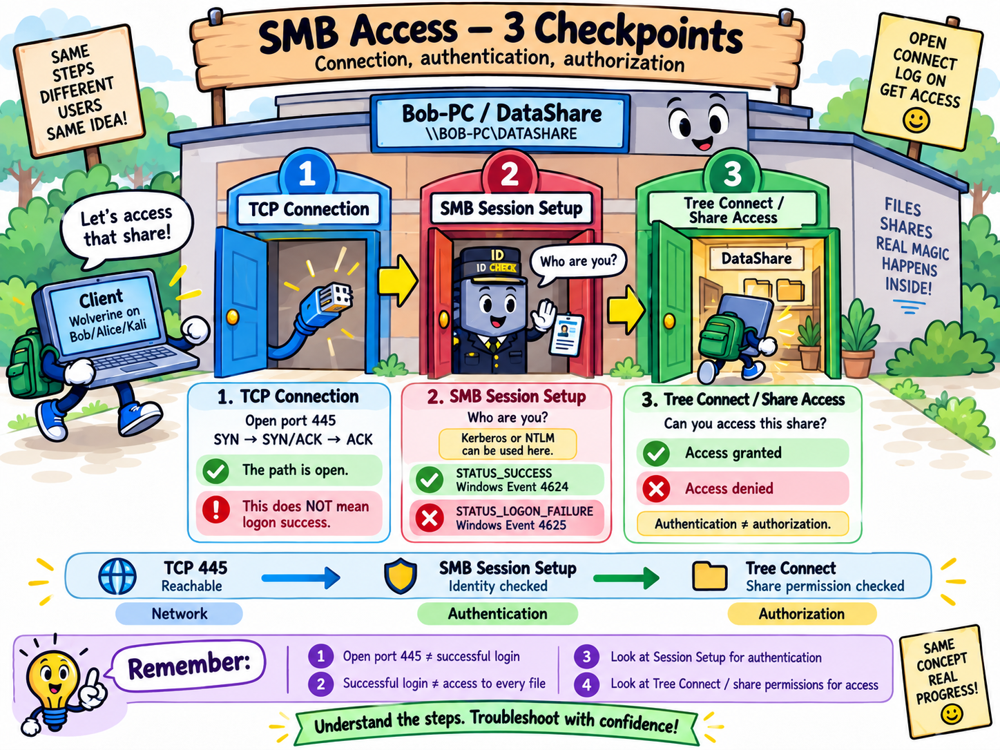

# Incident 12 — Active Directory Authentication Investigation

> **Lab scope:** Private, isolated, authorized home lab.  
> All systems, accounts, captures, and credentials used in this project belong to the lab environment and were created for educational purposes.

## Overview

This incident documents how authentication works inside a small Windows Active Directory environment and how the same activity can be observed from several points of view:

- Active Directory objects and domain membership
- DNS and Active Directory service discovery
- Kerberos ticket creation and caching
- SMB2 authentication and service access
- Wireshark packet analysis
- The practical difference between a domain-joined client and a non-domain client

The main goal was not to exploit Active Directory. The goal was to understand the normal authentication path first and to correlate host configuration, DNS, Kerberos tickets, SMB traffic, and packet captures.

---

## Lab Environment

| System | Role | IP observed during Incident 12 | Notes |
|---|---|---:|---|
| **DC1** | Windows Server 2019 Domain Controller | `192.168.42.40` | AD DS, DNS, KDC |
| **BOB-PC** | Windows 10 domain member | `192.168.42.23` | Logged in as `REDTEAMLAB\wolverine` |
| **ALICE-PC** | Windows 10 domain member | `192.168.42.24` | Logged in locally as `ALICE-PC\alice` during part of the investigation |
| **Kali** | Analyst / packet capture system | `192.168.42.20` on `eth2` | Not domain joined |

**Domain:** `redteamlab.local`  
**NetBIOS name:** `REDTEAMLAB`

A useful distinction confirmed during the lab was:

```text
Same network != Same domain
```

Kali can communicate with systems on `192.168.42.0/24` even though Kali is not joined to `redteamlab.local`.

---

## Conceptual Diagrams

These three diagrams summarize the main ideas used in the incident.

### Active Directory Lab Map



### Kerberos Ticket Flow



### SMB Access Checkpoints



---

# Phase 1 — Environment Verification

The first step was to verify the live configuration instead of trusting older notes.

## DC1

Commands:

```powershell
hostname
ipconfig /all
(Get-CimInstance Win32_ComputerSystem).Domain
```

Observed:

```text
Hostname: DC1
IPv4: 192.168.42.40
Domain: redteamlab.local
DHCP: disabled
DNS: local DC/DNS service
```

DC1 is the Domain Controller and DNS server for the lab.

## BOB-PC

Commands:

```powershell
hostname
ipconfig /all
whoami
```

Observed:

```text
Hostname: Bob-Pc
IPv4: 192.168.42.23
DNS: 192.168.42.40
User: redteamlab\wolverine
```

BOB-PC is domain joined and was logged in with a domain identity.

## ALICE-PC

Commands:

```powershell
hostname
ipconfig /all
whoami
```

Observed:

```text
Hostname: Alice-Pc
IPv4: 192.168.42.24
DNS: 192.168.42.40
User: alice-pc\alice
```

An important observation was that ALICE-PC was domain joined while the current interactive user was a **local account**.

This demonstrates that:

```text
Computer domain membership != Current user identity
```

## Kali

Commands:

```bash
ip -br a
ip route
```

Observed lab interfaces included:

```text
eth0 -> 10.10.10.6/24
eth1 -> 172.30.1.20/24
eth2 -> 192.168.42.20/24
```

`eth2` was the interface connected to RedTeamLab.

### Evidence

- `01-dc1-environment.png`
- `02-bob-environment.png`
- `03-alice-environment.png`
- `04-kali-network.png`

---

# Phase 2 — Active Directory Foundations

The next objective was to prove what the domain actually contained.

## Domain Information

On DC1:

```powershell
Get-ADDomain
```

Important fields included:

```text
DNSRoot: redteamlab.local
NetBIOSName: REDTEAMLAB
DistinguishedName: DC=redteamlab,DC=local
DomainSID: S-1-5-21-...
Forest: redteamlab.local
DomainMode: Windows2016Domain
PDCEmulator: DC1.redteamlab.local
```

This established the identity of the domain and showed that DC1 holds important domain roles.

`DC1.redteamlab.local` should be read as:

```text
DC1                    -> hostname
redteamlab.local       -> domain
DC1.redteamlab.local   -> FQDN
```

## Domain Computers

Command:

```powershell
Get-ADComputer -Filter * | Select-Object Name,DNSHostName
```

Observed domain computer objects included:

```text
DC1
BOB-PC
ALICE-PC
```

This is stronger evidence than simply showing that the machines can communicate on the same network. Active Directory has computer objects representing them.

## Domain Users

Command:

```powershell
Get-ADUser -Filter * | Select-Object Name,SamAccountName,Enabled
```

Observed accounts included:

```text
Administrator
Guest
krbtgt
gambit
wolverine
sqladmin
rogue
```

The investigation also checked the Domain Admins group:

```powershell
Get-ADGroupMember -Identity "Domain Admins" |
Select-Object Name,SamAccountName
```

Observed members included:

```text
Administrator
wolverine
sqladmin
```

One notable lab configuration was that `sqladmin`, an account intended to represent a service account, was also a member of **Domain Admins**. In a real environment, that combination would represent excessive privilege and should be reviewed.

### Evidence

- `05-ad-domain.png`
- `06-ad-computers.png`
- `07-ad-users.png`
- `08-domain-admins.png`

---

# Phase 3 — DNS and Active Directory Service Discovery

Active Directory depends heavily on DNS. The objective here was to move beyond the simple idea of "DNS converts names to IP addresses" and observe how clients locate domain services.

## Name Resolution

From ALICE-PC:

```powershell
nslookup dc1.redteamlab.local
```

The query resolved:

```text
dc1.redteamlab.local -> 192.168.42.40
```

An initial DNS timeout was observed, followed by a successful response.

## SRV Record Discovery

From Kali:

```bash
dig @192.168.42.40 _ldap._tcp.dc._msdcs.redteamlab.local SRV
```

The important answer was conceptually:

```text
_ldap._tcp.dc._msdcs.redteamlab.local
        SRV
        port 389
        target DC1.redteamlab.local
```

The response also supplied the address mapping:

```text
DC1.redteamlab.local -> 192.168.42.40
```

This demonstrated that an SRV record tells a client:

```text
Which service?
Which protocol?
Which port?
Which host provides it?
```

In this case, the domain advertised LDAP on TCP/389 through DC1.

## Discovering the Domain Controller

From ALICE-PC:

```powershell
nltest /dsgetdc:redteamlab.local
```

The result identified:

```text
DC: \\DC1.redteamlab.local
Address: \\192.168.42.40
Domain: redteamlab.local
Forest: redteamlab.local
```

Useful flags included:

```text
PDC
GC
DS
LDAP
KDC
TIMESERV
WRITABLE
DNS_DC
DNS_DOMAIN
DNS_FOREST
```

The most important flag for the next stage was:

```text
KDC
```

which confirmed that DC1 provides the **Kerberos Key Distribution Center** role.

### Evidence

- `09-nslookup-dc1.png`
- `10-dig-srv.png`
- `11-nltest.png`

---

# Phase 4 — Kerberos Ticket Cache

BOB-PC was used for Kerberos analysis because it was domain joined and the current user was:

```text
REDTEAMLAB\wolverine
```

## Inspecting Existing Tickets

Commands:

```powershell
whoami
klist
```

The cache showed a Ticket Granting Ticket:

```text
Client: wolverine @ REDTEAMLAB.LOCAL
Server: krbtgt/REDTEAMLAB.LOCAL @ REDTEAMLAB.LOCAL
Kdc Called: DC1
```

It also contained a service ticket for LDAP.

The key mental model was:

```text
TGT = proof of the user's authenticated domain identity

Service ticket = ticket for one specific service
```

The TGT is therefore not the same thing as access to a file share.

### Evidence

- `12-klist-tgt.png`

---

# Phase 5 — Requesting a CIFS/SMB Service Ticket

From BOB-PC:

```powershell
dir \\DC1\NETLOGON
```

Then:

```powershell
klist
```

After requesting the network resource, the ticket cache contained a new ticket for CIFS:

```text
Client: wolverine @ REDTEAMLAB.LOCAL
Server: cifs/DC1 @ REDTEAMLAB.LOCAL
Kdc Called: DC1.redteamlab.local
```

This connected several concepts that had previously been studied separately:

```text
User requests \\DC1\NETLOGON
        |
        v
Windows needs SMB/CIFS
        |
        v
Kerberos service ticket requested
        |
        v
cifs/DC1 ticket received
        |
        v
SMB session can authenticate using Kerberos
```

### Evidence

- `13-klist-cifs.png`

---

# Phase 6 — Capturing Kerberos in Wireshark

The first packet capture did **not** show a new Kerberos exchange.

That was an important finding rather than a failed experiment.

The SMB connection already existed and Windows reused cached state. Therefore, accessing `\\DC1\NETLOGON` did not require a new Kerberos exchange during that capture window.

To force a clean authentication sequence, the existing SMB connections and Kerberos tickets were cleared.

Commands used on BOB-PC:

```powershell
net use
net use * /delete /y
klist purge
```

A fresh Wireshark capture was started on Kali, after which BOB-PC generated new traffic by accessing:

```powershell
dir \\DC1\NETLOGON
```

## Observed Kerberos Sequence

The capture contained the following sequence:

| Packet | Protocol / Message | Direction | Meaning |
|---:|---|---|---|
| 11 | AS-REQ | Bob -> DC1 | Initial request for authentication/TGT |
| 12 | KRB Error: PREAUTH_REQUIRED | DC1 -> Bob | KDC requests Kerberos pre-authentication |
| 19 | AS-REQ | Bob -> DC1 | Request repeated with pre-authentication |
| 20 | AS-REP | DC1 -> Bob | TGT issued |
| 28 | TGS-REQ | Bob -> DC1 | Service ticket requested |
| 30 | TGS-REP | DC1 -> Bob | Service ticket issued |
| 38 | TGS-REQ | Bob -> DC1 | Additional service-ticket request |
| 39 | TGS-REP | DC1 -> Bob | Additional service-ticket response |
| 44 | SMB2 Session Setup Request | Bob -> DC1 | SMB authentication/session setup |
| 46 | SMB2 Session Setup Response | DC1 -> Bob | Session accepted |

The central sequence can be summarized as:

```text
AS-REQ
   |
PREAUTH_REQUIRED
   |
AS-REQ with pre-authentication
   |
AS-REP
   |
  TGT
   |
TGS-REQ
   |
TGS-REP
   |
Service Ticket
   |
SMB2 Session Setup
```

## AS and TGS in Plain Language

```text
AS-REQ  -> "I want my domain badge."
AS-REP  -> "Here is your TGT."

TGS-REQ -> "I have my badge. I want a ticket for service X."
TGS-REP -> "Here is your ticket for service X."
```

The TGT is delivered in the **AS-REP**.

The service ticket is delivered in the **TGS-REP**.

### Evidence

- `14-wireshark-kerberos.png`

---

# Kerberos and SMB2 — How They Fit Together

A major learning objective of Incident 12 was understanding that **Kerberos and SMB2 are not the same protocol**.

SMB2 is the protocol used to access network file resources.

Kerberos is one authentication mechanism that SMB2 can use during **Session Setup**.

A simplified SMB2 flow is:

```text
1. TCP connection to port 445
2. SMB2 Negotiate
3. SMB2 Session Setup
4. Tree Connect
5. File operations
```

Kerberos or NTLM belongs conceptually inside the authentication step:

```text
SMB2 Session Setup
        |
        +-- Kerberos
        |
        +-- NTLM
```

Therefore:

```text
SMB2 = file-sharing protocol
Kerberos = authentication mechanism
NTLM = another authentication mechanism
```

The Kerberos traffic occurs before / around the point where the SMB session is authenticated because the client first needs the appropriate service ticket.

---

# Kerberos vs NTLM

The lab also established the conceptual reason the two mechanisms appear in different situations.

## Domain-joined BOB-PC

BOB-PC is joined to `redteamlab.local` and `wolverine` has a Kerberos TGT.

When BOB-PC accesses a domain service such as:

```text
\\DC1\NETLOGON
```

Kerberos can be used.

Expected/observed Kerberos indicators include:

```text
AS-REQ
AS-REP
TGS-REQ
TGS-REP
```

## Non-domain Kali

Kali is on the same IP network but is not joined to the Windows domain.

It does not have a Windows domain logon session with a TGT.

When using SMB credentials from Kali, NTLM can be used during SMB Session Setup instead.

A comparison test was prepared with:

```bash
smbclient -L //192.168.42.23 -U 'REDTEAMLAB\Administrator%WrongPassword123'
```

and the Wireshark filters:

```text
ntlmssp
```

or:

```text
smb2
```

The expected NTLM exchange is:

```text
NTLMSSP_NEGOTIATE
NTLMSSP_CHALLENGE
NTLMSSP_AUTH
```

with an invalid password producing an SMB authentication failure.

> **Evidence note:** the retained Incident 12 transcript contains the NTLM comparison procedure and expected packet sequence, but does not preserve a confirmed final NTLM capture result. If `15-wireshark-ntlm.png` was captured separately, it can be added here as evidence.

Optional evidence:

- `15-wireshark-ntlm.png`

---

# Important Troubleshooting Lesson — Caching

One of the most useful parts of the incident was discovering why Kerberos initially appeared to be missing from Wireshark.

The first capture showed SMB traffic but no new Kerberos traffic.

The reason was that Windows could reuse:

- Kerberos tickets already stored in the user's ticket cache
- an already established SMB connection/session

This led to an important investigation rule:

> **The absence of a Kerberos exchange inside a capture does not prove Kerberos was not used. The authentication may have happened before the capture started or existing state may have been reused.**

To force a fresh exchange:

```powershell
net use * /delete /y
klist purge
```

Then a new network request was generated.

This changed the packet capture from only SMB activity to a complete Kerberos authentication and service-ticket sequence.

---

# Key Findings

1. `redteamlab.local` was confirmed as the Active Directory domain.
2. DC1 (`192.168.42.40`) was confirmed as the Domain Controller, DNS server, and KDC.
3. DC1, BOB-PC, and ALICE-PC existed as Active Directory computer objects.
4. BOB-PC used DC1 as DNS and was logged in as the domain identity `REDTEAMLAB\wolverine`.
5. ALICE-PC was domain joined while the active user was the local identity `ALICE-PC\alice`.
6. `wolverine` was confirmed as a member of Domain Admins.
7. `sqladmin` was also found in Domain Admins despite being used as a service-style account in the lab.
8. DNS SRV records advertised the LDAP service on DC1 over TCP/389.
9. `nltest` successfully discovered DC1 as the Domain Controller for `redteamlab.local`.
10. `klist` showed a Kerberos TGT for `wolverine`.
11. Accessing `\\DC1\NETLOGON` resulted in a CIFS service ticket appearing in the Kerberos cache.
12. After cached tickets and SMB sessions were cleared, Wireshark captured a fresh Kerberos AS/TGS exchange.
13. The capture linked Kerberos ticket acquisition to the following SMB2 Session Setup.
14. The exercise demonstrated why packet-capture timing and cached authentication state matter during network investigations.

---

# Commands Used

## Windows / Active Directory

```powershell
hostname
ipconfig /all
whoami

(Get-CimInstance Win32_ComputerSystem).Domain

Get-ADDomain

Get-ADComputer -Filter * |
Select-Object Name,DNSHostName

Get-ADUser -Filter * |
Select-Object Name,SamAccountName,Enabled

Get-ADGroupMember -Identity "Domain Admins" |
Select-Object Name,SamAccountName

nslookup dc1.redteamlab.local

nltest /dsgetdc:redteamlab.local

klist

dir \\DC1\NETLOGON

net use

net use * /delete /y

klist purge
```

## Kali / DNS / SMB

```bash
ip -br a
ip route

dig @192.168.42.40 _ldap._tcp.dc._msdcs.redteamlab.local SRV

smbclient -L //192.168.42.23 -U 'REDTEAMLAB\Administrator%WrongPassword123'
```

## Wireshark Filters

```text
kerberos
tcp.port == 88
smb2
ntlmssp
```

---

# Evidence Index

| Screenshot | Purpose |
|---|---|
| `01-dc1-environment.png` | DC1 hostname, IP, DNS/domain configuration |
| `02-bob-environment.png` | BOB-PC network configuration and domain user |
| `03-alice-environment.png` | ALICE-PC configuration and local interactive user |
| `04-kali-network.png` | Kali interfaces and RedTeamLab route |
| `05-ad-domain.png` | Active Directory domain information |
| `06-ad-computers.png` | Domain computer objects |
| `07-ad-users.png` | Domain users |
| `08-domain-admins.png` | Domain Admins membership |
| `09-nslookup-dc1.png` | DC1 DNS resolution |
| `10-dig-srv.png` | LDAP SRV record discovery |
| `11-nltest.png` | Domain Controller discovery and roles |
| `12-klist-tgt.png` | Kerberos TGT and cached tickets |
| `13-klist-cifs.png` | CIFS service ticket |
| `14-wireshark-kerberos.png` | Full Kerberos + SMB2 packet sequence |
| `15-wireshark-ntlm.png` | Optional NTLM comparison capture |

---

# What This Incident Proved

This lab did **not** demonstrate an Active Directory compromise.

It demonstrated normal authentication behavior and the ability to investigate it.

The evidence confirmed the following chain:

```text
Domain identity
      |
      v
DNS discovers domain services
      |
      v
DC1 acts as KDC
      |
      v
AS exchange
      |
      v
TGT
      |
      v
TGS exchange
      |
      v
Service ticket
      |
      v
SMB2 Session Setup
      |
      v
Access to the requested SMB service
```

The most important lesson was that several technologies that initially looked unrelated are part of the same path:

```text
DNS
  -> Active Directory
      -> Kerberos
          -> Service Ticket
              -> SMB2 Session Setup
                  -> Network Resource
```

---

# Lessons Learned

- A **network** and a **Windows domain** are different concepts.
- A computer can be domain joined while the currently logged-in user is local.
- Active Directory uses DNS not only for hostname resolution but also for service discovery.
- SRV records advertise where domain services are located.
- DC1 acts as the Kerberos KDC in this lab.
- A **TGT** represents an authenticated domain identity.
- A **service ticket** is issued for a specific service such as CIFS.
- SMB2 and Kerberos are different protocols with different jobs.
- Kerberos can be used during SMB2 Session Setup to prove identity.
- Cached tickets and existing sessions can hide authentication traffic from a packet capture.
- Investigation requires distinguishing what the evidence proves from what is only assumed.

---

# Scope and Limitations

This project focused on understanding **normal** Active Directory authentication.

It did not attempt to demonstrate:

- Kerberoasting
- Pass-the-Hash
- Pass-the-Ticket
- Golden Ticket
- DCSync
- Credential dumping
- Lateral movement
- Domain compromise

Those techniques require a solid understanding of the normal identity and ticket flow documented here first.

The retained Incident 12 record also does not contain completed evidence for the planned share-vs-NTFS authorization phase or a preserved final assessment, so those are intentionally not presented here as completed findings.

---

## Final Takeaway

Before this incident, DNS, Active Directory, Kerberos, SMB, NTLM, tickets, and Domain Controllers could look like separate technologies.

Incident 12 connected them into one authentication story:

> **A domain client discovers services through DNS, authenticates through the Domain Controller, receives Kerberos tickets for specific services, and can then use those tickets during protocols such as SMB. Wireshark and local ticket caches provide different views of the same process.**

That relationship — not just the individual commands — was the main objective of the lab.
