# Incident 13 — Active Directory Enumeration & Kerberos Investigation

## Overview

Incident 13 documents the enumeration of the `redteamlab.local` Active Directory environment and the investigation of Kerberos authentication traffic.

The main objective was to move from simply recognizing Active Directory and Kerberos concepts to understanding how they are connected during real activity inside the lab.

During this incident I:

- Verified the laboratory environment
- Identified the Domain Controller
- Verified the current domain user
- Enumerated domain users
- Enumerated domain groups
- Identified privileged accounts
- Enumerated Service Principal Names (SPNs)
- Inspected Kerberos tickets
- Cleared the Kerberos ticket cache
- Generated fresh Kerberos traffic
- Captured Kerberos authentication in Wireshark
- Generated an SMB/CIFS service ticket
- Correlated Active Directory enumeration with Kerberos
- Identified `sqladmin` as an interesting Kerberoasting target

All testing was performed inside my isolated `redteamlab.local` laboratory.

---

# Lab Environment

| System | Role | IP Address |
|---|---|---|
| DC1 | Domain Controller / DNS / KDC | `192.168.42.40` |
| BOB-PC | Domain-joined Windows client | `192.168.42.23` |
| ALICE-PC | Windows client | `192.168.42.24` |
| Kali | Red Team / Wireshark / Network analysis | `192.168.42.20` |

Active Directory domain:

    redteamlab.local

NetBIOS domain name:

    REDTEAMLAB

Primary domain account used during the incident:

    REDTEAMLAB\wolverine

Simplified lab topology:

                          redteamlab.local
                               |
                               |
                     +------------------+
                     |       DC1        |
                     | Domain Controller|
                     | DNS / LDAP / KDC |
                     | 192.168.42.40    |
                     +------------------+
                        /             \
                       /               \
                      /                 \
             +-------------+       +-------------+
             |   BOB-PC    |       |  ALICE-PC   |
             | Domain User |       | Windows PC  |
             |192.168.42.23|       |192.168.42.24|
             +-------------+       +-------------+

                     +----------------+
                     |      KALI      |
                     | Red Team /     |
                     | Wireshark      |
                     | 192.168.42.20  |
                     +----------------+

---

# Phase 1 — Environment Verification

The first phase established the identity and network configuration of the machines involved in the incident.

The basic questions were:

    WHO AM I?
    WHERE AM I?
    WHAT DOMAIN AM I IN?
    WHERE IS THE DOMAIN CONTROLLER?

---

## DC1 — Domain Controller

Commands executed:

    hostname
    ipconfig /all
    (Get-CimInstance Win32_ComputerSystem).Domain
    Get-ADDomain

Important information confirmed:

    Hostname: DC1
    IP Address: 192.168.42.40
    Domain: redteamlab.local
    NetBIOS Name: REDTEAMLAB

DC1 is the Domain Controller for the laboratory and provides important Active Directory services including DNS, LDAP and Kerberos/KDC functionality.

### Screenshot 01

    01-dc1-environment.png

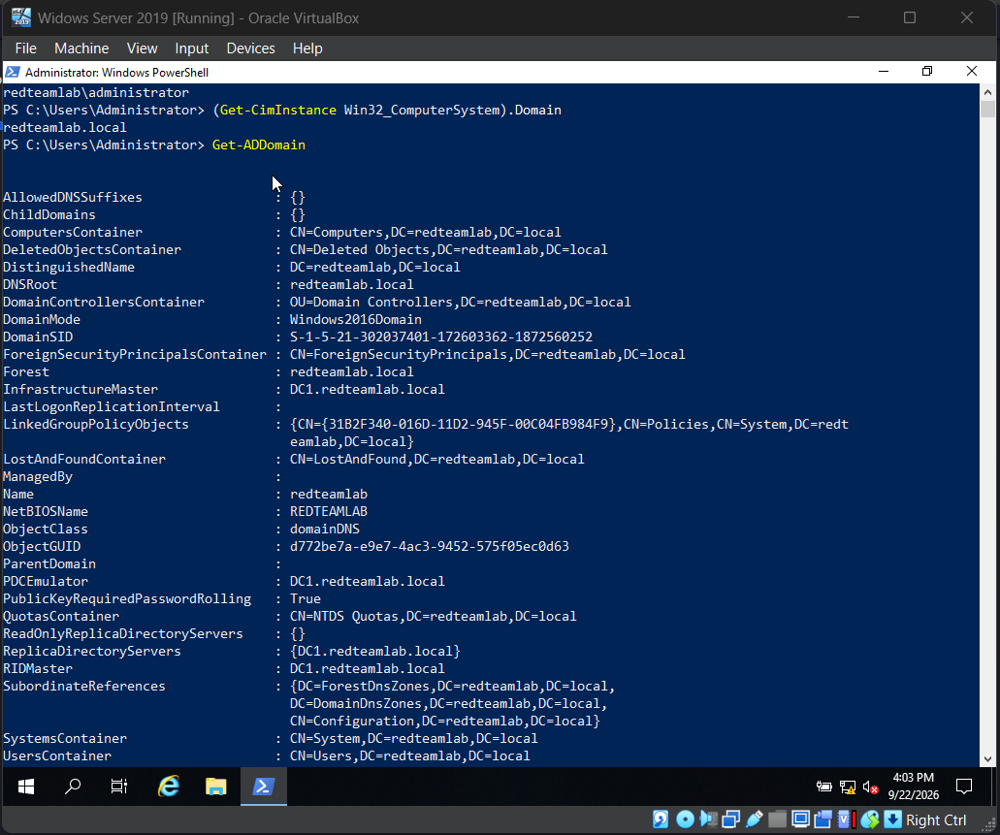
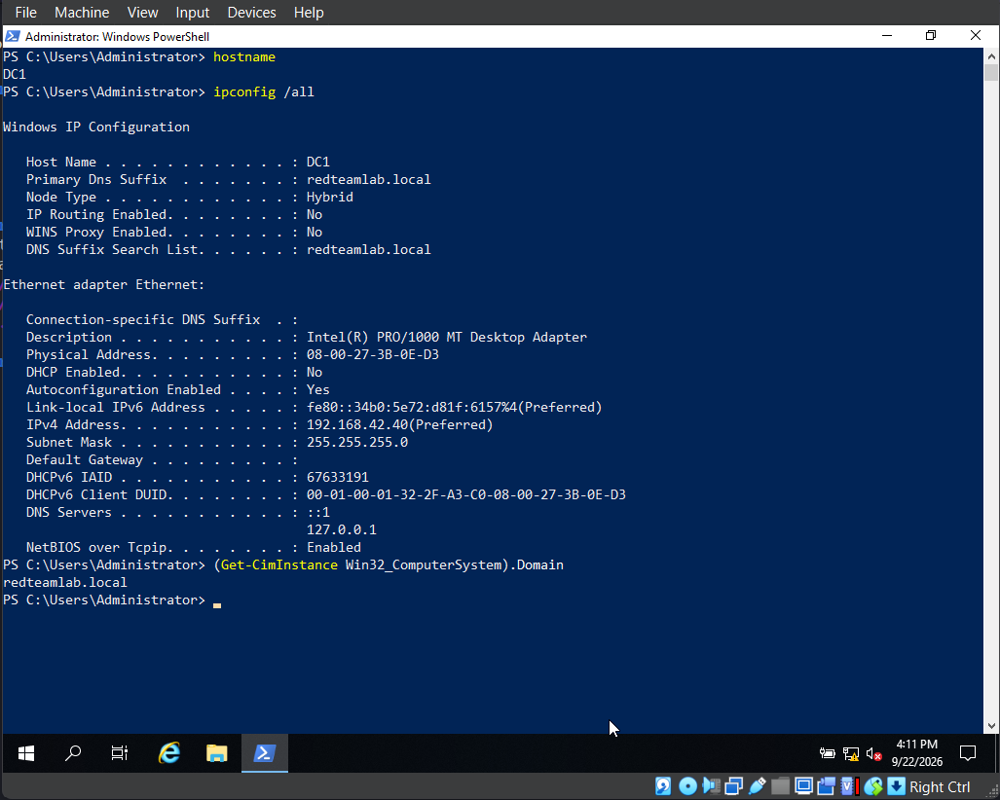

---

## BOB-PC — Domain-Joined Client

Commands executed:

    hostname
    ipconfig /all
    whoami
    echo %USERDOMAIN%
    echo %LOGONSERVER%

Observed information:

    Hostname:
    BOB-PC

    Current user:
    redteamlab\wolverine

    IPv4:
    192.168.42.23

    DNS Server:
    192.168.42.40

    USERDOMAIN:
    REDTEAMLAB

    LOGONSERVER:
    \\DC1

This confirmed that BOB-PC was operating as a domain client and that the current account was:

    REDTEAMLAB\wolverine

The command:

    echo %LOGONSERVER%

returned:

    \\DC1

showing that DC1 was the logon server associated with the current domain session.

### Screenshot 02

    02-bob-environment.png

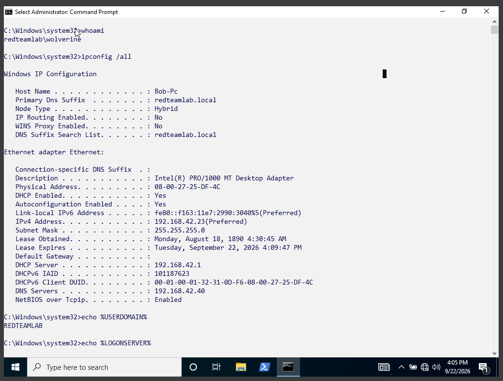

---

## ALICE-PC

Commands executed:

    hostname
    ipconfig /all
    whoami

Observed information:

    Hostname:
    ALICE-PC

    Current user:
    alice-pc\alice

    IPv4:
    192.168.42.24

    DNS Server:
    192.168.42.40

An important distinction was visible here.

The account:

    ALICE-PC\alice

is a local account.

The account:

    REDTEAMLAB\wolverine

is a domain account.

A local account exists on a specific Windows machine.

A domain account exists inside Active Directory and can be recognized by domain-joined systems according to the permissions assigned to that account.

### Screenshot 03

    03-alice-environment.png

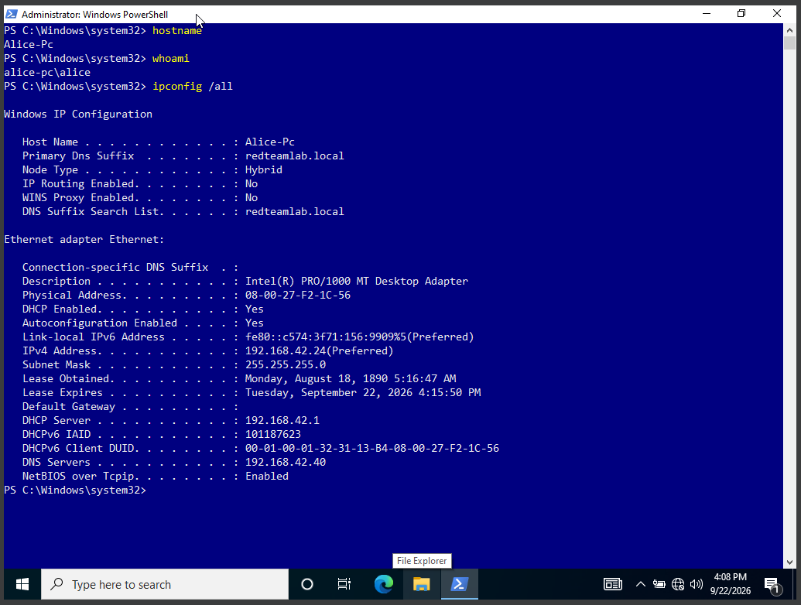

---

## Kali

Commands executed:

    ip -br a
    ip route

The Red Team interface used for the lab was:

    192.168.42.20/24

The routing information confirmed connectivity to:

    192.168.42.0/24

### Screenshot 04

    04-kali-network.png

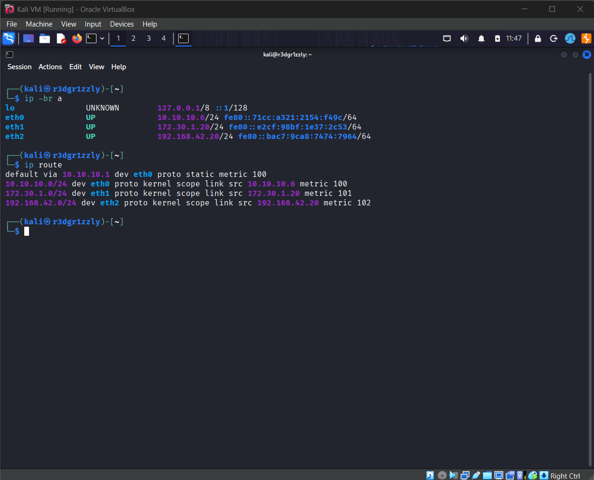

---

# Phase 2 — Active Directory Enumeration

After verifying the environment, Active Directory enumeration was performed from BOB-PC.

The goal was to understand what information could be discovered from an authenticated domain session.

---

## Domain User Enumeration

Command:

    net user /domain

Accounts observed included:

    Administrator
    gambit
    Guest
    krbtgt
    rogue
    sqladmin
    wolverine

This command showed which user accounts existed inside the domain.

The important lesson was that enumeration begins by identifying the objects that exist before attempting to understand relationships or possible attack paths.

---

## Domain Group Enumeration

Command:

    net group /domain

Groups observed included:

    Domain Admins
    Enterprise Admins
    Schema Admins
    Domain Users
    ...

Groups are extremely important in Active Directory because privileges are frequently inherited through group membership.

---

## Domain Admin Enumeration

Command:

    net group "Domain Admins" /domain

Observed members:

    Administrator
    wolverine
    sqladmin

This immediately identified highly privileged domain accounts.

### Screenshot 05

    05-domain-enumeration.png

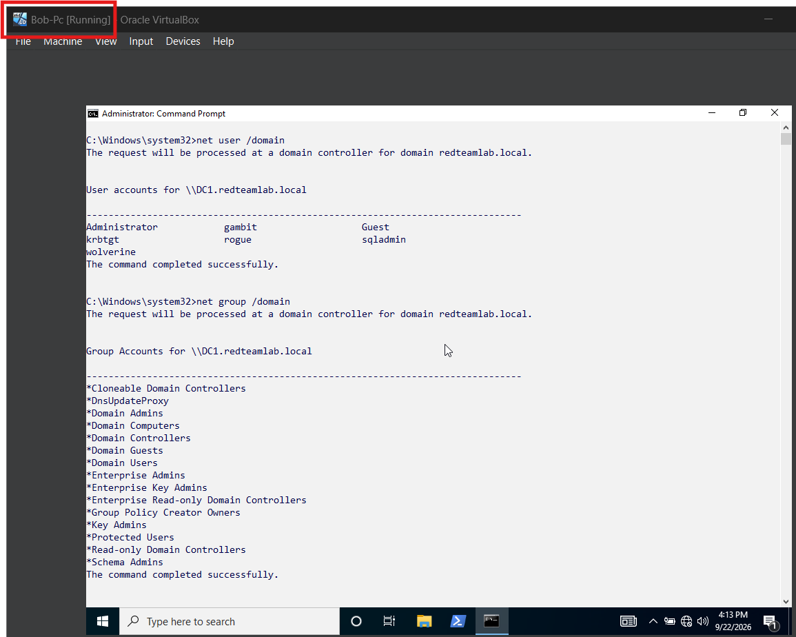

---

## Enterprise Admin Enumeration

Command:

    net group "Enterprise Admins" /domain

Observed members:

    Administrator
    wolverine
    sqladmin

The `Enterprise Admins` group is associated with forest-level administrative privileges.

This became especially important when the results were later correlated with SPN enumeration.

### Screenshot 06

    06-domain-admins.png

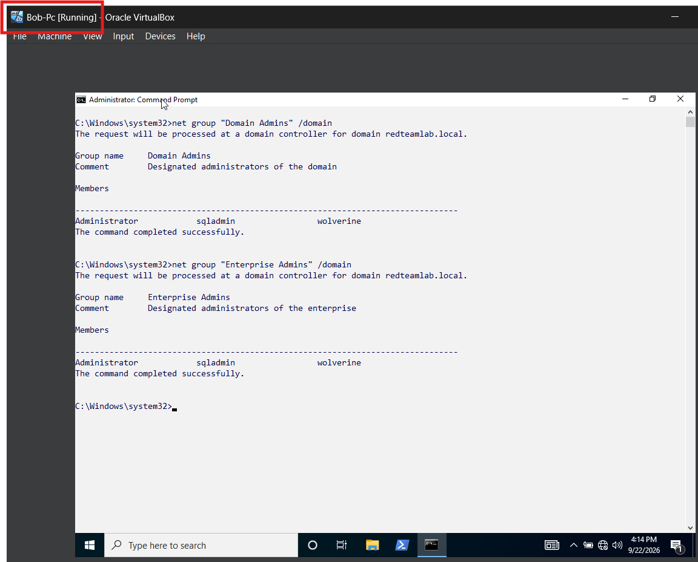

---

# Phase 3 — Service Principal Name Enumeration

The next phase focused on Service Principal Names.

Command:

    setspn -Q */*

The query returned SPNs associated with several systems and accounts, including:

    DC1
    krbtgt
    sqladmin
    BOB-PC
    ALICE-PC

---

# What Is an SPN?

SPN means:

    Service Principal Name

An SPN identifies a service instance associated with an Active Directory security principal.

Simplified relationship:

    ACCOUNT
       |
       +---- SPN
              |
              +---- SERVICE

Kerberos uses SPNs when clients request authentication tickets for specific services.

---

# Important Finding — sqladmin

During SPN enumeration, the following object was identified:

    CN=sqladmin,CN=Users,DC=redteamlab,DC=local

Associated SPN:

    DC1/sqladmin.REDTEAMLAB.local:64123

The important correlation was:

    sqladmin
       |
       +---- Domain Account
       |
       +---- SPN Registered
       |
       +---- Domain Admin
       |
       +---- Enterprise Admin

This was the most important enumeration finding of Incident 13.

### Screenshot 07

    07-spn-enumeration.png

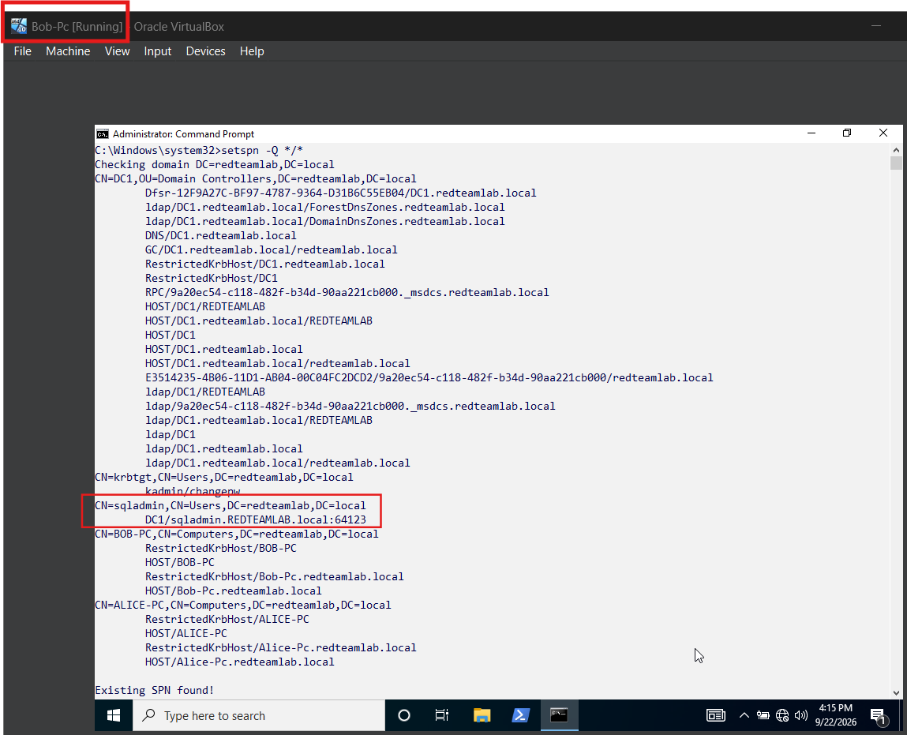

---

# Why the sqladmin Finding Matters

An authenticated domain user can request a Kerberos service ticket for a registered SPN.

That means an account with both:

    SPN
      +
    HIGH PRIVILEGES

is particularly interesting during an Active Directory Red Team assessment.

The conceptual attack path discovered during this incident was:

    Domain User
         |
         v
    Enumerate SPNs
         |
         v
    Identify Service Account
         |
         v
    Request Kerberos Service Ticket
         |
         v
    Obtain TGS
         |
         v
    Offline Password Analysis
         |
         v
    Weak Password?
       /     \
     NO       YES
              |
              v
        Recover Credentials
              |
              v
        Account Privileges

This is the conceptual foundation of Kerberoasting.

Incident 13 identified the target and the relationship between the account, its SPN and its privileges.

Practical Kerberoasting was intentionally postponed.

---

# Phase 4 — Kerberos Ticket Investigation

The next phase investigated the Kerberos ticket cache on BOB-PC.

Command:

    klist

`klist` displays Kerberos tickets currently stored in the user's ticket cache.

Tickets observed during the incident included:

    krbtgt/REDTEAMLAB.LOCAL
    ldap/DC1.redteamlab.local
    cifs/DC1

---

# Ticket Granting Ticket — TGT

The Ticket Granting Ticket is obtained after successful domain authentication.

Simplified flow:

    USER
      |
      | Authentication
      v
    KDC
      |
      v
    TGT

A useful mental model is:

    TGT = DOMAIN BADGE

The TGT does not automatically provide access to every service.

Instead, the client uses the TGT to request additional Kerberos service tickets.

### Screenshot 08

    08-klist-tickets.png

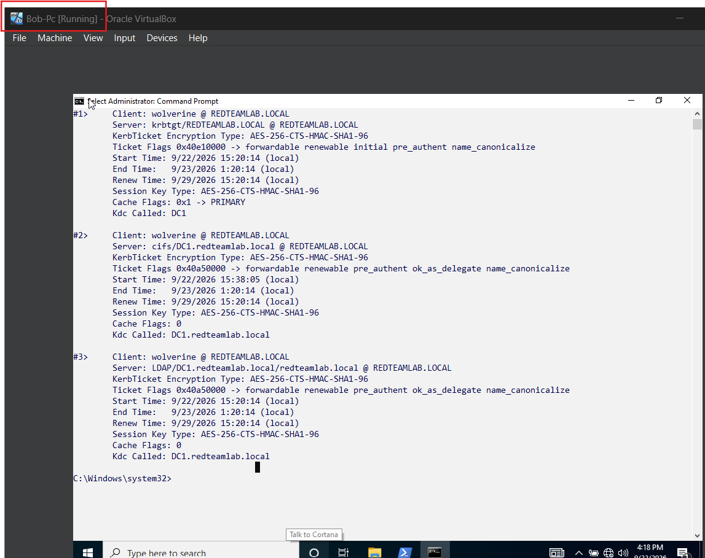

---

# Clearing the Kerberos Ticket Cache

Command:

    klist purge

The command removes tickets currently stored in the Kerberos cache.

The cache was then checked again:

    klist

Expected result:

    Cached Tickets: (0)

Conceptually:

    BEFORE PURGE

    TGT
    LDAP Ticket
    CIFS Ticket
    Other Tickets

          |
          | klist purge
          v

    AFTER PURGE

    Kerberos Ticket Cache
            =
          EMPTY

Clearing the cache made it possible to generate fresh Kerberos activity and observe the authentication sequence more clearly.

### Screenshot 09

    09-klist-purge.png

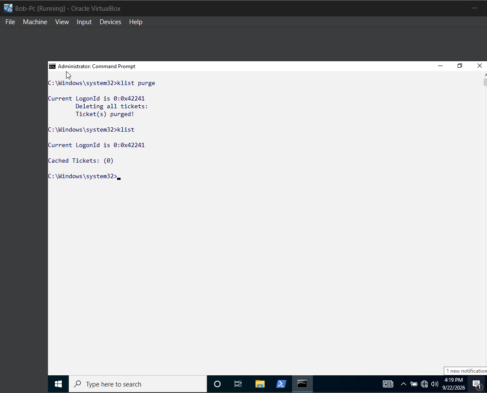

---

# Phase 5 — Wireshark Kerberos Capture

Wireshark was used on Kali to observe the Kerberos authentication process.

Display filter:

    kerberos

Before generating new SMB traffic, existing SMB sessions were removed from BOB-PC.

Command:

    net use * /delete /y

New access to the Domain Controller was then generated with:

    dir \\DC1\NETLOGON

This generated fresh authentication activity.

---

# Kerberos Authentication Flow

The important packets observed were:

    AS-REQ

    PREAUTH_REQUIRED

    AS-REQ

    AS-REP

    TGS-REQ

    TGS-REP

    SMB2 Session Setup

The logical sequence was:

    BOB-PC                                   DC1 / KDC
       |                                        |
       | ----------- AS-REQ ------------------> |
       |       Request TGT                      |
       |                                        |
       | <----- PREAUTH_REQUIRED -------------- |
       |       Prove your identity              |
       |                                        |
       | ----------- AS-REQ ------------------> |
       |       Request with preauthentication   |
       |                                        |
       | <---------- AS-REP ------------------- |
       |       TGT issued                       |
       |                                        |
       | ----------- TGS-REQ -----------------> |
       |       Request service ticket           |
       |                                        |
       | <---------- TGS-REP ------------------ |
       |       Service ticket issued            |
       |                                        |

After the service ticket was obtained:

    BOB-PC
       |
       | Service Ticket
       v
    SMB / CIFS Service
       |
       v
    SMB2 Session Setup

### Screenshot 10

    10-wireshark-kerberos.png

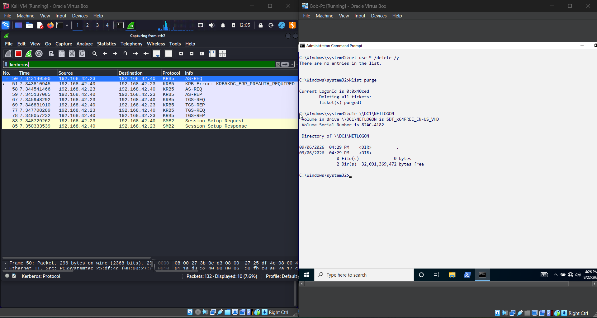

---

# Understanding the Kerberos Messages

## AS-REQ

AS-REQ means:

    Authentication Service Request

The client contacts the KDC and begins the process of obtaining a Ticket Granting Ticket.

Mental model:

    "I want my domain badge."

---

## PREAUTH_REQUIRED

The KDC requires the client to prove its identity before issuing the TGT.

Mental model:

    "Prove that you are really this user."

---

## AS-REP

After successful authentication, the KDC returns the Ticket Granting Ticket.

Mental model:

    "Here is your domain badge."

---

## TGS-REQ

The client already has a TGT and now requests a ticket for a specific service.

Mental model:

    "I already have my badge.
     Now I want a ticket for this service."

---

## TGS-REP

The KDC returns the requested service ticket.

Mental model:

    "Here is your ticket for that service."

---

## SMB2 Session Setup

The client uses the authentication material to establish the SMB session with the target server.

Simplified model:

    TGT
     |
     v
    REQUEST CIFS TICKET
     |
     v
    SERVICE TICKET
     |
     v
    SMB SERVER
     |
     v
    SMB2 SESSION

---

# Phase 6 — CIFS Service Ticket

After executing:

    dir \\DC1\NETLOGON

the Kerberos ticket cache was checked again:

    klist

A CIFS service ticket was present.

CIFS is associated with Windows file-sharing services.

Conceptually:

    \\DC1\NETLOGON
           |
           v
         SMB/CIFS
           |
           v
    Kerberos Service Ticket
           |
           v
          DC1

### Screenshot 11

    11-klist-cifs.png

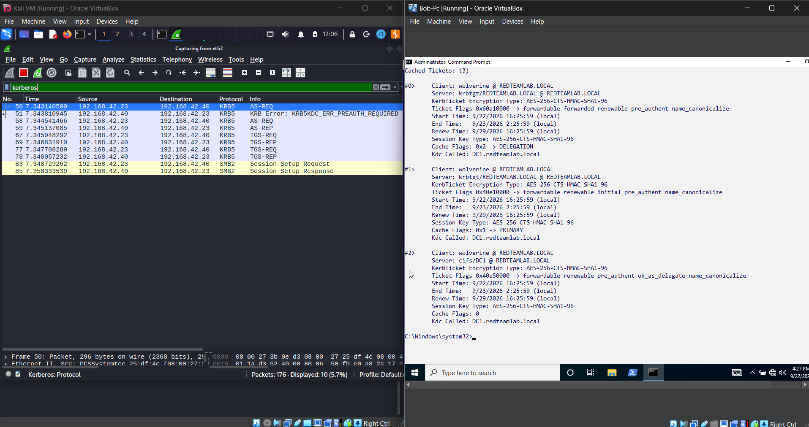

---

# TGT vs Service Ticket

## TGT

TGT means:

    Ticket Granting Ticket

Purpose:

    Authenticate the domain identity to the KDC
    and request additional Kerberos tickets.

Example:

    krbtgt/REDTEAMLAB.LOCAL

Mental model:

    TGT = DOMAIN BADGE

---

## Service Ticket

A service ticket is created for a specific service.

Examples include:

    CIFS
    LDAP
    HTTP

Mental model:

    SERVICE TICKET = TICKET FOR ONE SERVICE

Relationship:

    TGT
     |
     +----> LDAP Service Ticket
     |
     +----> CIFS Service Ticket
     |
     +----> HTTP Service Ticket

---

# Authentication vs Authorization

One of the important concepts reinforced during Incident 13 was the difference between authentication and authorization.

## Authentication

Authentication answers:

    WHO ARE YOU?

Example:

    REDTEAMLAB\wolverine

Kerberos primarily participates in proving identity.

---

## Authorization

Authorization answers:

    WHAT ARE YOU ALLOWED TO DO?

Examples:

    Can the user read this SMB share?

    Can the user modify this file?

    Can the user access this resource?

Successfully authenticating to a service does not automatically mean the account has permission to access every resource behind that service.

Authentication proves identity.

Authorization determines permissions.

---

# Kerberos vs NTLM

Kerberos and NTLM use different authentication mechanisms.

| Characteristic | Kerberos | NTLM |
|---|---|---|
| Uses tickets | Yes | No |
| Uses a TGT | Yes | No |
| Uses a KDC | Yes | No |
| Common in Active Directory | Yes | Yes / fallback situations |
| Wireshark indicators | `AS-REQ`, `AS-REP`, `TGS-REQ`, `TGS-REP` | `NTLMSSP_NEGOTIATE`, `NTLMSSP_AUTH` |

Kerberos model:

    CLIENT
       |
       v
    KDC
       |
       +---- TGT
       |
       +---- SERVICE TICKET
                 |
                 v
              SERVICE

NTLM instead uses a challenge-response authentication process rather than the Kerberos ticket system.

---

# DNS and Domain Controller Discovery

Active Directory relies heavily on DNS.

A record:

    Hostname -> IP Address

SRV record:

    Service -> Port -> Host

An important Active Directory SRV query used during the lab was:

    dig @192.168.42.40 _ldap._tcp.dc._msdcs.redteamlab.local SRV

This identifies a Domain Controller providing LDAP services for the domain.

The result pointed to DC1 and LDAP port 389.

Windows can also locate a Domain Controller using:

    nltest /dsgetdc:redteamlab.local

This returns information about the Domain Controller associated with the domain.

---

# SID

SID means:

    Security Identifier

A SID uniquely identifies a Windows security principal such as:

- User
- Group
- Computer

Example structure:

    S-1-5-21-...-1104

The final component is the RID.

Common RID values discussed during the investigation included:

    500 = Administrator

    512 = Domain Admins

    513 = Domain Users

SID information can be inspected with:

    whoami /user

Group memberships can be inspected with:

    whoami /groups

---

# Commands Used During Incident 13

## Windows Identity

    hostname

    whoami

    whoami /user

    whoami /groups

    ipconfig /all

---

## Domain Verification

    echo %USERDOMAIN%

    echo %LOGONSERVER%

    nltest /dsgetdc:redteamlab.local

---

## Active Directory Enumeration

    net user /domain

    net group /domain

    net group "Domain Admins" /domain

    net group "Enterprise Admins" /domain

    setspn -Q */*

---

## Kerberos

    klist

    klist purge

---

## SMB

    dir \\DC1\NETLOGON

    net use

    net use * /delete /y

---

## DC1 PowerShell

    hostname

    ipconfig /all

    (Get-CimInstance Win32_ComputerSystem).Domain

    Get-ADDomain

---

## Kali

    ip -br a

    ip route

    dig @192.168.42.40 _ldap._tcp.dc._msdcs.redteamlab.local SRV

---

## Wireshark Filters

    kerberos

Useful combined investigation filter:

    dns || kerberos || smb2

---

# Screenshot Index

| # | Screenshot | Content |
|---|---|---|
| 01 | `01-dc1-environment.png` | DC1 hostname, IP and domain |
| 02 | `02-bob-environment.png` | BOB-PC hostname, IP, domain and current user |
| 03 | `03-alice-environment.png` | ALICE-PC hostname, IP and user |
| 04 | `04-kali-network.png` | Kali interfaces and routing |
| 05 | `05-domain-enumeration.png` | Domain users and groups |
| 06 | `06-domain-admins.png` | Domain Admins and Enterprise Admins |
| 07 | `07-spn-enumeration.png` | SPN enumeration and `sqladmin` finding |
| 08 | `08-klist-tickets.png` | Existing Kerberos tickets |
| 09 | `09-klist-purge.png` | Empty Kerberos cache after purge |
| 10 | `10-wireshark-kerberos.png` | Kerberos authentication sequence |
| 11 | `11-klist-cifs.png` | New tickets after SMB access |

---

# Main Finding of Incident 13

The most significant finding was:

    Account:
    sqladmin

    Distinguished Name:
    CN=sqladmin,CN=Users,DC=redteamlab,DC=local

    SPN:
    DC1/sqladmin.REDTEAMLAB.local:64123

Observed privileges:

    Domain Admin

    Enterprise Admin

The relationship is:

    sqladmin
       |
       +---- Domain Account
       |
       +---- SPN
       |
       +---- Service Account
       |
       +---- Kerberos Service Ticket
       |
       +---- Potential Offline Password Analysis
       |
       +---- Highly Privileged Account

This makes the account an interesting potential Kerberoasting target inside the lab.

---

# Kerberoasting — Conceptual Attack Path

Incident 13 did not execute the Kerberoasting attack.

However, the enumeration phase discovered the conditions that make the technique relevant.

Conceptually:

    AUTHENTICATED DOMAIN USER
               |
               v
         ENUMERATE SPNs
               |
               v
       FIND SERVICE ACCOUNT
               |
               v
      REQUEST SERVICE TICKET
               |
               v
              TGS
               |
               v
     OFFLINE PASSWORD ANALYSIS
               |
               v
          PASSWORD WEAK?
            /       \
          NO         YES
                      |
                      v
               CREDENTIALS
                      |
                      v
              ACCOUNT ACCESS
                      |
                      v
                 PRIVILEGES

The important lesson is that the attack path was discovered through enumeration.

Several pieces of information were correlated:

    USER ENUMERATION
           +
    GROUP ENUMERATION
           +
    PRIVILEGE ENUMERATION
           +
    SPN ENUMERATION
           =
    POTENTIAL ATTACK PATH

---

# What I Learned

Incident 13 connected Active Directory concepts that had previously been studied separately.

The complete methodology became:

    IDENTIFY MYSELF
          |
          v
    IDENTIFY THE HOST
          |
          v
    IDENTIFY THE DOMAIN
          |
          v
    FIND THE DOMAIN CONTROLLER
          |
          v
    ENUMERATE USERS
          |
          v
    ENUMERATE GROUPS
          |
          v
    IDENTIFY PRIVILEGED ACCOUNTS
          |
          v
    ENUMERATE SPNs
          |
          v
    CORRELATE SERVICES AND ACCOUNTS
          |
          v
    INSPECT KERBEROS TICKETS
          |
          v
    GENERATE SERVICE ACCESS
          |
          v
    OBSERVE KERBEROS IN WIRESHARK
          |
          v
    IDENTIFY POSSIBLE ATTACK PATHS

The most important lesson is:

> Enumeration is not simply collecting usernames, groups and services. The real value comes from correlating those objects until relationships and potential attack paths become visible.

---

# Key Takeaway 1 — Active Directory Is About Relationships

Finding a username is only the beginning.

Useful questions include:

    WHO IS THIS ACCOUNT?

    WHICH GROUPS CONTAIN IT?

    WHAT PRIVILEGES DOES IT HAVE?

    DOES IT RUN A SERVICE?

    DOES IT HAVE AN SPN?

    WHICH HOST IS ASSOCIATED WITH IT?

    WHICH SERVICES ARE ASSOCIATED WITH IT?

Those relationships are what make Active Directory enumeration valuable.

---

# Key Takeaway 2 — Kerberos Is a Ticket System

The basic model is:

    USER AUTHENTICATION
          |
          v
         TGT
          |
          v
    SERVICE TICKET
          |
          v
    TARGET SERVICE

TGT:

    Domain badge

Service ticket:

    Ticket for a specific service

---

# Key Takeaway 3 — klist Shows the Current Kerberos State

The command:

    klist

shows tickets currently stored in the user's Kerberos cache.

It is not simply a historical log.

After:

    klist purge

the current cached tickets are removed.

---

# Key Takeaway 4 — Accessing a Service Can Generate a Ticket

Executing:

    dir \\DC1\NETLOGON

caused Windows to access the SMB/CIFS service.

That activity resulted in a Kerberos service ticket that could then be inspected with:

    klist

This connected:

    USER ACTION
       |
       v
    SERVICE ACCESS
       |
       v
    KERBEROS TICKET
       |
       v
    NETWORK TRAFFIC

---

# Key Takeaway 5 — Wireshark Makes Kerberos Visible

Kerberos was no longer just theoretical.

The authentication sequence appeared directly in network traffic:

    AS-REQ
       |
       v
    PREAUTH_REQUIRED
       |
       v
    AS-REQ
       |
       v
    AS-REP
       |
       v
    TGS-REQ
       |
       v
    TGS-REP
       |
       v
    SMB2 SESSION SETUP

This connected the Windows ticket cache with actual packets on the network.

---

# Key Takeaway 6 — SPNs Can Reveal Interesting Accounts

The `sqladmin` account demonstrated why SPN enumeration matters.

The important relationship was:

    SERVICE ACCOUNT
          +
         SPN
          +
    HIGH PRIVILEGES
          =
    INTERESTING RED TEAM TARGET

---

# What Was Not Performed

The following activities were not completed during Incident 13:

- Practical Kerberoasting
- Password cracking of `sqladmin`
- Privilege escalation
- Lateral movement
- Domain compromise
- PortSwigger Authentication lab
- Linux speed drill
- Final 12-question assessment

Incident 13 stopped after Active Directory enumeration, Kerberos investigation, Wireshark correlation and identification of the potential Kerberoasting target.

---

# Next Steps

The logical continuation is:

    ACTIVE DIRECTORY ENUMERATION
               |
               v
        SPN IDENTIFICATION
               |
               v
          KERBEROASTING
               |
               v
    OFFLINE PASSWORD ANALYSIS
               |
               v
      CREDENTIAL VALIDATION
               |
               v
       PRIVILEGE ANALYSIS
               |
               v
     ATTACK PATH EVALUATION

Before moving deeper into the attack chain, the concepts from Incident 13 should become reproducible without relying completely on step-by-step instructions.

Other pending exercises:

1. Complete the 12-question Active Directory/Kerberos assessment
2. Complete one PortSwigger Authentication lab
3. Complete the Linux command-line speed drill
4. Continue into practical Kerberoasting when the Kerberos model is fully understood

---

# Incident 13 Final Summary

Incident 13 demonstrated how an authenticated domain user can gather meaningful information about an Active Directory environment using standard Windows functionality.

The investigation started with host and domain verification.

It then progressed through:

    Environment Verification
            |
            v
    Domain Enumeration
            |
            v
    User Enumeration
            |
            v
    Group Enumeration
            |
            v
    Privilege Identification
            |
            v
    SPN Enumeration
            |
            v
    Kerberos Ticket Inspection
            |
            v
    Kerberos Cache Purge
            |
            v
    SMB Access
            |
            v
    Wireshark Analysis
            |
            v
    Attack Path Identification

The most important finding was:

> `sqladmin` has a registered SPN and is also a highly privileged Active Directory account.

This creates a potential Kerberoasting attack path and demonstrates why enumeration is one of the most important parts of an Active Directory Red Team assessment.

The main lesson from Incident 13 is therefore not:

> "Which hacking tool should I run?"

The better methodology is:

    WHO AM I?
        |
        v
    WHERE AM I?
        |
        v
    WHAT DOMAIN AM I IN?
        |
        v
    WHERE IS THE DOMAIN CONTROLLER?
        |
        v
    WHO ELSE EXISTS?
        |
        v
    WHICH GROUPS EXIST?
        |
        v
    WHO IS PRIVILEGED?
        |
        v
    WHICH SERVICES EXIST?
        |
        v
    WHICH ACCOUNTS HAVE SPNs?
        |
        v
    WHICH KERBEROS TICKETS EXIST?
        |
        v
    WHAT RELATIONSHIPS EXIST?
        |
        v
    WHAT ATTACK PATH DOES THE ENVIRONMENT REVEAL?

That transition — from executing individual commands to understanding relationships inside the Active Directory environment — is the main objective completed in Incident 13.
