# Incident 14 — Kerberoasting from a Standard Domain User

## Overview

Incident 14 focuses on performing a complete Kerberoasting workflow inside the isolated `redteamlab.local` Active Directory laboratory.

The objective of this incident was to start from a **normal domain user account**, enumerate Service Principal Names, identify a Kerberoastable service account, request its Kerberos service ticket, extract the ticket material, identify its format, perform offline password cracking, observe the Kerberos exchange in Wireshark, and finally validate the privileges of the recovered account.

The starting account was:

    REDTEAMLAB\gambit

`gambit` is a normal domain user and does **not** have an SPN.

Therefore, `gambit` itself is not the Kerberoasting target.

Instead, `gambit` was used as the authenticated low-privileged starting point from which the domain was queried.

The interesting account discovered during enumeration was:

    sqladmin

because it had:

    Registered SPN
          +
    Kerberos Service Ticket
          +
    Weak Password
          +
    High Domain Privileges

This made `sqladmin` the Kerberoasting target for Incident 14.

All activity was performed inside my own isolated Active Directory laboratory.

---

# Incident Objective

The main attack path demonstrated in this incident was:

    STANDARD DOMAIN USER
            |
            v
      AUTHENTICATE TO AD
            |
            v
       ENUMERATE SPNs
            |
            v
      FIND sqladmin SPN
            |
            v
       REQUEST A TGS
            |
            v
    EXTRACT TICKET MATERIAL
            |
            v
     IDENTIFY HASH FORMAT
            |
            v
     OFFLINE PASSWORD CRACK
            |
            v
      RECOVER PASSWORD
            |
            v
    VALIDATE sqladmin LOGIN
            |
            v
     VERIFY DOMAIN GROUPS

---

# Lab Environment

| System | Role | IP Address |
|---|---|---|
| DC1 | Domain Controller / DNS / KDC | `192.168.42.40` |
| Kali | Red Team workstation / Impacket / Hashcat / Wireshark | `192.168.42.20` |
| BOB-PC | Domain-joined Windows client used for final credential validation | `192.168.42.23` |

Active Directory domain:

    redteamlab.local

NetBIOS domain:

    REDTEAMLAB

Starting domain account:

    gambit

Starting laboratory credential:

    REDTEAMLAB\gambit
    Password1

Kerberoasting target discovered during the incident:

    sqladmin

Recovered laboratory password:

    Password45

---

# Important Kerberoasting Requirement

Kerberoasting targets accounts that have a registered:

    SPN — Service Principal Name

The account:

    gambit

does not have an SPN.

Therefore this incident did **not** attempt to Kerberoast `gambit`.

Instead:

    gambit
       |
       | authenticated domain user
       v
    queries Active Directory
       |
       v
    discovers sqladmin
       |
       v
    sqladmin has SPN
       |
       v
    sqladmin can be targeted with Kerberoasting

This distinction is important.

A normal domain account can be the **starting point** of a Kerberoasting attack without being the **target** of Kerberoasting.

---

# Phase 1 — Environment Verification

The first step was to confirm the identity and network configuration of the systems involved.

Kerberos is time-sensitive, so the clocks of Kali and DC1 must also be reasonably synchronized.

A large time difference between the client and the Domain Controller can cause Kerberos authentication failures.

---

## DC1 Verification

On DC1, PowerShell was used to verify the Domain Controller environment.

Commands:

    hostname

    ipconfig /all

    (Get-CimInstance Win32_ComputerSystem).Domain

    Get-ADDomain

Important information:

    Hostname:
    DC1

    IP Address:
    192.168.42.40

    Domain:
    redteamlab.local

DC1 performs several important roles inside the laboratory:

    Active Directory Domain Controller
    DNS Server
    Kerberos Key Distribution Center
    LDAP Server

### Screenshot 01

    01-dc1-environment.png

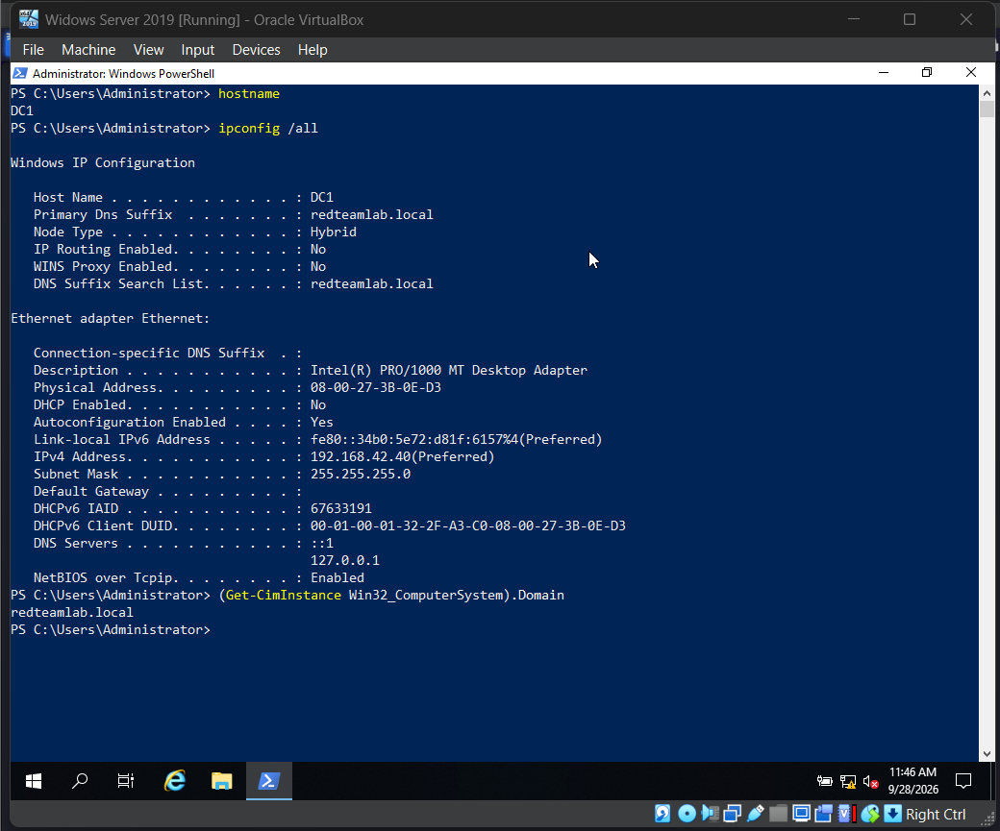
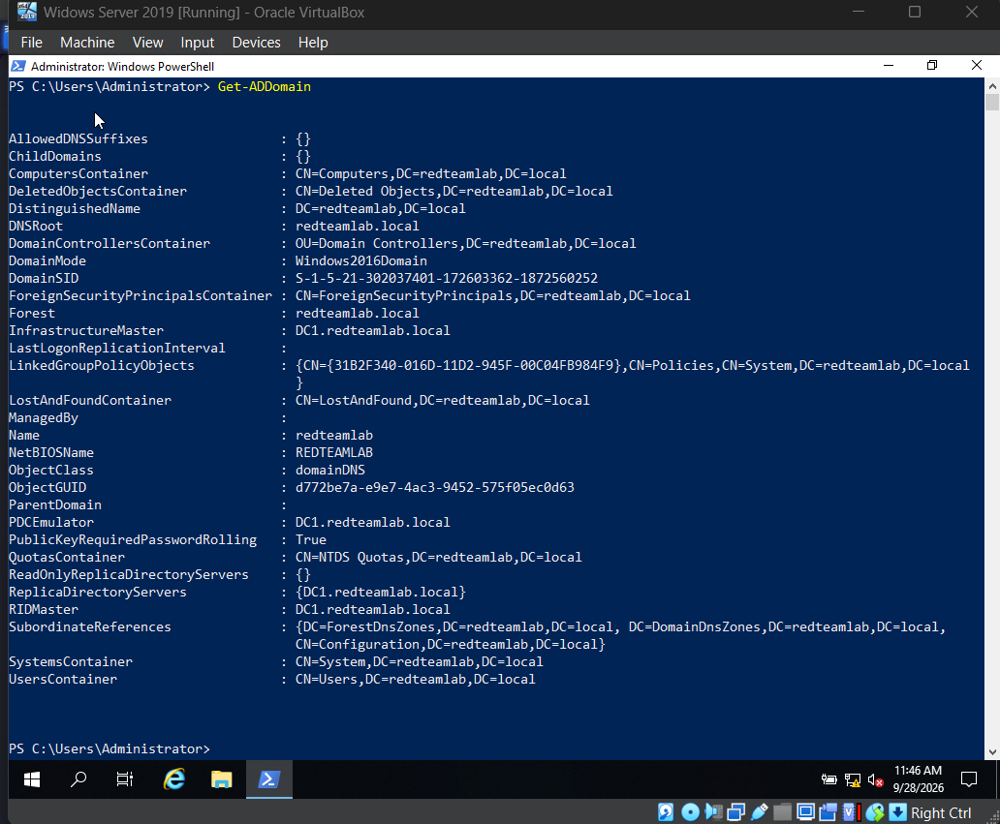

---

## Kali Verification

On Kali:

    ip -br a

    ip route

These commands were used to confirm the Red Team network interface and routing information.

Important laboratory address:

    Kali:
    192.168.42.20

Network:

    192.168.42.0/24

### Screenshot 02

    02-kali-network.png

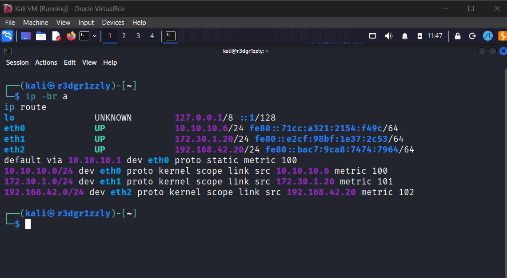

---

# Phase 2 — Impacket Verification

Kerberoasting was performed from Kali using the Impacket implementation of `GetUserSPNs`.

The first step was to verify that the tool was installed.

Command:

    which impacket-GetUserSPNs

If the tool is missing, the required package can be installed with:

    sudo apt install python3-impacket -y

The important concept is that Impacket provides Python implementations of several Windows and Active Directory protocols that are extremely useful during authorized Red Team assessments.

### Screenshot 03

    03-impacket-check.png

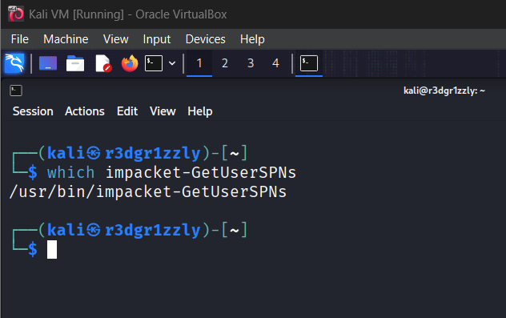

---

# Phase 3 — SPN Enumeration

The attack started using the credentials of the normal domain user:

    gambit

Command:

    impacket-GetUserSPNs redteamlab.local/gambit:'Password1' -dc-ip 192.168.42.40

This authenticated to the domain and queried Active Directory for accounts that had registered Service Principal Names.

Conceptually:

    gambit credentials
          |
          v
    authenticate to DC1
          |
          v
    query Active Directory
          |
          v
    enumerate accounts with SPNs

The important result was the discovery of:

    sqladmin

with the SPN:

    DC1/sqladmin.REDTEAMLAB.local:64123

This was the important relationship:

    sqladmin
       |
       +---- Domain Account
       |
       +---- Registered SPN
       |
       +---- Kerberos Service Principal
       |
       +---- Potential Kerberoasting Target

### Screenshot 04

    04-spn-enumeration.png

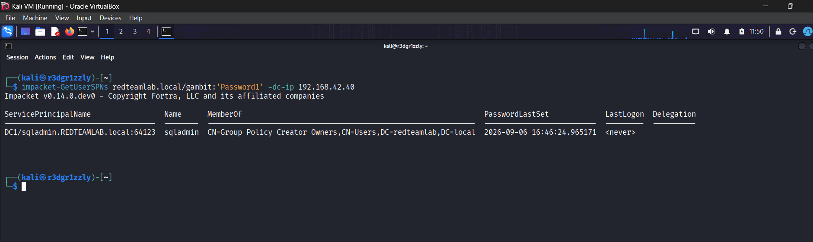

---

# Why SPN Enumeration Matters

Kerberos uses Service Principal Names to uniquely identify services.

A simplified relationship is:

    ACCOUNT
       |
       v
      SPN
       |
       v
    SERVICE

A domain user can request a Kerberos service ticket for a registered SPN.

Therefore, during an Active Directory assessment, the following relationship is very important:

    DOMAIN ACCOUNT
          +
         SPN
          =
    KERBEROASTABLE ACCOUNT

This does not automatically mean that the account will be compromised.

The success of the offline attack depends heavily on the strength of the service account password.

---

# Phase 4 — Requesting the Kerberos TGS

After identifying `sqladmin`, the next step was to request the Kerberos service ticket associated with the account's SPN.

Command:

    impacket-GetUserSPNs redteamlab.local/gambit:'Password1' -dc-ip 192.168.42.40 -request -outputfile tgs_hashes.txt

This performs two important actions:

1. Enumerates Kerberoastable SPN accounts.
2. Requests Kerberos service ticket material and saves it to a file.

Output file:

    tgs_hashes.txt

Conceptually:

    gambit
       |
       | valid domain credentials
       v
    DC1 / KDC
       |
       | request ticket for sqladmin SPN
       v
    TGS-REP
       |
       v
    Service Ticket
       |
       v
    tgs_hashes.txt

### Screenshot 05

    05-tgs-request.png

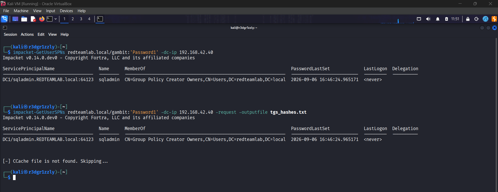

---

# Phase 5 — Inspecting the Extracted Ticket Material

The output file was inspected with:

    cat tgs_hashes.txt

The important observation was that this file did **not** contain the plaintext password of `sqladmin`.

Instead, it contained Kerberos TGS material that could be analyzed offline.

The extracted line contained a format similar to:

    $krb5tgs$23$...

The important part was:

    krb5tgs
    etype 23

This indicates Kerberos TGS material using RC4-HMAC.

### Screenshot 06

    06-tgs-hash-format.png

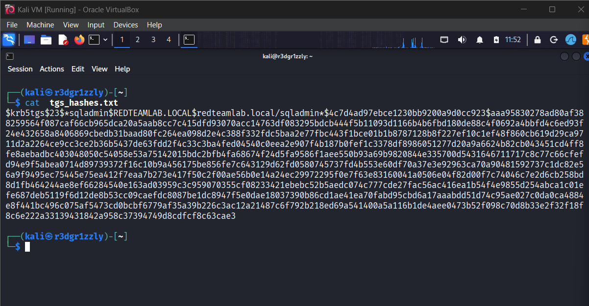

---

# What Was Actually Obtained?

At this stage the password had **not** been recovered.

The attack had obtained:

    Kerberos Service Ticket Material

not:

    Plaintext Password

This distinction is fundamental.

The process was:

    REQUEST TGS
        |
        v
    RECEIVE TGS-REP
        |
        v
    EXTRACT CRACKABLE MATERIAL
        |
        v
    PERFORM OFFLINE PASSWORD GUESSING

The password itself was never transmitted over the network in plaintext.

---

# Phase 6 — Identifying the Hash Format

Before using Hashcat, the extracted material was identified.

Command:

    name-that-hash --file tgs_hashes.txt

The format was identified as:

    Kerberos 5 TGS-REP
    etype 23

Hashcat mode:

    13100

This demonstrates an important password-cracking methodology:

    OBTAIN HASH / TICKET MATERIAL
             |
             v
      IDENTIFY FORMAT
             |
             v
      IDENTIFY ALGORITHM
             |
             v
       SELECT TOOL MODE
             |
             v
       ATTEMPT CRACKING

It is better to identify the format rather than blindly memorizing Hashcat mode numbers.

### Screenshot 07

    07-hash-format-identified.png

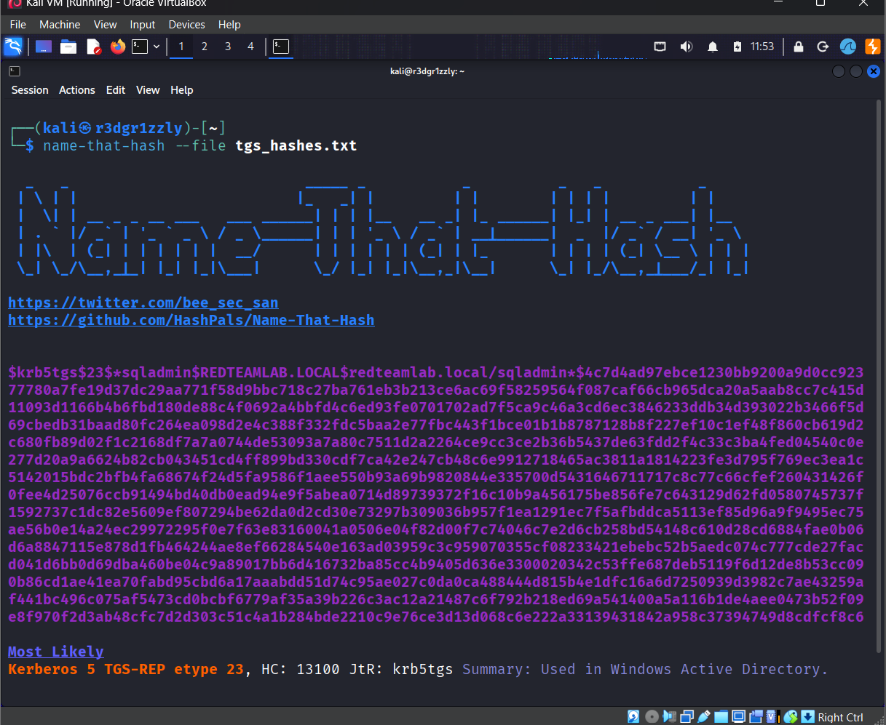

---

# Phase 7 — Offline Password Cracking

The extracted Kerberos TGS material was then tested using Hashcat.

Command:

    hashcat -m 13100 tgs_hashes.txt /usr/share/wordlists/rockyou.txt

Components:

    hashcat

Password recovery tool.

    -m 13100

Kerberos 5 TGS-REP etype 23 mode.

    tgs_hashes.txt

Extracted Kerberos ticket material.

    /usr/share/wordlists/rockyou.txt

Password candidate wordlist.

The password was successfully recovered:

    sqladmin : Password45

Hashcat reported:

    Status: Cracked

### Screenshot 08

    08-hashcat-cracked.png

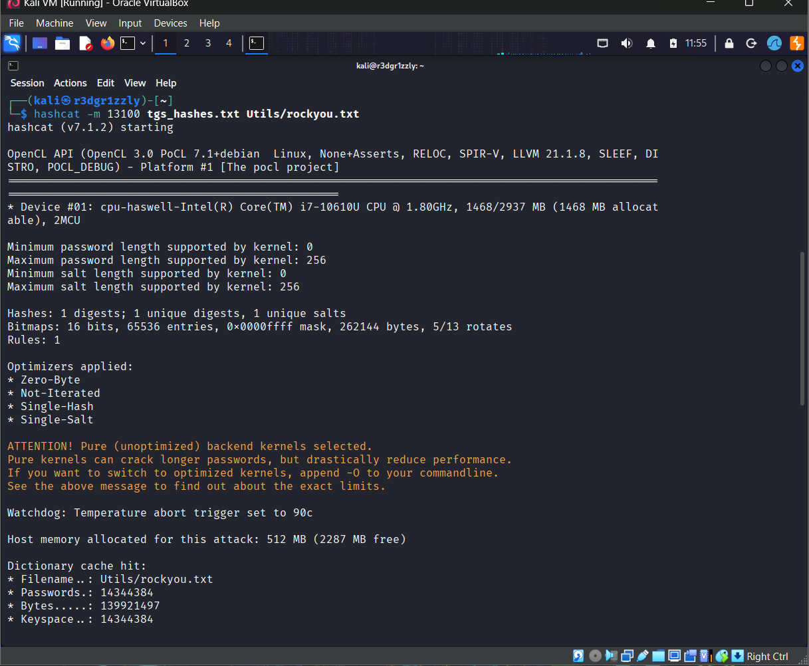
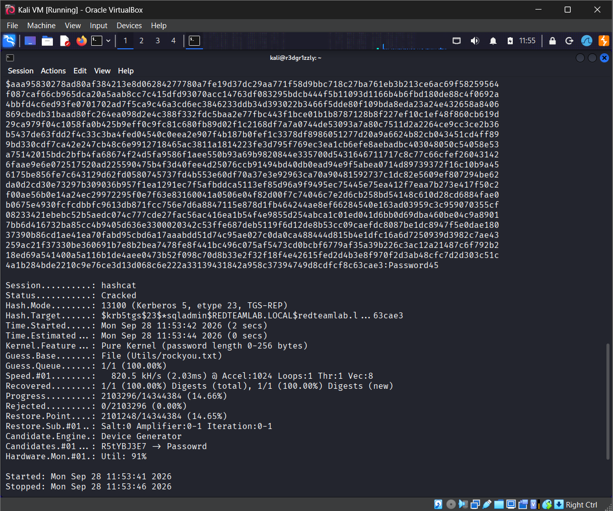

---

# Why Kerberoasting Can Be Cracked Offline

This is one of the most important concepts from Incident 14.

After the service ticket has been obtained, password guesses can be tested locally.

The Domain Controller is no longer involved in each password attempt.

Conceptually:

    DOMAIN CONTROLLER
           |
           | issues TGS
           v
       ATTACKER
           |
           v
    saves ticket material
           |
           v
       HASHCAT
           |
           v
     password guesses
           |
           v
    OFFLINE VALIDATION

The attack therefore avoids repeatedly sending password guesses to the Domain Controller.

This is why service account password strength is extremely important.

---

# Phase 8 — Wireshark Kerberos Investigation

The Kerberoasting request was repeated while capturing traffic with Wireshark on Kali.

Interface:

    eth2

Wireshark display filter:

    kerberos

A more specific filter can also be used:

    kerberos.msg_type == 12 || kerberos.msg_type == 13

The TGS request was repeated with:

    impacket-GetUserSPNs redteamlab.local/gambit:'Password1' -dc-ip 192.168.42.40 -request -outputfile tgs_hashes2.txt

The important Kerberos packets observed were:

    TGS-REQ

and:

    TGS-REP

Kerberos message types:

    TGS-REQ = 12

    TGS-REP = 13

---

# Kerberos TGS Flow

The network flow observed in Wireshark was:

    KALI / gambit                         DC1 / KDC
         |                                   |
         | -------- TGS-REQ ---------------> |
         |                                   |
         | Request service ticket            |
         | for sqladmin SPN                  |
         |                                   |
         | <------- TGS-REP ---------------- |
         |                                   |
         | Kerberos service ticket returned  |
         |                                   |

This packet exchange directly correlates with the Impacket command.

The complete relationship is:

    GetUserSPNs -request
            |
            v
        TGS-REQ
            |
            v
         DC1 / KDC
            |
            v
        TGS-REP
            |
            v
    Service Ticket Material
            |
            v
     tgs_hashes.txt

---

# TGS-REQ

TGS-REQ means:

    Ticket Granting Service Request

The client asks the KDC for a service ticket.

In this incident, the requested service was associated with:

    sqladmin

and its SPN:

    DC1/sqladmin.REDTEAMLAB.local:64123

---

# TGS-REP

TGS-REP means:

    Ticket Granting Service Reply

The KDC returns the requested service ticket.

The ticket contains encrypted information associated with the service account.

That encrypted material is what makes offline Kerberoasting password analysis possible.

---

# Wireshark Details

The TGS exchange and the Kerberos details were documented together in one screenshot.

Important information visible in the packet analysis included:

    TGS-REQ

    TGS-REP

    SPN:
    DC1/sqladmin.REDTEAMLAB.local:64123

    Encryption Type:
    RC4-HMAC / etype 23

### Screenshot 09

    09-wireshark-tgs.png

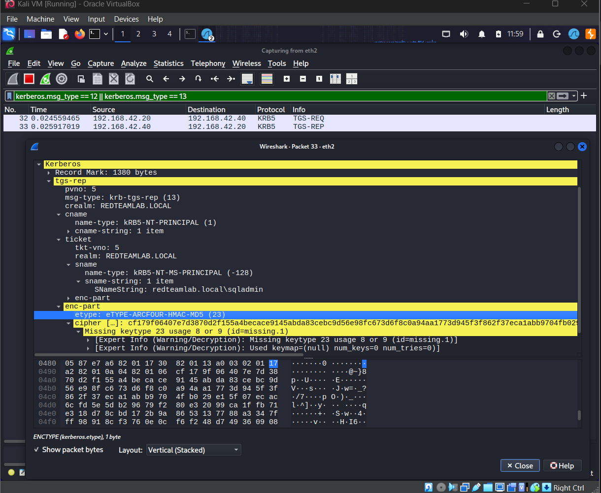

---

# Phase 9 — Credential and Privilege Validation

After recovering the laboratory password:

    Password45

the next objective was to verify that the credential actually belonged to the expected account and determine the account's privileges.

BOB-PC was started for this phase.

Login credentials:

    REDTEAMLAB\sqladmin

    Password45

After successful login, the user context and group memberships were inspected.

Useful commands:

    whoami

    whoami /user

    whoami /groups

The important result was confirmation that the authenticated user was:

    REDTEAMLAB\sqladmin

and that the account had privileged Active Directory group memberships.

This confirmed that the Kerberoasting attack had recovered credentials belonging to a high-value domain account.

The login validation and group membership were documented together in one screenshot.

### Screenshot 10

    10-sqladmin-login-groups.png

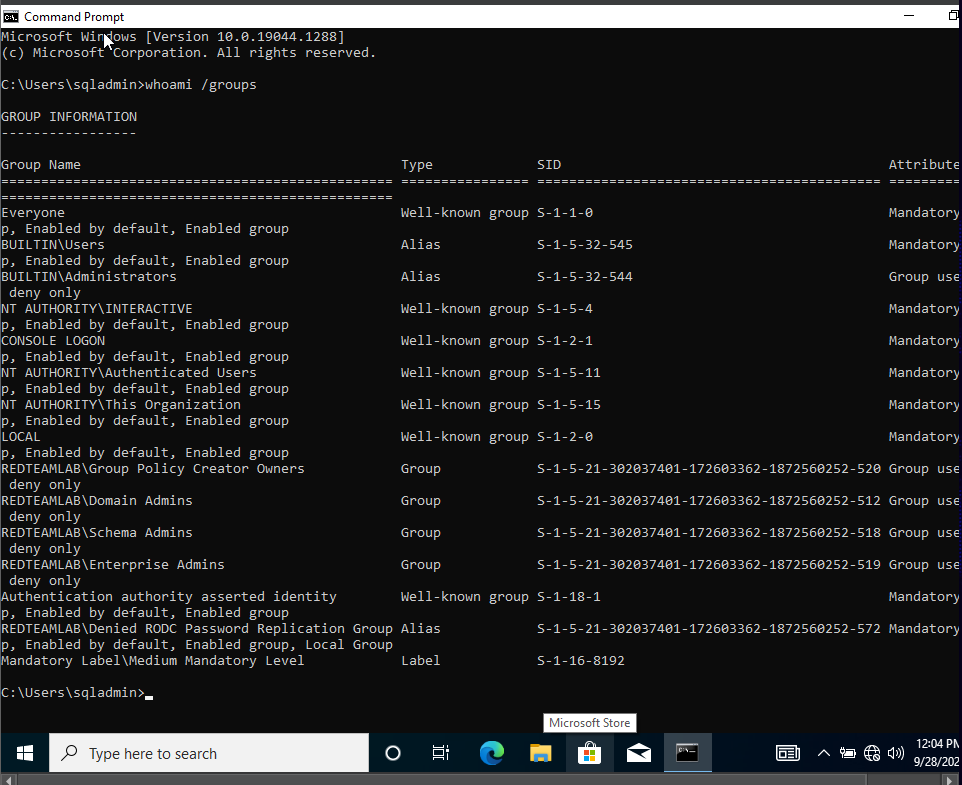

---

# Complete Attack Chain

The complete Incident 14 workflow was:

    gambit
    Normal Domain User
           |
           v
    Authenticate to Domain
           |
           v
    Query Active Directory
           |
           v
    Enumerate SPNs
           |
           v
    Discover sqladmin
           |
           v
    sqladmin has registered SPN
           |
           v
    Request Kerberos TGS
           |
           v
    Receive TGS-REP
           |
           v
    Save Kerberos ticket material
           |
           v
    Identify etype 23
           |
           v
    Hashcat mode 13100
           |
           v
    Offline Password Guessing
           |
           v
    Recover Password45
           |
           v
    Authenticate as sqladmin
           |
           v
    Verify Privileged Groups

---

# Tools Used

## Windows / PowerShell

    hostname

    ipconfig /all

    (Get-CimInstance Win32_ComputerSystem).Domain

    Get-ADDomain

    whoami

    whoami /user

    whoami /groups

---

## Kali Networking

    ip -br a

    ip route

---

## Impacket

    which impacket-GetUserSPNs

SPN enumeration:

    impacket-GetUserSPNs redteamlab.local/gambit:'Password1' -dc-ip 192.168.42.40

Request Kerberos TGS material:

    impacket-GetUserSPNs redteamlab.local/gambit:'Password1' -dc-ip 192.168.42.40 -request -outputfile tgs_hashes.txt

Wireshark test request:

    impacket-GetUserSPNs redteamlab.local/gambit:'Password1' -dc-ip 192.168.42.40 -request -outputfile tgs_hashes2.txt

---

## Linux

    cat tgs_hashes.txt

---

## Hash Identification

    name-that-hash --file tgs_hashes.txt

---

## Hashcat

    hashcat -m 13100 tgs_hashes.txt /usr/share/wordlists/rockyou.txt

---

## Wireshark

General Kerberos filter:

    kerberos

TGS-only filter:

    kerberos.msg_type == 12 || kerberos.msg_type == 13

---

# Screenshot Index

| # | Filename | Content |
|---:|---|---|
| 01 | `01-dc1-environment.png` | DC1 hostname, IP address and Active Directory domain |
| 02 | `02-kali-network.png` | Kali interfaces and routing |
| 03 | `03-impacket-check.png` | Verification that Impacket GetUserSPNs is installed |
| 04 | `04-spn-enumeration.png` | SPN enumeration using `gambit`; `sqladmin` discovered |
| 05 | `05-tgs-request.png` | Kerberos TGS request and output file creation |
| 06 | `06-tgs-hash-format.png` | Contents of the extracted Kerberos TGS material |
| 07 | `07-hash-format-identified.png` | Kerberos TGS-REP etype 23 identified, Hashcat mode 13100 |
| 08 | `08-hashcat-cracked.png` | Hashcat successfully recovering `Password45` |
| 09 | `09-wireshark-tgs.png` | TGS-REQ, TGS-REP, SPN and encryption type in Wireshark |
| 10 | `10-sqladmin-login-groups.png` | Successful `sqladmin` login and privileged group membership |

Total screenshots:

    10

---

# Main Finding

The central finding of Incident 14 was:

    sqladmin

had a registered SPN:

    DC1/sqladmin.REDTEAMLAB.local:64123

The account's Kerberos service ticket used:

    Kerberos 5 TGS-REP
    etype 23
    RC4-HMAC

The extracted ticket material was successfully cracked offline.

Recovered laboratory credential:

    sqladmin : Password45

The recovered account also had elevated Active Directory privileges.

The dangerous relationship was therefore:

    SERVICE ACCOUNT
          +
         SPN
          +
    WEAK PASSWORD
          +
    HIGH PRIVILEGES
          =
    HIGH-IMPACT ATTACK PATH

---

# What Incident 14 Demonstrated

Incident 14 showed that an attacker does not necessarily need administrative access to begin discovering valuable Active Directory attack paths.

The starting position was:

    Normal Domain User

The starting user:

    gambit

was enough to enumerate SPN accounts.

This led to:

    sqladmin

which had an SPN.

The service ticket for that account was then requested.

The ticket material was analyzed offline.

The password was recovered.

The recovered credential was then validated.

The complete progression was:

    LOW PRIVILEGE
          |
          v
      ENUMERATION
          |
          v
      RELATIONSHIP
          |
          v
    KERBEROS TICKET
          |
          v
    OFFLINE ANALYSIS
          |
          v
      CREDENTIAL
          |
          v
      PRIVILEGE

---

# Important Lesson — Enumeration Before Exploitation

The attack did not begin with Hashcat.

It began with enumeration.

Without knowing that `sqladmin` had an SPN, there would have been no reason to request its service ticket.

The real sequence was:

    WHO AM I?
        |
        v
    WHAT DOMAIN AM I IN?
        |
        v
    WHAT ACCOUNTS EXIST?
        |
        v
    WHICH ACCOUNTS HAVE SPNs?
        |
        v
    WHICH ACCOUNT IS INTERESTING?
        |
        v
    WHAT KERBEROS TICKET CAN I REQUEST?
        |
        v
    WHAT CAN I LEARN FROM THAT TICKET?

This is a much better Red Team methodology than blindly launching tools.

---

# Important Lesson — SPN Does Not Mean Compromise

Finding an SPN does not automatically compromise an account.

The correct relationship is:

    SPN FOUND
       |
       v
    TGS REQUESTABLE
       |
       v
    TICKET MATERIAL AVAILABLE
       |
       v
    PASSWORD GUESSING POSSIBLE
       |
       v
    PASSWORD STRONG?
       |
      / \
    YES  NO
     |    |
     |    v
     |  PASSWORD MAY BE RECOVERED
     |
     v
    ATTACK MAY FAIL

The weakness exploited during this incident was ultimately the password strength of the service account.

---

# Important Lesson — Passwords Do Not Travel in Plaintext

The Kerberoasting process did not capture:

    Password45

directly from the network.

Instead:

    Kerberos ticket material

was obtained.

Password candidates were then tested against that material offline.

Therefore:

    TGS-REP
       !=
    Plaintext Password

---

# Important Lesson — Offline Cracking Changes the Attack Surface

Once the ticket material had been saved locally, Hashcat performed the password testing without repeatedly contacting DC1.

Conceptually:

    DC1
     |
     | one ticket request
     v
    ATTACKER
     |
     +---- candidate 1
     |
     +---- candidate 2
     |
     +---- candidate 3
     |
     +---- candidate ...
     |
     v
    correct password

This demonstrates why strong passwords are extremely important for accounts associated with Kerberos SPNs.

---

# Important Lesson — Wireshark Connects the Tool to the Protocol

One of the most useful parts of the incident was correlating the Impacket command with actual network traffic.

Command:

    impacket-GetUserSPNs ... -request

Network result:

    TGS-REQ
       |
       v
    TGS-REP

This connected three levels of understanding:

    TOOL
      |
      v
    PROTOCOL
      |
      v
    ATTACK TECHNIQUE

Instead of treating Kerberoasting as a magic command, the network capture showed exactly where Kerberos was involved.

---

# Incident 13 vs Incident 14

Incident 13 focused on:

    Active Directory Enumeration
    Users
    Groups
    Privileged Accounts
    SPNs
    TGTs
    Service Tickets
    SMB/CIFS
    Wireshark Kerberos Flow

Incident 14 continued directly from that knowledge.

Incident 14 focused on:

    Standard Domain User
          |
          v
    SPN Enumeration
          |
          v
    Kerberoasting Target
          |
          v
    TGS Request
          |
          v
    Ticket Extraction
          |
          v
    Hash Identification
          |
          v
    Offline Cracking
          |
          v
    Credential Validation

Incident 13 answered:

> "Which accounts and Kerberos relationships exist?"

Incident 14 answered:

> "What offensive path can be built from one of those relationships?"

---

# Knowledge Progression

The Active Directory study path now looks like:

    ACTIVE DIRECTORY FUNDAMENTALS
                |
                v
         DOMAIN / DC / DNS
                |
                v
        USERS AND GROUPS
                |
                v
          PRIVILEGED USERS
                |
                v
              SPNs
                |
                v
          KERBEROS TGT
                |
                v
       KERBEROS SERVICE TICKET
                |
                v
             SMB/CIFS
                |
                v
       WIRESHARK KERBEROS
                |
                v
      SPN TARGET IDENTIFICATION
                |
                v
          KERBEROASTING
                |
                v
       OFFLINE PASSWORD CRACK
                |
                v
        CREDENTIAL VALIDATION

---

# Questions I Can Now Answer

After Incident 14 I should be able to explain:

1. What is an SPN?
2. Why does Kerberos use SPNs?
3. Why can a normal domain user enumerate SPNs?
4. Why was `gambit` the starting account but not the Kerberoasting target?
5. Why was `sqladmin` Kerberoastable?
6. What does `GetUserSPNs` query?
7. What does the `-request` option do?
8. What is a TGS?
9. What is a TGS-REQ?
10. What is a TGS-REP?
11. What does `$krb5tgs$23$` represent?
12. What does `etype 23` mean?
13. Why was Hashcat mode `13100` used?
14. Why is the password attack offline?
15. Why does the Domain Controller not see every password guess?
16. Why does password strength matter?
17. Why does finding an SPN not automatically mean account compromise?
18. How can Wireshark confirm the Kerberos ticket request?
19. Why was the recovered credential validated on a domain-joined workstation?
20. Why is a privileged service account with a weak password especially dangerous?

---

# Incident 14 Summary

Incident 14 demonstrated the complete Kerberoasting workflow inside an isolated Active Directory lab.

The operation began with the normal domain user:

    gambit

Using those credentials, Active Directory was queried for accounts with registered SPNs.

The account:

    sqladmin

was discovered with:

    DC1/sqladmin.REDTEAMLAB.local:64123

A Kerberos service ticket was requested for this SPN.

The returned Kerberos TGS material was saved locally and identified as:

    Kerberos 5 TGS-REP
    etype 23
    RC4-HMAC

Hashcat mode:

    13100

was then used with the laboratory wordlist.

The password was successfully recovered:

    Password45

Wireshark confirmed the underlying Kerberos exchange:

    TGS-REQ
        |
        v
    TGS-REP

The recovered credentials were then validated using:

    REDTEAMLAB\sqladmin

and the account's privileged group memberships were confirmed.

The complete attack path was therefore:

    NORMAL DOMAIN USER
            |
            v
       SPN ENUMERATION
            |
            v
       SERVICE ACCOUNT
            |
            v
         TGS REQUEST
            |
            v
      KERBEROS TICKET
            |
            v
      OFFLINE CRACKING
            |
            v
     PASSWORD RECOVERY
            |
            v
     CREDENTIAL VALIDATION
            |
            v
      PRIVILEGE CONFIRMATION

The most important lesson from Incident 14 is:

> Kerberoasting is not about magically stealing a password from Kerberos. It is about using normal Kerberos service-ticket functionality to obtain material associated with an SPN account and then testing password candidates offline. The real attack path begins with enumeration, depends on the existence of an SPN, and becomes dangerous when the associated service account uses a weak password and has high privileges.
