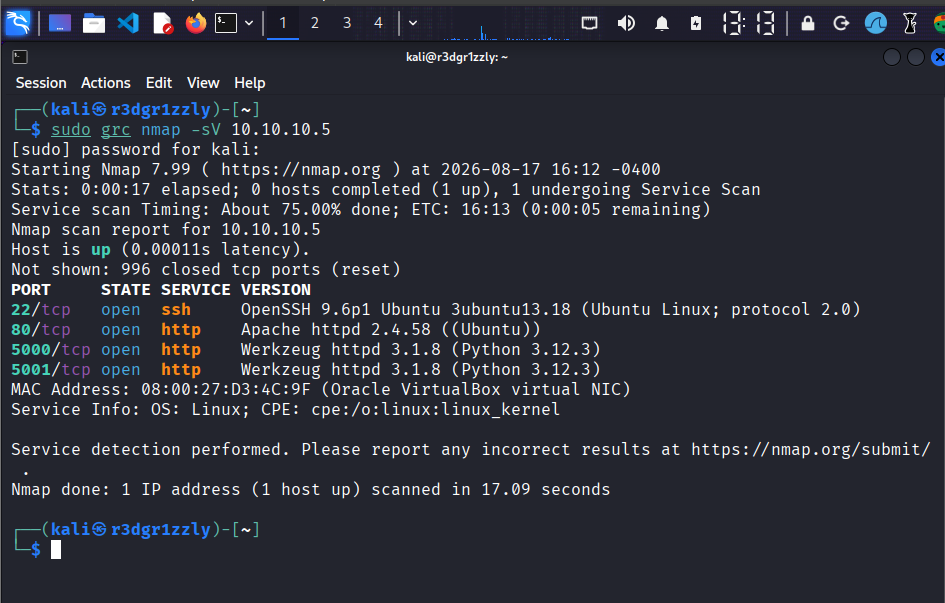
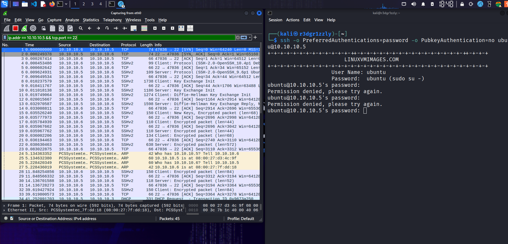
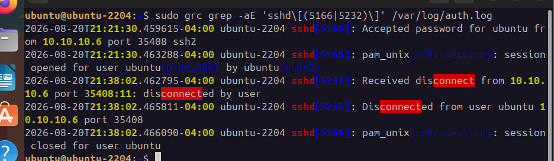

# Incident 7 — Full Security Incident Investigation

A complete security investigation was performed against a Linux server inside an isolated laboratory environment.

This incident represents the final investigation of the Cybersecurity Incident Lab and consolidates the activity, evidence, and concepts examined during the previous incidents.

Unlike the previous incidents, Incident 7 did not introduce a new attack technique. Instead, the objective was to review and correlate the evidence collected during the laboratory exercises in order to reconstruct the observed security activity, identify confirmed security weaknesses, assess their impact, and document the final findings.

The investigation combined:

- Network reconnaissance
- TCP traffic analysis
- Service identification
- Web reconnaissance
- HTTP investigation
- Web directory enumeration
- File upload analysis
- Filesystem evidence
- OS command injection
- SSH authentication analysis
- Network and host evidence correlation
- Incident timeline reconstruction
- Security impact assessment
- Remediation recommendations

---

## Investigation Goals

- Identify the target's exposed network services
- Analyze TCP connection behavior
- Identify services and protocols
- Review web reconnaissance activity
- Analyze HTTP requests and responses
- Identify accessible and unavailable web resources
- Investigate file upload functionality
- Analyze HTTP file upload traffic
- Investigate command injection behavior
- Determine the execution context of server-side commands
- Identify suspicious SSH authentication activity
- Analyze repeated SSH connections
- Correlate network traffic with host authentication logs
- Build an incident timeline
- Separate observations from hypotheses and confirmed findings
- Assess the security impact
- Recommend appropriate remediation

---

## Laboratory Environment

### Investigation / Attacker System

**Kali Linux**

IP address:

`10.10.10.6`

Primary tools used throughout the laboratory:

- Nmap
- Wireshark
- curl
- Gobuster
- Hydra
- Netcat

### Target System

**Ubuntu Server**

IP address:

`10.10.10.5`

The Ubuntu machine acted as the target system and hosted the services and applications investigated during the laboratory.

The environment was isolated from external production systems and all activity was performed in a controlled and authorized virtual laboratory.

---

## Investigation Methodology

The investigation followed an evidence-driven methodology:

```text
Observation
     |
     v
Hypothesis
     |
     v
Evidence Collection
     |
     v
Evidence Correlation
     |
     v
Finding
     |
     v
Impact Assessment
     |
     v
Remediation
```

A single observation was not automatically treated as proof of an attack or successful exploitation.

Whenever possible, network evidence was correlated with evidence collected directly from the target system.

This distinction was particularly important when analyzing encrypted protocols such as SSH, where network traffic can show connection behavior but cannot directly reveal authentication results.

---

## Investigation Phases

### Phase 1 — Network Reconnaissance

The Ubuntu target was examined to identify exposed TCP services and determine the visible attack surface.

Network traffic was analyzed to understand TCP behavior including:

- SYN
- SYN/ACK
- ACK
- RST
- FIN

Repeated connection attempts against multiple ports were observed during the scanning activity.

The investigation demonstrated that different TCP responses can provide information about whether a port is open, closed, or otherwise unreachable.

---

### Phase 2 — Service Investigation

Discovered ports were investigated to determine which services were actually listening on them.

Port numbers were treated as indicators rather than absolute proof of the application or protocol in use.

Service identification was strengthened by examining:

- Protocol behavior
- Connection responses
- Application responses
- Service banners
- Server headers

This demonstrated the importance of confirming service identification using multiple forms of evidence.

---

### Phase 3 — Web Reconnaissance

The web service hosted on the Ubuntu server was investigated for accessible resources and potentially undisclosed content.

Automated directory enumeration generated multiple HTTP requests against the target.

Relevant HTTP concepts examined during the investigation included:

- GET
- POST
- HTTP 200
- HTTP 404
- Request headers
- Response headers
- Requested paths
- Server responses

Network traffic was correlated with server-side evidence to distinguish existing resources from unavailable resources.

The activity demonstrated how automated web reconnaissance appears both in network traffic and in web server logs.

---

### Phase 4 — File Upload Investigation

File upload functionality in a custom Flask application was examined to determine how files were transmitted, processed, and stored by the server.

The investigation examined:

- POST requests
- `multipart/form-data`
- MIME types
- Filenames
- Server responses
- Filesystem evidence
- Upload storage locations

The HTTP request demonstrated that a file was transmitted to the server.

Filesystem inspection on Ubuntu was then used to confirm that the uploaded file was actually written to disk.

This distinction was important because network traffic alone demonstrated file transmission but did not independently prove that the server stored the file.

The investigation also identified insufficient file validation as a security weakness.

---

### Phase 5 — Command Injection Investigation

A deliberately vulnerable Flask application containing server-side functionality that interacted with operating system commands was investigated.

Normal application behavior was first established using the application's ping functionality.

User-controlled input was then supplied in a controlled manner to determine whether the input could influence the operating system command executed by the server.

The investigation confirmed that an additional operating system command could be executed.

The output of the additional command was returned in the HTTP response, providing evidence that command execution occurred on the Ubuntu target.

The investigation also identified the user context under which the vulnerable application executed the operating system command.

This demonstrated that unsanitized user-controlled input reaching a shell command can result in server-side command execution.

---

### Phase 6 — SSH Authentication Investigation

SSH activity against the Ubuntu server was analyzed for repeated authentication attempts and suspicious behavior.

Wireshark was used to examine network-level behavior while Ubuntu authentication logs provided host-level evidence.

The investigation distinguished between:

- TCP connection establishment
- SSH protocol negotiation
- Encrypted SSH traffic
- Authentication failures
- Invalid users
- Successful authentication events
- Connection termination

A TCP three-way handshake demonstrated that communication with the SSH service was possible.

However, the TCP handshake did not prove that authentication succeeded.

Because SSH authentication traffic is encrypted, host-based authentication logs were required to determine the actual authentication result.

The logs contained events including:

- `Failed password`
- `Invalid user`
- `Accepted password`
- Connection and disconnection events

Multiple usernames were tested within a short period of time.

The frequency and pattern of the attempts were consistent with automated brute-force or dictionary-based authentication activity.

---

### Phase 7 — Evidence Correlation

Evidence from the different phases was combined to reconstruct the activity observed against the target.

Sources included:

- Wireshark packet captures
- Network scan results
- HTTP traffic
- Web server logs
- Application behavior
- Filesystem evidence
- SSH authentication logs
- Command execution output

Evidence correlation allowed individual observations to be strengthened or rejected.

For example, repeated TCP connections to TCP port 22 could indicate suspicious SSH activity, but they did not independently prove a brute-force attack.

Authentication logs showing multiple password failures and invalid usernames from the same source provided the host-based evidence required to confirm the authentication attack.

---

### Phase 8 — Incident Timeline

A chronological timeline was reconstructed using the collected evidence.

The timeline documented the progression from initial network reconnaissance through web investigation, application testing, command execution, and SSH authentication activity.

The timeline was used to demonstrate how apparently separate technical events can be combined into a coherent security investigation.

---

## Evidence Structure

Evidence collected during the investigation was organized by category:

```text
evidence/
├── network-recon/
├── web-recon/
├── file-upload/
├── command-injection/
└── ssh-authentication/
```

Screenshots were stored separately:

```text
screenshots/
├── network-recon/
├── web-recon/
├── file-upload/
├── command-injection/
└── ssh-authentication/
```

Each screenshot or evidence artifact supports a specific observation or finding documented in this report.

---

## Evidence Standards

During the investigation, findings were classified according to the strength of the available evidence.

### Observation

Something directly visible in:

- Network traffic
- Logs
- Application responses
- Command output
- The target filesystem

An observation describes what was directly seen without assuming why it occurred.

### Hypothesis

A possible explanation for an observation that required additional evidence.

For example, numerous TCP connections to an SSH service could indicate automated authentication activity, but additional evidence was required before classifying the activity as brute-force behavior.

### Confirmed Finding

A conclusion supported by sufficient evidence.

Whenever possible, a confirmed finding was supported by more than one evidence source.

For example:

```text
Repeated SSH connections
        +
Authentication failures in auth.log
        +
Multiple usernames tested rapidly
        =
Confirmed automated SSH authentication attack
```

---

# Investigation Findings

## Finding 1 — Network Reconnaissance Identified

Network scanning activity originating from the Kali Linux system:

`10.10.10.6`

was observed against the Ubuntu target:

`10.10.10.5`

Multiple TCP ports were probed during the reconnaissance activity.

Packet analysis demonstrated different TCP responses depending on the state of the targeted port.

The scanning behavior demonstrated how exposed network services can be discovered through TCP reconnaissance.

**Classification:** Confirmed Finding

---

## Finding 2 — Exposed Network Services Identified

The investigation confirmed that network services were exposed by the Ubuntu target.

Observed network traffic demonstrated that identifying an open port does not automatically identify the exact application with absolute certainty.

Service identification required correlation between:

- Port information
- TCP behavior
- Protocol behavior
- Application responses
- Service banners where available

**Classification:** Confirmed Finding

---

## Finding 3 — Automated Web Directory Enumeration Identified

Repeated HTTP requests were observed against the web server from the Kali Linux system.

The activity was generated during controlled directory enumeration and included requests for multiple web resources.

HTTP responses and server-side evidence were used to distinguish accessible resources from resources that were unavailable.

The volume and pattern of requests were consistent with automated web reconnaissance.

**Classification:** Confirmed Finding

---

## Finding 4 — File Upload Functionality Accepted and Stored Files

The target Flask application accepted files transmitted through HTTP POST requests using:

`multipart/form-data`

Network traffic confirmed the upload request.

Filesystem evidence on the Ubuntu server confirmed that uploaded files were actually written to disk.

This demonstrated an important distinction:

```text
HTTP upload request
        |
        v
Confirms file transmission
        |
        v
Filesystem evidence
        |
        v
Confirms file storage
```

Insufficient file validation was identified as a security weakness.

**Classification:** Confirmed Finding

---

## Finding 5 — OS Command Injection Confirmed

The Flask application contained functionality that passed user-controlled input to an operating system command.

Normal application behavior was first established.

Modified input demonstrated that an additional operating system command could be executed by the server.

The HTTP response contained the output of the additional command, confirming server-side command execution.

The investigation also demonstrated that the injected command executed with the privileges of the account running the vulnerable application.

This represents a significant security weakness because user-controlled input was able to influence operating system command execution.

**Classification:** Confirmed Finding

---

## Finding 6 — Automated SSH Authentication Attack Identified

A high number of SSH authentication attempts were observed against the Ubuntu server from:

`10.10.10.6`

Authentication logs contained events including:

- `Failed password`
- `Invalid user`
- `Accepted password`
- Connection events
- Disconnection events

Multiple usernames were tested within a very short period of time, including:

- `root`
- `admin`
- `user`
- `test`
- `testuser`
- `ubuntu`

The frequency and pattern of the authentication attempts were consistent with automated brute-force or dictionary-based authentication activity.

**Classification:** Confirmed Finding

---

## Finding 7 — Successful SSH Authentication Confirmed

Ubuntu authentication logs confirmed that the automated SSH activity resulted in successful authentication events.

Two relevant successful authentication events were identified:

```text
2026-08-17T13:26:08.226623-04:00
ubuntu-2204 sshd[5991]:
Accepted password for testuser from 10.10.10.6 port 32848 ssh2
```

and:

```text
2026-08-17T13:26:11.554204-04:00
ubuntu-2204 sshd[6298]:
Accepted password for ubuntu from 10.10.10.6 port 47984 ssh2
```

These entries confirmed that valid credentials were accepted by the SSH server for both:

- `testuser`
- `ubuntu`

The investigation therefore distinguished between several different levels of evidence:

```text
TCP three-way handshake
        |
        v
Communication with SSH is possible
        |
        v
Failed password
        |
        v
Authentication attempted but failed
        |
        v
Accepted password
        |
        v
Successful SSH authentication confirmed
```

A successful TCP three-way handshake alone would not prove successful authentication.

The `Accepted password` events provided host-based confirmation that the SSH server authenticated the supplied credentials.

**Classification:** Confirmed Finding

---

# Evidence Correlation

One of the primary objectives of Incident 7 was to understand how different sources of evidence contribute to an investigation.

No single evidence source provided the complete picture.

---

## Network Reconnaissance Correlation

Network packet captures showed connection attempts against multiple TCP ports.

TCP responses provided information about whether a connection could be established or rejected.

Scan results provided additional information about the visible attack surface.

Together, these sources confirmed network reconnaissance activity.

---

## Web Enumeration Correlation

HTTP requests observed in network traffic were correlated with server responses and web server logs.

This allowed requests generated by automated enumeration to be associated with specific resources on the target.

Responses such as HTTP `200` and HTTP `404` helped distinguish accessible resources from unavailable resources.

---

## File Upload Correlation

The HTTP POST request demonstrated that a file was transmitted from Kali to the Flask application.

The HTTP request alone did not prove that the file was stored.

Filesystem inspection on Ubuntu confirmed that the uploaded file existed on the target.

The combination of network and filesystem evidence therefore confirmed successful file storage.

---

## Command Injection Correlation

The HTTP request demonstrated that user-controlled input reached the vulnerable Flask application.

The application response contained output produced by an additional operating system command.

This provided evidence that the supplied input influenced server-side command execution.

Application behavior and command output were therefore combined to confirm the vulnerability.

---

## SSH Authentication Correlation

Network traffic demonstrated repeated TCP connections from Kali to the SSH service on Ubuntu.

Wireshark could show:

- Source and destination IP addresses
- Source and destination ports
- TCP connection establishment
- SSH protocol negotiation
- Encrypted SSH traffic
- Connection termination

However, Wireshark could not directly reveal the password or authentication result because SSH communication was encrypted.

Ubuntu authentication logs provided the missing host-level information, including:

- Attempted usernames
- Invalid users
- Failed authentication attempts
- Successful authentication events

The combination of network behavior and authentication logs allowed the SSH activity to be accurately classified.

---

# Incident Timeline

The collected evidence reconstructed the laboratory activity as the following sequence.

---

## 1. Network Reconnaissance

The Kali Linux system examined the Ubuntu server to identify exposed network services.

Multiple TCP ports were probed.

TCP connection behavior was analyzed using network traffic.

---

## 2. Service Identification

Discovered ports were investigated to identify the associated services and protocols.

Service behavior and available banners were used to strengthen identification.

---

## 3. Web Reconnaissance

The exposed web service was investigated.

Automated directory enumeration generated multiple HTTP requests against different resources.

HTTP responses and server-side logs were analyzed.

---

## 4. File Upload Investigation

The Flask application's upload functionality was tested.

An HTTP POST request transferred a file to the server.

Filesystem evidence confirmed that the server stored the file.

Insufficient upload validation was identified.

---

## 5. Command Injection Investigation

A vulnerable server-side command execution function was investigated.

Controlled user input influenced the operating system command executed by the Flask application.

The response contained output from an additional command.

Server-side command execution was confirmed.

---

## 6. SSH Authentication Activity

Repeated SSH authentication attempts were generated against the Ubuntu server.

Authentication logs recorded:

- Incorrect passwords
- Invalid usernames
- Multiple authentication attempts
- Successful authentication events

At:

`2026-08-17 13:26:08`

successful authentication was recorded for:

`testuser`

from:

`10.10.10.6`

At:

`2026-08-17 13:26:11`

successful authentication was recorded for:

`ubuntu`

from:

`10.10.10.6`

---

## 7. Evidence Correlation

Network traffic, HTTP activity, application responses, filesystem evidence, and authentication logs were combined.

Observations were compared against host-based evidence before being classified as confirmed findings.

---

# Security Impact Assessment

The investigation identified several security weaknesses with different potential impacts.

---

## Network Exposure

Exposed network services provide information and potential entry points that can be identified during reconnaissance.

Unnecessary services increase the attack surface of a system.

Potential impact:

- Information disclosure
- Service fingerprinting
- Identification of potential attack paths

---

## Web Enumeration

Automated resource discovery can reveal:

- Hidden directories
- Administrative interfaces
- Backup files
- Development resources
- Sensitive content

Even when enumeration does not directly compromise a system, it can provide information useful for subsequent attacks.

---

## File Upload Weaknesses

Insufficient validation of uploaded files can allow potentially dangerous content to be stored on a server.

Potential impact includes:

- Storage of unauthorized content
- Application abuse
- Exposure of uploaded files
- Possible execution risk depending on server configuration

---

## OS Command Injection

OS command injection represents a high-impact application vulnerability.

Successful exploitation can allow unintended operating system commands to execute with the privileges of the vulnerable application.

Potential impact includes:

- Information disclosure
- Unauthorized command execution
- Modification of files
- Application compromise
- Possible broader system compromise

---

## SSH Authentication

Repeated password authentication attempts demonstrated that password-based SSH authentication can be vulnerable when weak credentials are used.

The laboratory activity resulted in successful authentication events.

Potential impact includes:

- Unauthorized account access
- Credential compromise
- Access to server resources
- Possible further system compromise depending on account privileges

Successful SSH authentication represents a substantially greater impact than unsuccessful login attempts because valid authenticated access has been obtained.

---

# Remediation Recommendations

The confirmed findings suggest several defensive improvements.

---

## Network Services

- Disable unnecessary network services
- Restrict exposed ports using firewall rules
- Limit service access to trusted networks where possible
- Regularly review listening services
- Use network segmentation where appropriate
- Monitor abnormal scanning activity

---

## Web Services

- Monitor unusual volumes of HTTP requests
- Review web server access logs
- Avoid exposing unnecessary administrative resources
- Remove obsolete files and directories
- Restrict access to sensitive resources
- Detect automated enumeration patterns

---

## File Upload Security

- Restrict allowed file types
- Validate file extensions
- Validate actual file content
- Validate MIME types
- Generate server-side filenames where appropriate
- Store uploaded files outside executable application directories
- Apply restrictive filesystem permissions
- Limit upload size
- Prevent uploaded content from being executed

---

## Command Injection Prevention

- Never directly concatenate untrusted user input into shell commands
- Avoid invoking operating system shells when unnecessary
- Use safe programming language or operating system APIs
- Validate user input against strict allowlists
- Escape or reject unexpected characters when appropriate
- Run application services with the minimum required privileges
- Separate application privileges from administrative privileges

---

## SSH Security

- Use strong and unique credentials
- Prefer SSH public-key authentication
- Disable unnecessary SSH accounts
- Disable direct root login where appropriate
- Restrict SSH access by network where possible
- Implement authentication rate limiting
- Monitor repeated authentication failures
- Review successful login events
- Consider automated blocking mechanisms such as Fail2ban
- Use multi-factor authentication where appropriate

---

## Logging and Monitoring

- Preserve relevant security logs
- Centralize logs where appropriate
- Monitor authentication failures
- Monitor successful remote logins
- Monitor unusual network connection patterns
- Monitor abnormal HTTP request volumes
- Correlate network and host-based evidence during investigations
- Establish alerts for suspicious authentication activity

---

# Final Assessment

The investigation confirmed multiple forms of security activity against the Ubuntu target within the controlled laboratory environment.

The overall progression examined during the laboratory was:

```text
Network Reconnaissance
        |
        v
Service Discovery
        |
        v
Web Reconnaissance
        |
        v
File Upload Investigation
        |
        v
OS Command Injection
        |
        v
SSH Authentication Attack
        |
        v
Successful Authentication
        |
        v
Evidence Correlation
        |
        v
Security Assessment
```

The investigation demonstrated an important distinction between observation and confirmation.

For example:

### TCP Connection

A SYN packet indicates a connection attempt.

A completed TCP three-way handshake demonstrates that communication with a service is possible.

Neither event proves successful application authentication.

### SSH Authentication

Repeated SSH connections may indicate suspicious activity.

`Failed password` events confirm unsuccessful authentication attempts.

`Invalid user` events confirm attempts against usernames that do not exist on the target.

`Accepted password` events confirm successful authentication.

### File Upload

An HTTP upload request demonstrates that a file was transmitted to the server.

Filesystem evidence confirms that the file was actually stored.

### Command Injection

User-controlled input reaching server-side command functionality indicates a potential vulnerability.

Output from an additional operating system command confirms command execution.

This evidence-driven approach prevents assumptions from being treated as facts.

---

# Key Lessons Learned

The Cybersecurity Incident Lab demonstrated several important principles of security investigation.

### Network traffic does not always tell the complete story

Wireshark provides detailed visibility into network communication, but encrypted protocols such as SSH prevent direct inspection of authentication contents.

Host logs are therefore essential for determining authentication results.

### An open port does not automatically identify the application

Port numbers provide useful indicators, but service identification should be supported by protocol behavior, banners, or application responses.

### A TCP handshake is not the same as authentication

The TCP three-way handshake only establishes communication between two systems.

Application-level authentication occurs later.

### HTTP traffic must be interpreted together with application behavior

A request can demonstrate that data was transmitted to a server, but additional evidence may be required to determine what the server actually did with that data.

### Host-based evidence strengthens network observations

Server logs, filesystem evidence, and application output can confirm activity that network traffic alone cannot prove.

### Correlation increases investigative confidence

A single event may have multiple possible explanations.

When several independent evidence sources support the same conclusion, the resulting finding becomes significantly stronger.

---

# Conclusion

Incident 7 represents the final investigation of the Cybersecurity Incident Lab.

Rather than introducing a new vulnerability or attack technique, this incident consolidated the concepts, evidence, and investigative techniques examined during the previous laboratory exercises.

The investigation included:

- Network reconnaissance
- TCP traffic analysis
- Service identification
- HTTP investigation
- Web directory enumeration
- File upload analysis
- Filesystem evidence
- OS command injection
- SSH authentication analysis
- Network and host evidence correlation
- Incident timeline reconstruction
- Security impact assessment
- Remediation recommendations

The primary lesson from the investigation is that no single source of evidence provides a complete description of a security incident.

Network traffic can reveal communication patterns, endpoints, protocols, ports, and connection behavior.

Host logs can reveal authentication results and system activity.

Application responses can provide evidence of vulnerable behavior.

Filesystem evidence can confirm modifications made to the target system.

---

# Final Evidence Review

The final stage of the investigation reviewed a small set of screenshots collected during the laboratory.

These screenshots were used as supporting evidence for service discovery, SSH connection behavior, authentication results, and network-to-host correlation.

> Note: packet captures and exported log files were not retained for this final review.  
> The screenshots therefore represent the preserved evidence artifacts for this laboratory exercise.

---

## Evidence 01 — Network Service Discovery



An Nmap service/version scan was performed from the Kali Linux system against:

`10.10.10.5`

The target responded as active and two TCP services were identified:

```text
22/tcp open  ssh   OpenSSH 9.6p1 Ubuntu
80/tcp open  http  Apache httpd 2.4.58
```

This evidence confirms that SSH and HTTP were exposed by the Ubuntu target at the time of the scan.

**Observation**

- Target: `10.10.10.5`
- TCP `22` was open
- TCP `80` was open
- SSH was identified as OpenSSH
- HTTP was identified as Apache

**Finding:** Exposed SSH and HTTP services were confirmed.

---

## Evidence 02 — Failed SSH Authentication



An SSH connection was initiated from Kali:

`10.10.10.6`

to Ubuntu:

`10.10.10.5:22`

Wireshark captured the SSH connection while password authentication was attempted from the Kali terminal.

The capture shows the initial TCP three-way handshake:

```text
10.10.10.6:47036 → 10.10.10.5:22  SYN
10.10.10.5:22    → 10.10.10.6:47036 SYN/ACK
10.10.10.6:47036 → 10.10.10.5:22  ACK
```

SSH protocol negotiation and encrypted packets followed.

The terminal simultaneously displayed:

```text
Permission denied, please try again.
```

This demonstrates an important distinction:

```text
Successful TCP connection
        !=
Successful SSH authentication
```

The TCP session was successfully established, but the supplied credentials were rejected.

---

## Evidence 03 — Network and Host Log Correlation


Wireshark showed SSH communication between:

```text
10.10.10.6:47036 → 10.10.10.5:22
```

The Ubuntu authentication log independently recorded:

```text
Failed password for ubuntu from 10.10.10.6 port 47036 ssh2
```

The following values match across both evidence sources:

- Source IP: `10.10.10.6`
- Source port: `47036`
- Target service: SSH
- Target port: `22`

This provides direct correlation between network-level activity and host-level authentication evidence.

Wireshark demonstrated that an SSH connection existed.

The Ubuntu authentication log demonstrated what happened during authentication.

**Finding:** The SSH connection observed in network traffic was correlated with a failed authentication event on the target.

---

## Evidence 04 — Failed SSH Session Confirmed in Authentication Log


The Ubuntu authentication log was filtered specifically for the SSH session using source port:

`47036`

Two authentication failures were recorded:

```text
2026-08-20T21:48:01.898951-04:00
Failed password for ubuntu from 10.10.10.6 port 47036 ssh2
```

```text
2026-08-20T21:48:30.835227-04:00
Failed password for ubuntu from 10.10.10.6 port 47036 ssh2
```

This confirms that the network session observed in Wireshark contained unsuccessful SSH authentication attempts.

**Classification:** Confirmed Finding

---

## Evidence 05 — Successful SSH Authentication



A separate SSH session from Kali was successfully authenticated.

The Ubuntu authentication log recorded:

```text
2026-08-20T21:21:30.459615-04:00
Accepted password for ubuntu from 10.10.10.6 port 35408 ssh2
```

Immediately afterward, the system recorded:

```text
pam_unix(sshd:session): session opened for user ubuntu
```

The same session was later terminated:

```text
Received disconnect from 10.10.10.6 port 35408
Disconnected from user ubuntu 10.10.10.6 port 35408
pam_unix(sshd:session): session closed for user ubuntu
```

This provides stronger evidence than a TCP handshake alone.

The sequence was:

```text
TCP connection
      |
      v
SSH negotiation
      |
      v
Password accepted
      |
      v
SSH session opened
      |
      v
User disconnects
      |
      v
SSH session closed
```

The authentication log therefore confirms both successful authentication and creation of an authenticated SSH session.

**Classification:** Confirmed Finding

---

# Final Evidence Correlation

The SSH evidence demonstrates why different evidence sources must be interpreted together.

For the failed session:

```text
Wireshark
10.10.10.6:47036 → 10.10.10.5:22
        |
        v
Ubuntu auth.log
Failed password for ubuntu
from 10.10.10.6 port 47036
```

For the successful session:

```text
Ubuntu auth.log
Accepted password for ubuntu
from 10.10.10.6 port 35408
        |
        v
SSH session opened
        |
        v
Authenticated access confirmed
        |
        v
Session later disconnected and closed
```

The evidence demonstrates several different levels of certainty:

| Evidence | What it proves |
|---|---|
| TCP SYN | A connection was attempted |
| SYN/ACK | The target responded and the port was reachable |
| TCP three-way handshake | A TCP connection was established |
| SSH protocol packets | SSH communication occurred |
| Encrypted SSH packets | Data was exchanged, but its authentication contents are not directly visible |
| `Failed password` | SSH authentication failed |
| `Accepted password` | Valid credentials were accepted |
| `session opened` | An authenticated SSH session was created |
| `session closed` | The authenticated SSH session terminated |

This distinction prevents network observations from being interpreted as stronger evidence than they actually provide.

---

# Final Investigation Assessment

The Cybersecurity Incident Lab demonstrated several stages of security activity against the Ubuntu target:

```text
Network Reconnaissance
        |
        v
Service Discovery
        |
        v
Web Reconnaissance
        |
        v
File Upload Investigation
        |
        v
OS Command Injection
        |
        v
SSH Authentication Investigation
        |
        v
Network / Host Evidence Correlation
        |
        v
Final Security Assessment
```

The laboratory demonstrated that security investigations require evidence from multiple sources.

Network traffic was useful for identifying:

- communicating systems
- ports
- protocols
- TCP connection behavior
- HTTP requests
- repeated network activity

Host-based evidence provided information that network captures alone could not reliably determine, including:

- authentication failures
- invalid users
- successful authentication
- session creation
- session termination
- filesystem changes

Application responses provided additional evidence when investigating web vulnerabilities such as file upload weaknesses and OS command injection.

The strongest findings were those supported by correlated evidence rather than by a single observation.

---

# Final Conclusion

Incident 7 completes the Cybersecurity Incident Lab.

Unlike the previous incidents, its purpose was not to introduce another attack technique.

Its purpose was to combine the knowledge developed throughout the previous investigations and apply an evidence-driven approach to security analysis.

The completed laboratory covered:

- TCP/IP investigation
- Network port scanning
- Service discovery
- Wireshark traffic analysis
- SSH protocol analysis
- HTTP analysis
- Web directory enumeration
- File upload investigation
- Filesystem verification
- OS command injection
- SSH authentication attacks
- Linux authentication logs
- Network-to-host evidence correlation
- Incident reconstruction
- Security impact assessment
- Remediation

The most important conclusion from the project is that an investigator must distinguish between what is **observed**, what is **suspected**, and what is **confirmed**.

A network connection does not prove authentication.

An HTTP request does not necessarily prove that the requested action succeeded.

An uploaded file request does not independently prove that a file was written to disk.

Encrypted SSH traffic does not reveal whether a password was accepted.

Additional host, application, or filesystem evidence is required to answer those questions.

By correlating evidence from multiple sources, the investigation was able to transform individual observations into supported security findings.

**Incident Status: COMPLETE**

**Cybersecurity Incident Lab Status: COMPLETE**

By combining these different sources, observations can be tested, hypotheses can be validated or rejected, and confirmed security findings can be documented with a higher degree of confidence.

Incident 7 concludes the Cybersecurity Incident Lab as a final evidence-correlation and security investigation exercise.

**Incident Status: Investigation Complete**
