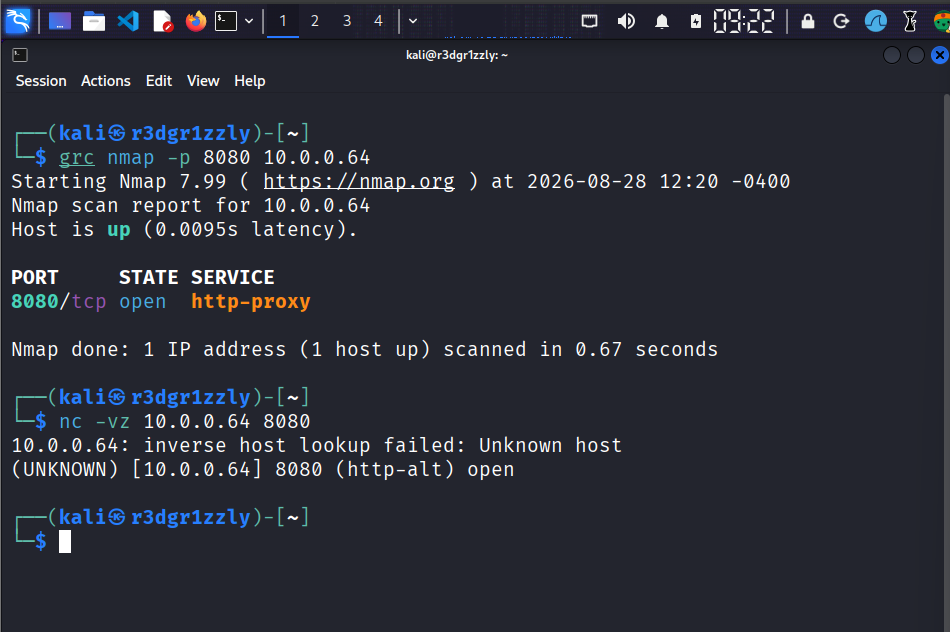
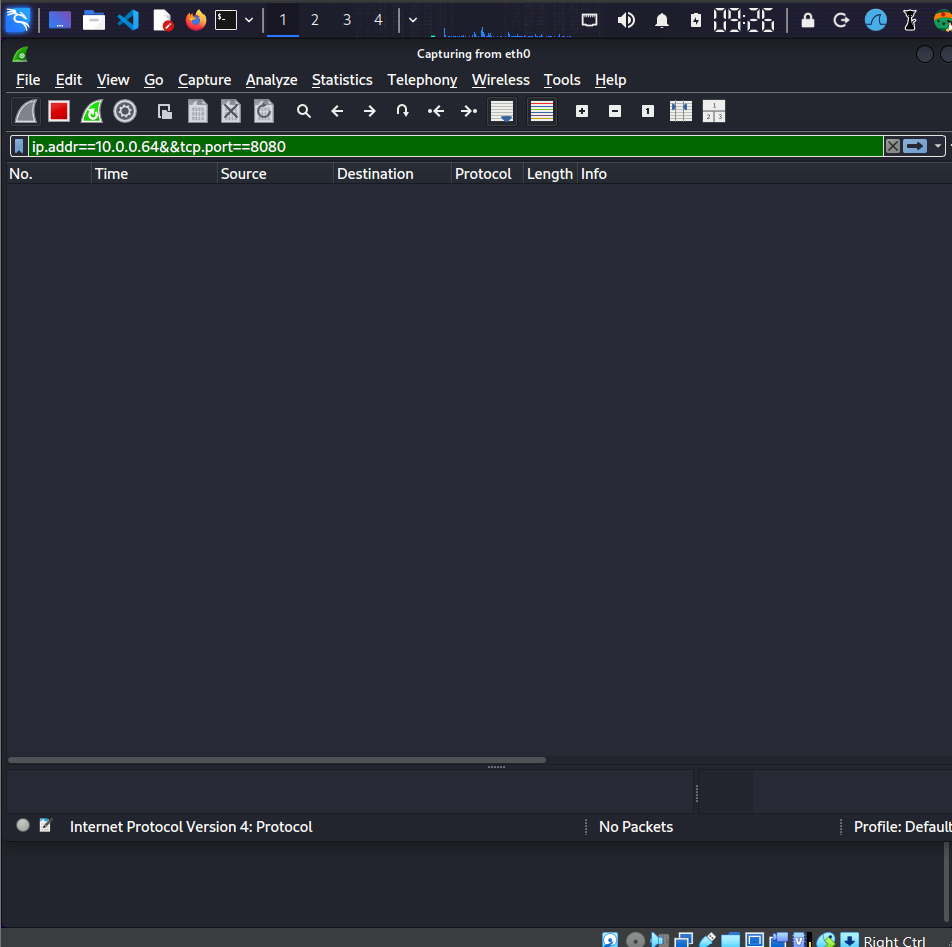
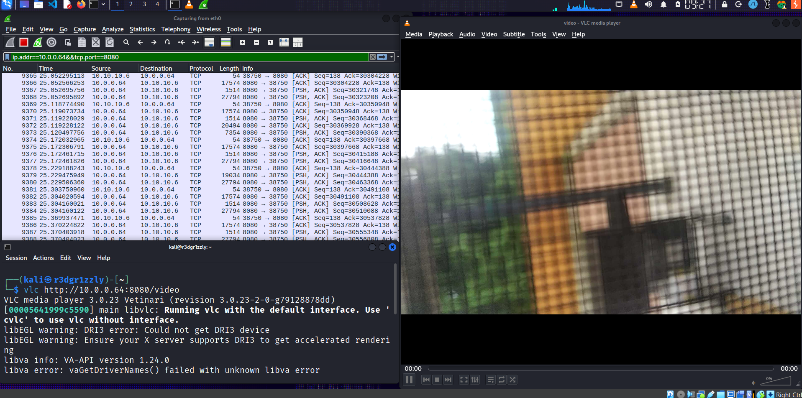
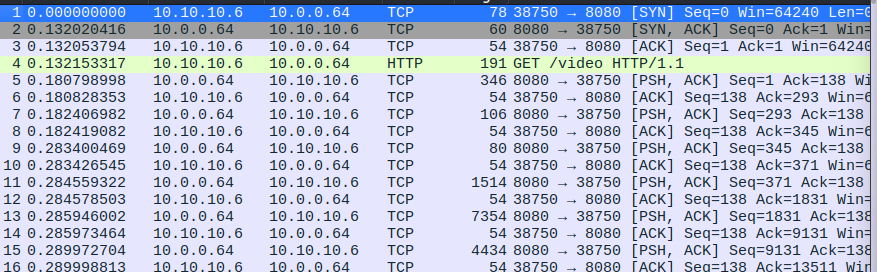
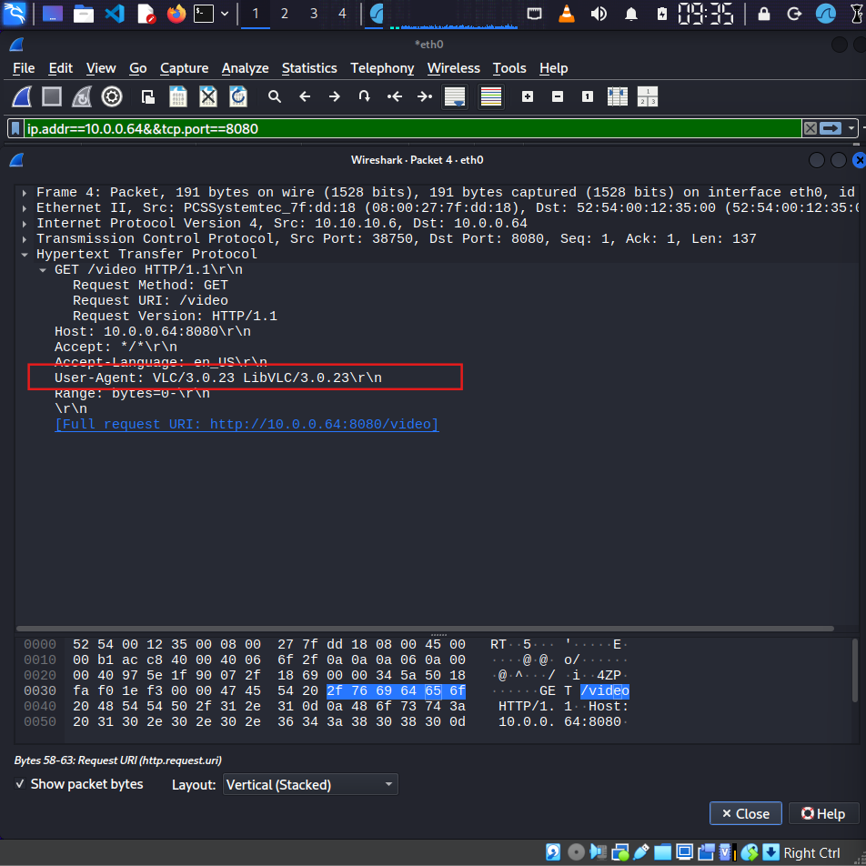
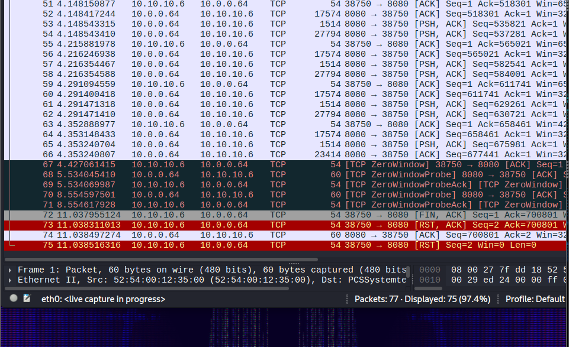
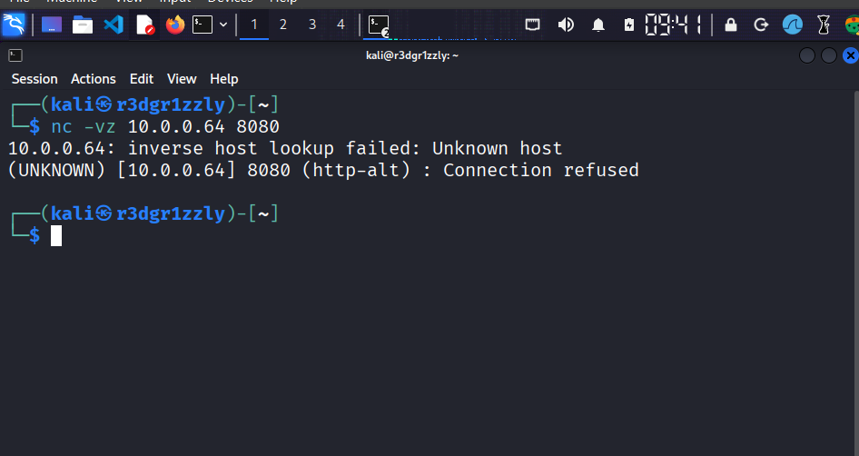

# Incident 9 — HTTP Video Stream Investigation

## Authorization and Lab Scope

This investigation was performed exclusively in a private and authorized cybersecurity lab.

The systems involved are personally controlled devices:

- Kali Linux analyzer: `10.10.10.6`
- Android phone / video source: `10.0.0.64`

The Android phone is connected to a residential Wi-Fi network that is not owned by the investigator.

For this reason, this investigation does **not** include:

- Subnet scanning
- LAN discovery
- Host enumeration
- Interaction with other residential-network devices
- Testing of systems not personally controlled

All testing was restricted specifically to the personally controlled Android device at `10.0.0.64`.

The objective of the lab is defensive cybersecurity education and network traffic analysis.

The investigation focuses on understanding how a continuous HTTP video stream appears at the packet level and how an analyst can correlate application behavior with TCP/IP evidence using:

- Nmap
- Netcat
- VLC
- Wireshark

---

# Scenario

An Android phone was configured to operate as an IP camera.

The phone exposed a live video feed through the following URL:

`http://10.0.0.64:8080/video`

Kali Linux connected to the video feed using VLC.

While the video was playing, Wireshark captured the communication between the Android device and Kali.

The investigation was designed to determine:

- Whether the video service was reachable
- Which TCP port was used
- Which application requested the stream
- Which HTTP resource was requested
- How the TCP connection was established
- How the video data appeared in Wireshark
- Which direction carried most of the application data
- How the HTTP server delivered the continuous video stream
- How the TCP connection terminated
- What happened when the video server was stopped

---

# Lab Architecture

    Android Phone
    10.0.0.64
    HTTP video server
    TCP 8080
         |
         |
         | HTTP video stream
         |
         v
    Network / NAT path
         |
         |
         v
    Kali Linux
    10.10.10.6
    VLC + Wireshark

The Android phone acts as the server and video source.

Kali Linux acts as:

- HTTP client
- Video viewer
- Network analyzer

The stream is accessed using:

`http://10.0.0.64:8080/video`

---

# Investigation Objectives

The investigation aims to establish the following facts:

    Video source:           10.0.0.64
    Analyzer/client:        10.10.10.6
    Transport protocol:     TCP
    Server port:            8080
    Application protocol:   HTTP
    Requested resource:     /video
    Client application:     VLC 3.0.23
    Streaming mechanism:    multipart/x-mixed-replace
    Primary data flow:      10.0.0.64 -> 10.10.10.6

The investigation also examines the complete lifecycle of the TCP connection:

    TCP connection establishment
            |
            v
    HTTP request
            |
            v
    Continuous video transmission
            |
            v
    TCP acknowledgements
            |
            v
    Connection termination

---

# Step 1 — Verify the Video Service

The Android camera application was started on the phone.

The known and authorized target was:

`10.0.0.64`

The video server was configured to use:

`TCP 8080`

A targeted Nmap test was performed against only this host and this port:

    nmap -p 8080 10.0.0.64

## Command Explanation

### `nmap`

Nmap is a network exploration and service discovery utility.

### `-p 8080`

The `-p` option specifies which port should be tested.

In this case:

`-p 8080`

means:

> Test only TCP port 8080.

No other ports or hosts were scanned.

### `10.0.0.64`

This is the personally controlled Android phone and the only residential-network device included in the investigation.

The result showed that TCP port 8080 was open.

The finding was then confirmed independently using Netcat:

    nc -vz 10.0.0.64 8080

## Netcat Command Explanation

### `nc`

Runs Netcat.

### `-v`

Verbose mode.

It causes Netcat to display additional information about the connection attempt.

### `-z`

Zero-I/O mode.

Netcat checks whether a TCP connection can be established without beginning a normal application-data session.

The successful Netcat connection confirmed that an application was listening on:

`10.0.0.64:8080`

## Screenshot 01

This screenshot documents both:

`nmap -p 8080 10.0.0.64`

and:

`nc -vz 10.0.0.64 8080`

The combined evidence confirms that the Android video server was actively listening on TCP port 8080.

---

# Step 2 — Prepare Wireshark for the Investigation

Wireshark was opened on Kali before VLC connected to the video stream.

The following display filter was applied:

`ip.addr == 10.0.0.64 && tcp.port == 8080`

## Filter Explanation

The first expression:

`ip.addr == 10.0.0.64`

means:

> Show packets in which `10.0.0.64` appears as either the source or destination IP address.

This includes traffic in both directions:

`10.0.0.64 -> 10.10.10.6`

and:

`10.10.10.6 -> 10.0.0.64`

The second expression:

`tcp.port == 8080`

means:

> Show only TCP traffic involving port 8080.

Combined:

`ip.addr == 10.0.0.64 && tcp.port == 8080`

means:

> Display only TCP port 8080 communication involving the authorized Android phone.

This greatly reduces unrelated network traffic and allows the analyst to focus exclusively on the video session.

## Screenshot 02

This screenshot shows Wireshark prepared for the investigation before the VLC stream was started.

---

# Step 3 — Start the Video Stream with VLC

The Android video feed was opened from Kali using:

    vlc http://10.0.0.64:8080/video

The URL can be divided into several components.

### `http://`

Defines the application protocol.

### `10.0.0.64`

IP address of the Android phone.

### `8080`

TCP port used by the video server.

### `/video`

HTTP resource requested by VLC.

The complete action can therefore be interpreted as:

> Connect to the HTTP server at `10.0.0.64` using TCP port `8080` and request the resource `/video`.

VLC successfully displayed the live feed generated by the Android phone.

## Screenshot 03

This screenshot shows the live Android camera feed successfully displayed inside VLC.

It also provides visual confirmation that the network communication being captured by Wireshark corresponds to a real live video session.

---

# Step 4 — Reconstruct the Beginning of the Connection

The Wireshark capture clearly showed the beginning of the TCP session.

The first packets followed the standard TCP three-way handshake:

    Kali -> Android        SYN
    Android -> Kali        SYN, ACK
    Kali -> Android        ACK

After the TCP connection was established, VLC sent:

`GET /video HTTP/1.1`

The server then immediately began returning application data.

The sequence can therefore be represented as:

    Kali
     |
     | SYN
     v
    Android
     |
     | SYN, ACK
     v
    Kali
     |
     | ACK
     v
    TCP connection established
     |
     | GET /video
     v
    Android HTTP server
     |
     | video data
     v
    Kali / VLC

## Understanding the TCP Handshake

### SYN

`SYN` means:

`Synchronize`

It is used to initiate a TCP connection and synchronize TCP sequence numbers.

### SYN, ACK

The Android server responds with:

`SYN, ACK`

This indicates:

> The connection request was received and the server is willing to establish the TCP session.

### ACK

Kali sends the final:

`ACK`

The TCP session is now established.

VLC can then send the HTTP request.

## Screenshot 04

This screenshot is one of the most important pieces of evidence in the lab.

It captures, in a single view:

- TCP `SYN`
- TCP `SYN, ACK`
- TCP `ACK`
- HTTP `GET /video`
- Beginning of the video transfer
- Repeated `PSH, ACK`
- TCP acknowledgements

This screenshot demonstrates the transition from TCP connection establishment to HTTP application communication and finally to continuous video transfer.

---

# Step 5 — Identify the HTTP Client

The HTTP request packet containing:

`GET /video HTTP/1.1`

was inspected in detail.

Inside the HTTP headers, Wireshark revealed the following client identifier:

`User-Agent: VLC/3.0.23 LibVLC/...`

This is important forensic evidence.

The network traffic identifies:

`10.10.10.6`

as the client system.

The HTTP `User-Agent` provides application-level evidence identifying the software responsible for generating the request:

`VLC 3.0.23`

Other relevant HTTP information included:

`GET /video HTTP/1.1`

and the destination server:

`10.0.0.64:8080`

The investigator can therefore correlate:

    Source system:       10.10.10.6
    Application:         VLC
    Destination:         10.0.0.64:8080
    Requested resource:  /video

## Screenshot 05

This screenshot shows the expanded HTTP request and provides application-level evidence that VLC generated the request for `/video`.

---

# Step 6 — Reconstruct the HTTP Stream

Wireshark's:

`Follow -> TCP Stream`

feature was used to reconstruct the application conversation from the individual TCP packets.

This is important because TCP transports a continuous byte stream.

What appears in Wireshark as many individual packets actually belongs to one logical application session.

The beginning of the reconstructed stream contains the VLC request:

`GET /video HTTP/1.1`

and the server response.

A particularly important response header was discovered:

`Content-Type: multipart/x-mixed-replace`

This reveals how the Android camera application delivers the live feed.

---

# Understanding `multipart/x-mixed-replace`

The server does not return one ordinary static HTTP object and immediately close the connection.

Instead, it keeps the HTTP connection open and continuously sends new content parts.

Conceptually:

    HTTP connection opens
            |
            v
    multipart/x-mixed-replace
            |
            v
    image/frame
            |
            v
    image/frame
            |
            v
    image/frame
            |
            v
    image/frame
            |
           ...

This technique is commonly used by HTTP camera applications to deliver a continuous sequence of image frames.

Instead of repeatedly creating new HTTP connections, the server maintains one persistent response and continuously supplies new parts.

This explains why the connection remains active while VLC displays the camera feed.

It also explains the continuous stream of TCP application packets visible in Wireshark.

## Screenshot 06

This screenshot shows the reconstructed TCP stream and the HTTP response containing:

`Content-Type: multipart/x-mixed-replace`

This is strong evidence that the HTTP server is intentionally delivering continuously changing content through one persistent HTTP response.

---

# Step 7 — Understand the `PSH, ACK / ACK` Pattern

During the live stream, Wireshark displayed a large number of packets similar to:

    10.0.0.64 -> 10.10.10.6    PSH, ACK
    10.10.10.6 -> 10.0.0.64    ACK

    10.0.0.64 -> 10.10.10.6    PSH, ACK
    10.10.10.6 -> 10.0.0.64    ACK

    10.0.0.64 -> 10.10.10.6    PSH, ACK
    10.10.10.6 -> 10.0.0.64    ACK

This repeated pattern is consistent with a continuous TCP data transfer.

## Understanding ACK

TCP is a reliable transport protocol.

The receiver acknowledges successfully received bytes.

The TCP flag:

`ACK`

means:

`Acknowledgement`

For example:

    Android -> Kali
    application/video data

    Kali -> Android
    ACK

Kali is confirming that the transmitted TCP data was received.

## Understanding PSH

The TCP flag:

`PSH`

means:

`Push`

A packet marked:

`PSH, ACK`

indicates that the TCP segment contains application data and also acknowledges previously received TCP data.

In this investigation, the receiving application is VLC.

Therefore:

`10.0.0.64 -> 10.10.10.6 PSH, ACK`

indicates that the Android server is actively transmitting application data belonging to the video stream.

The following:

`10.10.10.6 -> 10.0.0.64 ACK`

indicates that Kali has received TCP data and is acknowledging it.

The repeated sequence:

    PSH, ACK
    ACK
    PSH, ACK
    ACK
    PSH, ACK
    ACK

is a visible packet-level pattern associated with the ongoing video stream.

---

# Traffic Direction

The dominant application-data direction was:

`10.0.0.64 -> 10.10.10.6`

This is expected because `10.0.0.64` is the video source.

Kali mainly sends:

- Initial TCP connection packets
- HTTP request data
- TCP acknowledgements
- TCP control traffic

The Android phone sends the continuous video data.

This produces an asymmetric traffic pattern:

    Android
    10.0.0.64
         |
         | large continuous application-data flow
         v
    Kali
    10.10.10.6

    Kali
    10.10.10.6
         |
         | mostly acknowledgements/control traffic
         v
    Android
    10.0.0.64

This asymmetry is an important network-analysis clue.

However, packet direction alone does not prove that the transferred content is video.

The conclusion becomes reliable when combined with:

- `GET /video`
- VLC `User-Agent`
- Live VLC playback
- `multipart/x-mixed-replace`
- Continuous TCP data transmission

---

# Step 8 — Analyze Connection Termination

After VLC was closed, the TCP connection did not end using only a complete graceful FIN exchange.

The capture showed:

`FIN, ACK`

followed by:

`RST, ACK`

and:

`RST`

This indicates that an orderly TCP shutdown began, but reset traffic was subsequently observed.

## Understanding FIN

The TCP flag:

`FIN`

means:

`Finish`

It indicates that one endpoint has finished sending data and wishes to close its side of the connection.

A typical graceful TCP shutdown can look similar to:

    FIN, ACK
    ACK
    FIN, ACK
    ACK

However, this was not the complete sequence observed in this investigation.

## Understanding RST

The TCP flag:

`RST`

means:

`Reset`

A reset is used to terminate or reject a TCP connection immediately.

The observed sequence included:

    FIN, ACK
    RST, ACK
    RST

The safest interpretation of the evidence is:

> A graceful shutdown was initiated with `FIN, ACK`, but reset packets were subsequently observed instead of a simple complete FIN/ACK teardown.

This can occur when an application closes a persistent connection while additional data is still being handled, or when an endpoint receives traffic for a TCP state that has already been closed.

The capture therefore demonstrates that real application shutdown behavior does not always appear as a textbook four-packet FIN sequence.

## Screenshot 07

This screenshot documents the actual TCP termination behavior observed during the experiment:

    FIN, ACK
    RST, ACK
    RST

---

# Step 9 — Stop the Android Video Server

The camera/video server application was stopped on the Android phone.

The same Netcat test used earlier was repeated:

    nc -vz 10.0.0.64 8080

This time the result was:

`Connection refused`

This is an important distinction.

The phone remained reachable, but no application was listening on TCP port 8080.

Conceptually:

    Android phone
    10.0.0.64
         |
         | host reachable
         |
         X TCP 8080
           no listening server

Earlier, while the application was running:

`10.0.0.64:8080 -> connection accepted`

After stopping the application:

`10.0.0.64:8080 -> Connection refused`

This provides further evidence that TCP port 8080 belonged to the Android camera application.

## Screenshot 08

This screenshot shows Netcat receiving:

`Connection refused`

after the Android camera server was stopped.

---

# Evidence Summary

The investigation established the following facts:

    Android video source:          10.0.0.64
    Kali analyzer:                 10.10.10.6
    Server port:                   TCP 8080
    Application protocol:          HTTP
    Video URL:                     http://10.0.0.64:8080/video
    Requested resource:            /video
    Client software:               VLC 3.0.23
    HTTP streaming mechanism:      multipart/x-mixed-replace
    Primary application-data flow: 10.0.0.64 -> 10.10.10.6

The TCP connection began with:

    SYN
    SYN, ACK
    ACK

VLC then generated:

`GET /video HTTP/1.1`

The Android server maintained the HTTP connection and continuously transmitted application data.

Wireshark showed repeated traffic patterns such as:

    PSH, ACK
    ACK
    PSH, ACK
    ACK
    ...

When VLC was closed, the captured termination sequence included:

    FIN, ACK
    RST, ACK
    RST

When the Android server was stopped, TCP port 8080 no longer accepted connections.

---

# Investigation Timeline

1. Android video server started.

2. Targeted Nmap test performed against only `10.0.0.64:8080`.

3. TCP port 8080 confirmed open.

4. Netcat independently confirmed that the port accepted TCP connections.

5. Wireshark capture started on Kali.

6. Display filter applied:

   `ip.addr == 10.0.0.64 && tcp.port == 8080`

7. VLC opened:

   `http://10.0.0.64:8080/video`

8. Kali initiated a TCP connection.

9. TCP three-way handshake observed:

       SYN
       SYN, ACK
       ACK

10. VLC requested:

    `GET /video HTTP/1.1`

11. HTTP headers identified the client as:

    `VLC/3.0.23 LibVLC/...`

12. Android server began continuous video transmission.

13. Wireshark recorded repeated:

       PSH, ACK
       ACK

14. Follow TCP Stream revealed:

    `Content-Type: multipart/x-mixed-replace`

15. VLC displayed the live Android camera feed.

16. VLC was closed.

17. TCP termination traffic included:

       FIN, ACK
       RST, ACK
       RST

18. Android camera server was stopped.

19. Netcat was executed again.

20. TCP 8080 returned:

    `Connection refused`

---

# Screenshot Evidence

## Screenshot 01 — Port Verification

Evidence:

- Targeted Nmap test
- TCP 8080 open
- Netcat connection successful

---

## Screenshot 02 — Wireshark Filter Ready

Evidence:

- Wireshark capture configured
- Filter restricted to Android TCP 8080 traffic

---

## Screenshot 03 — VLC Live Video

Evidence:

- VLC successfully displaying the Android camera feed
- Real application behavior correlated with captured network traffic

---

## Screenshot 04 — TCP Handshake and HTTP Stream

Evidence:

- SYN
- SYN, ACK
- ACK
- GET /video
- Beginning of continuous application-data transfer
- PSH, ACK / ACK traffic

---

## Screenshot 05 — HTTP Request Details

Evidence:

- GET /video
- HTTP request headers
- User-Agent identifying VLC 3.0.23 / LibVLC

---

## Screenshot 06 — Follow TCP Stream

Evidence:

- Reconstructed HTTP conversation
- Persistent HTTP stream
- `Content-Type: multipart/x-mixed-replace`

---

## Screenshot 07 — TCP Termination

Evidence:

- FIN, ACK
- RST, ACK
- RST

A graceful TCP shutdown was initiated, followed by reset traffic.

---

## Screenshot 08 — Server Stopped

Evidence:

- Android camera server stopped
- Netcat connection attempt refused
- TCP port 8080 no longer accepting connections

---

# Key Findings

## Finding 1 — The Android Device Exposed a TCP Service

The Android phone at `10.0.0.64` accepted TCP connections on port `8080` while the camera server application was running.

---

## Finding 2 — The Video Feed Used HTTP

The stream was accessed using:

`http://10.0.0.64:8080/video`

Wireshark confirmed the request:

`GET /video HTTP/1.1`

---

## Finding 3 — VLC Generated the Request

The HTTP request contained:

`User-Agent: VLC/3.0.23 LibVLC/...`

This provided application-level evidence identifying the client software.

---

## Finding 4 — The Video Used a Persistent HTTP Response

The server response contained:

`Content-Type: multipart/x-mixed-replace`

The Android application therefore kept the HTTP response active and continuously transmitted new content parts.

This behavior is consistent with HTTP camera streaming.

---

## Finding 5 — The Android Device Was the Primary Data Source

The dominant application-data direction was:

`10.0.0.64 -> 10.10.10.6`

The Android device continuously transmitted application data while Kali primarily returned acknowledgements and TCP control traffic.

---

## Finding 6 — TCP Reliability Was Visible During the Stream

Wireshark repeatedly showed patterns involving:

    PSH, ACK
    ACK

This demonstrated TCP acknowledgement behavior during a continuous application-data transfer.

---

## Finding 7 — The Connection Did Not End with Only a Textbook Graceful Teardown

The termination traffic included:

    FIN, ACK
    RST, ACK
    RST

A graceful shutdown was initiated, but reset packets were subsequently observed.

---

## Finding 8 — TCP 8080 Was Associated with the Camera Application

After the Android camera server was stopped:

    nc -vz 10.0.0.64 8080

returned:

`Connection refused`

This confirmed that the previously listening TCP service was associated with the camera application.

---

# What This Incident Demonstrates

A live video stream does not appear at the network layer as a single object labelled "video".

The activity must be reconstructed by correlating evidence from multiple protocol layers.

    APPLICATION
    VLC
     |
     | GET /video
     v
    HTTP
     |
     | multipart/x-mixed-replace
     v
    TCP
     |
     | SYN
     | SYN, ACK
     | ACK
     | PSH, ACK
     | ACK
     | FIN / RST
     v
    IP
     |
     | 10.0.0.64
     |       ^
     |       |
     |       v
     | 10.10.10.6
     v
    NETWORK

An investigator can combine:

- IP addresses
- TCP ports
- TCP flags
- HTTP requests
- HTTP headers
- Application identification
- Traffic direction
- Stream reconstruction
- Application behavior

to determine what happened.

No single packet proves the entire event.

The conclusion comes from correlating all available evidence.

---

# Conclusion

Incident 9 successfully documented and reconstructed a live HTTP video-streaming session between an Android phone and Kali Linux.

The Android device at:

`10.0.0.64`

operated an HTTP video service on:

`TCP 8080`

The resource:

`/video`

was requested by VLC running on Kali Linux at:

`10.10.10.6`

Wireshark captured the complete progression of the session.

The connection began with the TCP three-way handshake:

    SYN
    SYN, ACK
    ACK

VLC then transmitted:

`GET /video HTTP/1.1`

The HTTP request headers identified:

`VLC/3.0.23 LibVLC/...`

as the client application.

The Android server responded using:

`Content-Type: multipart/x-mixed-replace`

and maintained the HTTP connection while continuously transmitting the live feed.

At the TCP layer, the ongoing stream appeared as repeated application-data and acknowledgement traffic:

    PSH, ACK
    ACK
    PSH, ACK
    ACK
    ...

The dominant application-data direction was:

`10.0.0.64 -> 10.10.10.6`

which is consistent with the Android device acting as the video source and Kali acting as the receiver.

When VLC was closed, the captured TCP termination traffic included:

    FIN, ACK
    RST, ACK
    RST

indicating that a graceful shutdown began but reset traffic was subsequently generated.

Finally, after the Android camera server was stopped, TCP port 8080 returned:

`Connection refused`

confirming that the service was no longer listening.

The complete activity was reconstructed as:

    Android camera server starts
            |
            v
    TCP 8080 becomes available
            |
            v
    Kali establishes TCP connection
            |
            v
    SYN -> SYN,ACK -> ACK
            |
            v
    VLC sends GET /video
            |
            v
    Android responds using
    multipart/x-mixed-replace
            |
            v
    Continuous application/video data
            |
            v
    PSH,ACK <-> ACK
            |
            v
    VLC closes
            |
            v
    FIN,ACK followed by RST traffic
            |
            v
    Android server stops
            |
            v
    TCP 8080 -> Connection refused

This provides a complete network-forensics view of an HTTP video-streaming session inside a controlled and authorized laboratory.
