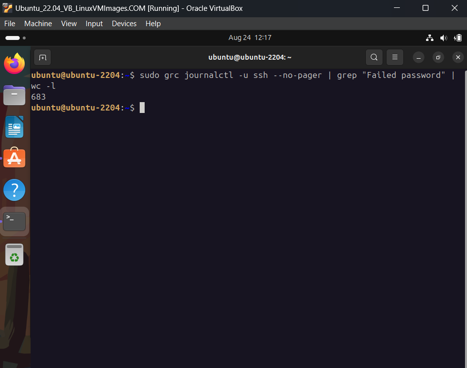
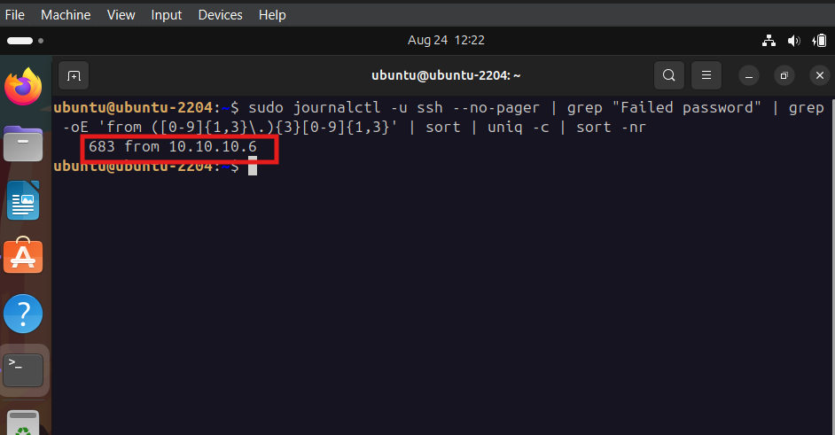
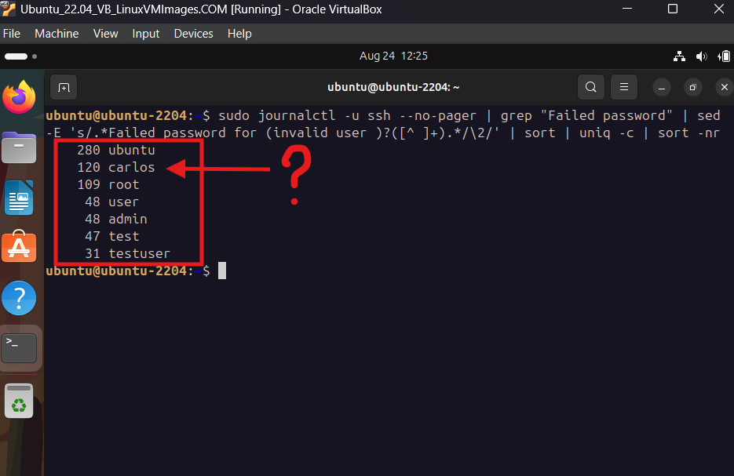
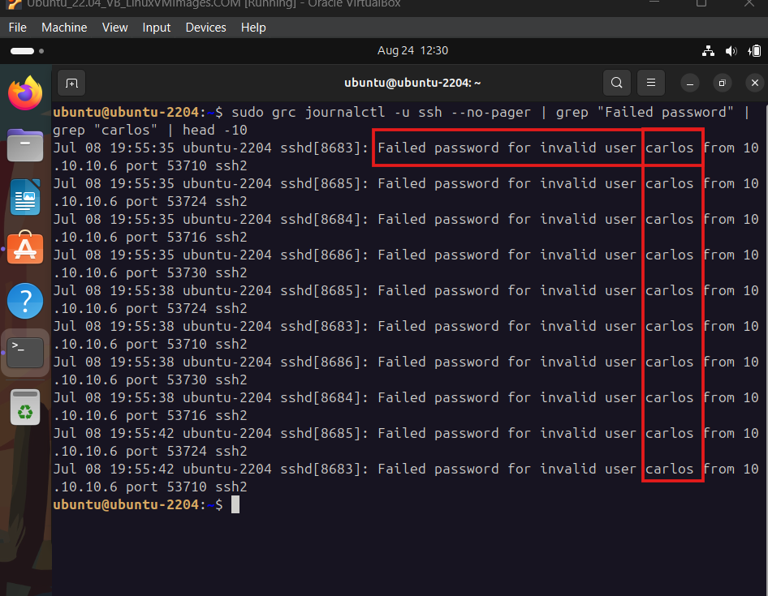
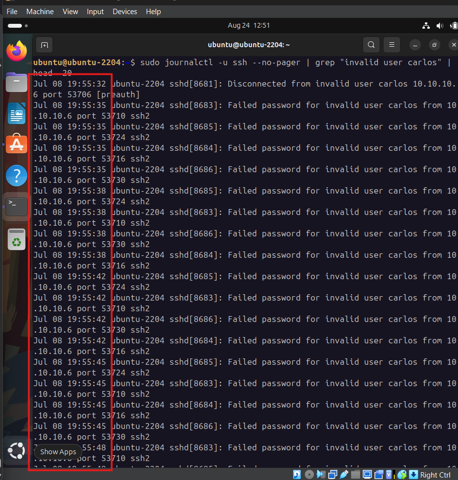
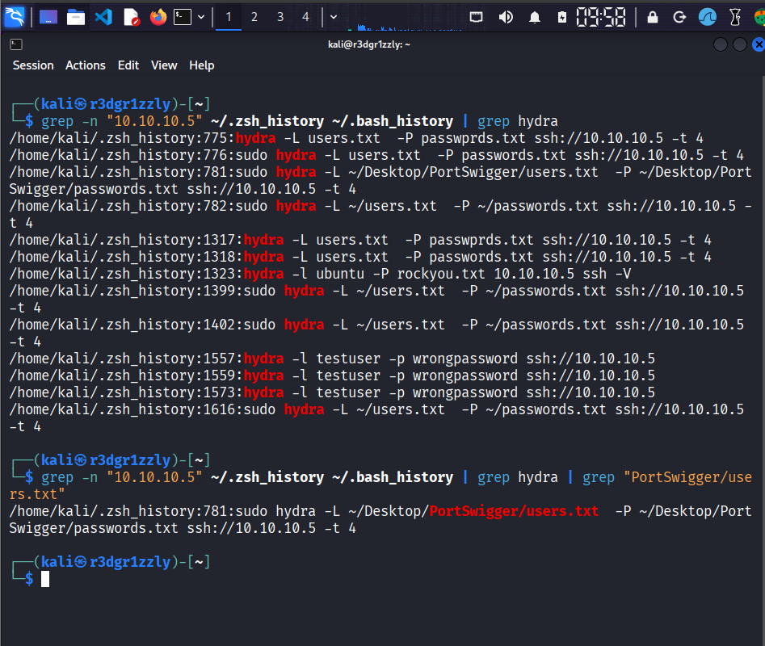
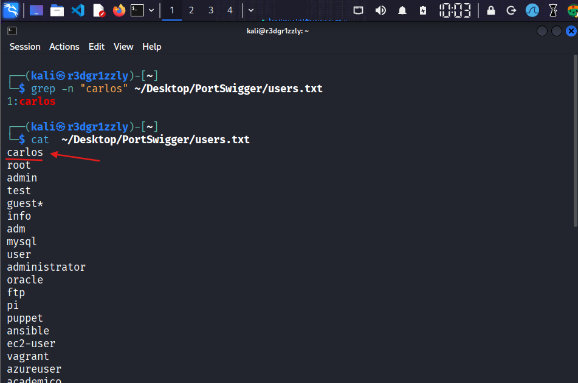

# Special Incident — Who's Carlos?

## Overview

During the analysis of historical SSH authentication logs on an Ubuntu server, an unexpectedly large number of failed authentication attempts was discovered.

What initially appeared to be normal historical activity quickly became an investigation when an unexpected username repeatedly appeared in the logs:

**`carlos`**

The account did not exist on the Ubuntu server, and there was no immediate explanation for why this username had been used hundreds of times against the SSH service.

This incident documents the investigation from the initial anomaly to the identification of the source of the activity.

The investigation was not originally planned. The evidence was discovered during another laboratory exercise, making this a useful example of investigating an unknown event without knowing the answer in advance.

---

## Lab Environment

This investigation was performed entirely inside an isolated and authorized virtual laboratory.

| System        | IP Address   | Role                                     |
| ------------- | ------------ | ---------------------------------------- |
| Kali Linux    | `10.10.10.6` | Analysis workstation / historical source |
| Ubuntu Server | `10.10.10.5` | Investigated server                      |
| SSH           | TCP `22`     | Investigated service                     |

All systems involved in this investigation are owned and controlled within the laboratory environment.

The objective of this case is defensive: analyze historical authentication activity, correlate evidence from multiple sources, determine the origin of the events, and document the findings.

---

# 1. Initial Discovery

The investigation began while reviewing historical SSH authentication events on the Ubuntu server.

The SSH journal contained a surprisingly large number of entries containing:

```text
Failed password
```

Instead of assuming these represented a brute-force attack, the first objective was simply to determine how many failed authentication events existed.

The events were counted using:

```bash
sudo journalctl -u ssh --no-pager | grep "Failed password" | wc -l
```

The result was:

```text
683
```

This established the first confirmed finding:

> **683 failed SSH password authentication events were present in the analyzed journal data.**

At this stage, the cause of the events was unknown.



---

# 2. Source IP Analysis

The next question was:

> Where did these failed authentication attempts originate?

The source IP addresses associated with the failed authentication events were extracted and counted.

```bash
sudo journalctl -u ssh --no-pager | grep "Failed password" | grep -oE 'from ([0-9]{1,3}\.){3}[0-9]{1,3}' | sort | uniq -c | sort -nr
```

The analysis showed that all 683 events originated from:

```text
10.10.10.6
```

This address belongs to the Kali Linux machine in the laboratory.

The evidence therefore established:

```text
Source: 10.10.10.6
Destination: 10.10.10.5
Service: SSH
Destination Port: TCP 22
Failed authentication events: 683
```

This significantly narrowed the investigation.



---

# 3. Username Analysis

Knowing that all events originated from the same machine was not enough.

The next objective was to determine which usernames were being used during the authentication attempts.

The failed authentication events were grouped by username.

```bash
sudo journalctl -u ssh --no-pager | grep "Failed password" | sed -E 's/.*Failed password for (invalid user )?([^ ]+).*/\2/' | sort | uniq -c | sort -nr
```

Multiple usernames appeared.

One expected username was:

```text
ubuntu
```

with approximately:

```text
280 attempts
```

However, another username immediately stood out:

```text
carlos
```

with approximately:

```text
120 attempts
```

The appearance of `carlos` was unexpected.



---

# 4. Who Is Carlos?

The username `carlos` was recognizable from previous PortSwigger Web Security Academy exercises.

However, those exercises had not intentionally involved the Ubuntu SSH server.

This created the central question of the investigation:

> **Why was the username `carlos` appearing repeatedly in the SSH authentication logs of the Ubuntu server?**

At this stage, it would have been incorrect to assume that the activity originated from PortSwigger simply because the username was familiar.

The evidence had to be investigated independently.

---

# 5. Carlos Was Not an Ubuntu User

The SSH events associated with `carlos` were examined more closely.

The logs contained entries indicating:

```text
Failed password for invalid user carlos
```

The important part was:

```text
invalid user
```

This indicated that the Ubuntu server did not recognize `carlos` as an existing local account.

The server had therefore received SSH authentication attempts using the username `carlos`, but no corresponding account existed on the system.

The source of those attempts was still:

```text
10.10.10.6
```

This produced another confirmed finding:

> **The Kali system had generated SSH authentication attempts against Ubuntu using the nonexistent username `carlos`.**



---

# 6. Timeline Analysis

The historical events involving `carlos` were then examined to determine when they occurred.

```bash
sudo journalctl -u ssh --no-pager | grep "invalid user carlos" | head -10
```

The events were concentrated on:

```text
July 08
```

Multiple failed authentication attempts involving the same nonexistent username appeared during the same historical period.

This suggested that the events were unlikely to represent isolated manual password mistakes.

Instead, the pattern was consistent with previously generated automated authentication activity inside the laboratory.



---

# 7. Investigation Moves to Kali

At this point the Ubuntu server had provided several pieces of evidence:

```text
683 failed SSH authentications

Source:
10.10.10.6

Unexpected username:
carlos

Account status:
invalid user

Historical activity:
July 08
```

Because `10.10.10.6` belongs to Kali, the investigation moved from the target server to the source workstation.

The objective was no longer to analyze the effect.

The objective was to identify the cause.

---

# 8. Shell History Investigation

The shell history on Kali was examined for historical commands involving the Ubuntu server.

Both Zsh and Bash history files were present:

```text
~/.zsh_history
~/.bash_history
```

Commands referencing the Ubuntu server were searched using:

```bash
grep -n "10.10.10.5" ~/.zsh_history ~/.bash_history
```

Several historical Hydra commands targeting the Ubuntu SSH service were discovered.

One command immediately stood out:

```bash
hydra -L ~/Desktop/PortSwigger/users.txt -P ~/Desktop/PortSwigger/passwords.txt ssh://10.10.10.5 -t 4
```

This was a major development in the investigation.



---

# 9. Understanding the Historical Command

The command revealed that Hydra had previously been used against the Ubuntu SSH service inside the laboratory.

The target was explicitly:

```text
ssh://10.10.10.5
```

The username source was:

```text
-L ~/Desktop/PortSwigger/users.txt
```

The uppercase `-L` option instructed Hydra to read usernames from a file.

The password source was:

```text
-P ~/Desktop/PortSwigger/passwords.txt
```

The uppercase `-P` option instructed Hydra to read passwords from another file.

The command also contained:

```text
-t 4
```

which configured four concurrent Hydra tasks.

The important discovery was that the username was not written directly inside the shell command.

Instead, usernames were being loaded from:

```text
~/Desktop/PortSwigger/users.txt
```

This explained why searching the shell history directly for both `carlos` and `10.10.10.5` had initially failed to reveal the connection.

---

# 10. The Final Piece of Evidence

The investigation now had one final question:

> Was `carlos` actually contained inside the username list used by the historical Hydra command?

The file was checked using:

```bash
grep -n "carlos" ~/Desktop/PortSwigger/users.txt
```

The result was:

```text
1:carlos
```

The username `carlos` was the first entry in the username list.



---

# 11. Evidence Correlation

The different pieces of evidence could now be correlated.

### Ubuntu SSH logs

The server recorded repeated events involving:

```text
Failed password for invalid user carlos
```

The source was:

```text
10.10.10.6
```

### Kali shell history

Kali contained a historical Hydra command targeting:

```text
ssh://10.10.10.5
```

The command loaded usernames from:

```text
~/Desktop/PortSwigger/users.txt
```

### Username list

The file contained:

```text
1:carlos
```

The complete evidence chain was therefore:

```text
~/Desktop/PortSwigger/users.txt
             │
             │ contains
             ▼
          carlos
             │
             │ loaded using -L
             ▼
           Hydra
             │
             │ SSH authentication activity
             ▼
      Ubuntu 10.10.10.5:22
             │
             ▼
          sshd logs
             │
             ▼
Failed password for invalid user carlos
from 10.10.10.6
```

---

# 12. Root Cause

The repeated `carlos` authentication events were traced to a historical Hydra exercise performed from Kali against the Ubuntu SSH service.

A username list stored inside a directory named:

```text
PortSwigger
```

had been reused during the SSH exercise.

That file contained:

```text
carlos
```

Hydra loaded the username from the file and attempted authentication against:

```text
10.10.10.5:22
```

Because no `carlos` account existed on Ubuntu, the SSH server recorded the attempts as:

```text
Failed password for invalid user carlos
```

The directory name initially created a misleading association with PortSwigger exercises.

However, the actual target recorded in the historical command was the local Ubuntu server.

---

# 13. Investigation Findings

### Confirmed

* The Ubuntu SSH journal contained 683 failed password authentication events.
* The analyzed failed authentication events originated from `10.10.10.6`.
* `10.10.10.6` corresponds to the Kali machine in the laboratory.
* Approximately 120 events involved the username `carlos`.
* Ubuntu identified `carlos` as an invalid user.
* The historical `carlos` events were observed on July 08.
* Kali shell history contained a Hydra command targeting `ssh://10.10.10.5`.
* The Hydra command loaded usernames from `~/Desktop/PortSwigger/users.txt`.
* The username file contained `carlos` as its first entry.

### Initial Hypothesis

The name `carlos` initially suggested a possible connection to previous PortSwigger exercises.

### Final Assessment

The evidence instead showed that a username list stored in the PortSwigger directory had been reused during a historical SSH authentication exercise against the local Ubuntu server.

The name of the directory was not evidence of the target.

The actual target was established by examining the historical command itself.

---

# 14. Lessons Learned

This investigation demonstrated why incident analysis should be driven by evidence rather than assumptions.

The initial observation was simply:

```text
683 Failed password events
```

That observation generated a series of questions:

```text
How many events?
        ↓
683

Where did they originate?
        ↓
10.10.10.6

Which usernames were involved?
        ↓
ubuntu, carlos, ...

Who is carlos?
        ↓
invalid user

When did the activity occur?
        ↓
July 08

What happened on the source machine?
        ↓
historical Hydra activity

Where did Hydra obtain the username?
        ↓
users.txt

Does that file contain carlos?
        ↓
YES — line 1
```

No single piece of evidence explained the incident.

The explanation emerged only after correlating:

* SSH authentication logs
* source IP addresses
* usernames
* timestamps
* shell history
* historical commands
* local wordlist contents

Another important lesson was that filenames and directory names can be misleading.

The path:

```text
~/Desktop/PortSwigger/users.txt
```

initially suggested that the activity was associated directly with a PortSwigger lab.

The historical command provided the actual evidence:

```text
ssh://10.10.10.5
```

The target was Ubuntu.

---

# Conclusion

**Who's Carlos?** began as an unexpected observation during an unrelated SSH investigation.

There was no predetermined answer.

The investigation started with 683 failed authentication events and eventually identified an unexpected username appearing repeatedly in the Ubuntu SSH logs.

By following the evidence across the Ubuntu server and Kali workstation, the activity was traced back to a historical Hydra exercise that loaded `carlos` from a previously created username list.

What began as an unexplained log entry became a complete evidence chain:

```text
LOG ANOMALY
     ↓
SOURCE IDENTIFICATION
     ↓
USERNAME ANALYSIS
     ↓
TIMELINE ANALYSIS
     ↓
SOURCE HOST INVESTIGATION
     ↓
SHELL HISTORY
     ↓
HYDRA COMMAND
     ↓
USERNAME FILE
     ↓
ROOT CAUSE
```

The most important result of the exercise was not identifying `carlos`.

It was demonstrating how an unknown historical event can be reconstructed by asking questions, testing hypotheses, rejecting unsupported assumptions, and correlating independent sources of evidence.

